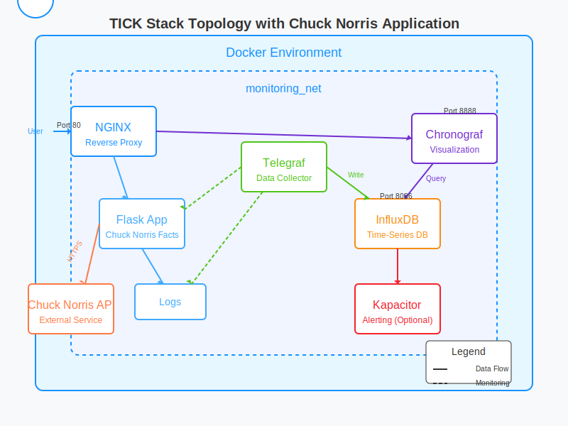

# TICK Stack with Chuck Norris Monitor - Lab Guide

This guide explains how to set up the TICK stack (Telegraf, InfluxDB, Chronograf, Kapacitor) to monitor a web application that integrates with the Chuck Norris API. Each component plays a specific role in the monitoring pipeline, and we'll explore how they work together.

 

## Understanding The Components

### 1. Telegraf
**What it is:** A collection agent that gathers metrics from various sources.

**Why we need it:** Telegraf serves as our "collector" that gathers all the data we want to monitor. It can collect:
- System metrics (CPU, memory, disk)
- Docker container metrics
- HTTP endpoint performance 
- Log files

**How it works:** Telegraf uses plugins to collect data from different sources, then sends this data to InfluxDB in a format it can understand.

### 2. InfluxDB
**What it is:** A time-series database optimized for high-write and query loads.

**Why we need it:** Monitoring data is time-based (metrics collected at specific timestamps), making InfluxDB ideal for storing this information efficiently. It handles:
- Storing metrics with timestamps
- Retaining historical data
- Querying time-series data quickly

**How it works:** InfluxDB stores data in "buckets" (collections of related time-series data) and uses a SQL-like query language called Flux.

### 3. Chronograf
**What it is:** A visualization and dashboard tool.

**Why we need it:** Raw metrics aren't useful without visualization. Chronograf provides:
- Interactive dashboards 
- Data exploration tools
- Admin interfaces for InfluxDB and Kapacitor

**How it works:** Chronograf connects to InfluxDB, queries the data, and displays it in customizable dashboards.

### 4. Kapacitor (Optional for Alerting)
**What it is:** A real-time streaming data processing engine.

**Why it's useful:** Kapacitor allows you to:
- Create alerts based on thresholds
- Process data in real-time
- Execute custom logic on your metrics

**How it works:** Kapacitor subscribes to data from InfluxDB and can perform calculations, transformations, and trigger alerts.

## Lab Setup Steps

### Step 1: Initial Server Setup

```bash
# Update system packages
sudo apt-get update && sudo apt-get upgrade -y

# Install required packages
sudo apt-get install -y \
    apt-transport-https \
    ca-certificates \
    curl \
    git

# Install Docker
curl -fsSL https://get.docker.com -o get-docker.sh
sudo sh get-docker.sh

# Install Docker Compose
sudo curl -L "https://github.com/docker/compose/releases/latest/download/docker-compose-$(uname -s)-$(uname -m)" -o /usr/local/bin/docker-compose
sudo chmod +x /usr/local/bin/docker-compose

# Add your user to the docker group (why: to run docker without sudo)
sudo usermod -aG docker $USER
newgrp docker
```

### Step 2: Create Project Structure

```bash
# Create main project directory
mkdir -p ~/tick-stack
cd ~/tick-stack

# Create directories for each component
mkdir -p {telegraf,kapacitor,influxdb,nginx/conf.d,flask-app}
mkdir -p flask-app/logs

# Create log file for the Flask application
touch flask-app/logs/app.log
chmod 666 flask-app/logs/app.log
```

**Why this structure:** Each component needs its own configuration files and persistent storage. This directory structure keeps everything organized and allows Docker to mount these directories as volumes.

### Step 3: Environment Variables and Docker Compose

Create the environment file with configuration variables:

```bash
cat > ~/tick-stack/.env << 'EOL'
# InfluxDB Configuration
DOCKER_INFLUXDB_INIT_MODE=setup
DOCKER_INFLUXDB_INIT_USERNAME=admin
DOCKER_INFLUXDB_INIT_PASSWORD=your_secure_password
DOCKER_INFLUXDB_INIT_ORG=my_org
DOCKER_INFLUXDB_INIT_BUCKET=my_bucket
DOCKER_INFLUXDB_INIT_ADMIN_TOKEN=your_secure_token
INFLUX_TOKEN=your_secure_token
INFLUX_ORG=my_org

# Flask App Configuration
FLASK_ENV=production
LOG_LEVEL=INFO

# Get Docker GID - automatically detect your Docker group ID
DOCKER_GID=$(getent group docker | cut -d: -f3)
EOL
```

**Why these variables:** 
- InfluxDB requires initialization parameters for the first run
- The admin token is needed for secure API access
- FLASK_ENV controls debugging features
- LOG_LEVEL determines what gets logged
- DOCKER_GID gives Telegraf access to Docker metrics

Create the Docker Compose file:

```bash
cat > ~/tick-stack/docker-compose.yml << 'EOL'
version: '3'

services:
  influxdb:
    image: influxdb:latest
    container_name: influxdb
    restart: always
    ports:
      - "8086:8086"
    volumes:
      - ./influxdb:/var/lib/influxdb2
    environment:
      - DOCKER_INFLUXDB_INIT_MODE=${DOCKER_INFLUXDB_INIT_MODE}
      - DOCKER_INFLUXDB_INIT_USERNAME=${DOCKER_INFLUXDB_INIT_USERNAME}
      - DOCKER_INFLUXDB_INIT_PASSWORD=${DOCKER_INFLUXDB_INIT_PASSWORD}
      - DOCKER_INFLUXDB_INIT_ORG=${DOCKER_INFLUXDB_INIT_ORG}
      - DOCKER_INFLUXDB_INIT_BUCKET=${DOCKER_INFLUXDB_INIT_BUCKET}
      - DOCKER_INFLUXDB_INIT_ADMIN_TOKEN=${DOCKER_INFLUXDB_INIT_ADMIN_TOKEN}
    networks:
      - monitoring_net

  telegraf:
    image: telegraf:latest
    container_name: telegraf
    restart: always
    volumes:
      - ./telegraf/telegraf.conf:/etc/telegraf/telegraf.conf:ro
      - /var/run/docker.sock:/var/run/docker.sock:ro
      - /proc:/host/proc:ro
      - /sys:/host/sys:ro
      - ./flask-app/logs:/app/logs:ro
    environment:
      - INFLUX_TOKEN=${INFLUX_TOKEN}
      - INFLUX_ORG=${DOCKER_INFLUXDB_INIT_ORG}
      - INFLUX_BUCKET=${DOCKER_INFLUXDB_INIT_BUCKET}
    group_add:
      - "${DOCKER_GID:-999}"
    depends_on:
      - influxdb
    networks:
      - monitoring_net

  chronograf:
    image: chronograf:latest
    container_name: chronograf
    restart: always
    ports:
      - "8888:8888"
    volumes:
      - ./chronograf:/var/lib/chronograf
    depends_on:
      - influxdb
    environment:
      - INFLUXDB_URL=http://influxdb:8086
      - INFLUXDB_TOKEN=${INFLUX_TOKEN}
      - INFLUXDB_ORG=${DOCKER_INFLUXDB_INIT_ORG}
    networks:
      - monitoring_net

  kapacitor:
    image: kapacitor:latest
    container_name: kapacitor
    restart: always
    volumes:
      - ./kapacitor/kapacitor.conf:/etc/kapacitor/kapacitor.conf:ro
    depends_on:
      - influxdb
    networks:
      - monitoring_net

  flask-app:
    build: ./flask-app
    container_name: flask-app
    restart: always
    volumes:
      - ./flask-app:/app
      - ./flask-app/logs:/app/logs
    environment:
      - FLASK_ENV=${FLASK_ENV}
      - LOG_LEVEL=${LOG_LEVEL}
    networks:
      - monitoring_net

  nginx:
    image: nginx:latest
    container_name: nginx
    restart: always
    ports:
      - "80:80"
    volumes:
      - ./nginx/conf.d:/etc/nginx/conf.d
    depends_on:
      - flask-app
      - chronograf
    networks:
      - monitoring_net

networks:
  monitoring_net:
    driver: bridge
EOL
```

**Why this configuration:**
- **Volume mounts:** Each container needs access to its configuration and persistent data
- **Networks:** All services are on the same network so they can communicate
- **Dependencies:** Some services need to wait for others to start
- **Environment variables:** Passed from the .env file to configure the services
- **Restart policy:** Services automatically restart if they crash
- **Port mappings:** Only expose the necessary ports to the host

### Step 4: Telegraf Configuration

Telegraf is the data collector. Its configuration defines what metrics to collect and where to send them:

```bash
cat > ~/tick-stack/telegraf/telegraf.conf << 'EOL'
# Global Agent Configuration
[agent]
  interval = "10s"           # How often to collect metrics
  round_interval = true      # Round collection interval
  metric_batch_size = 1000   # Batch size for writes to InfluxDB
  metric_buffer_limit = 10000 # Buffer size if InfluxDB is unavailable
  collection_jitter = "0s"   # Add random delays to prevent thundering herd
  flush_interval = "10s"     # How often to send metrics to outputs
  flush_jitter = "0s"        # Add random delays to flush interval
  precision = ""            # Timestamp precision
  hostname = ""             # Override default hostname
  omit_hostname = false     # Include hostname in metrics

# Output to InfluxDB v2
[[outputs.influxdb_v2]]
  urls = ["http://influxdb:8086"]
  token = "${INFLUX_TOKEN}"
  organization = "${INFLUX_ORG}"
  bucket = "${DOCKER_INFLUXDB_INIT_BUCKET}"

# Docker Metrics Collection
[[inputs.docker]]
  endpoint = "unix:///var/run/docker.sock"
  gather_services = false
  container_names = []
  container_name_include = []
  container_name_exclude = []
  timeout = "5s"
  perdevice = true
  total = false
  
# System Metrics Collection
[[inputs.cpu]]
  percpu = true
  totalcpu = true
  collect_cpu_time = false
  report_active = false

[[inputs.disk]]
  ignore_fs = ["tmpfs", "devtmpfs", "devfs", "iso9660", "overlay", "aufs", "squashfs"]

[[inputs.diskio]]

[[inputs.mem]]

[[inputs.net]]

[[inputs.processes]]

[[inputs.swap]]

[[inputs.system]]

# HTTP Response Monitoring (Flask App)
[[inputs.http_response]]
  urls = ["http://flask-app:5000"]
  response_timeout = "5s"
  method = "GET"
  follow_redirects = true

# Monitor the Chuck Norris API
[[inputs.http_response]]
  urls = ["https://api.chucknorris.io/jokes/random"]
  response_timeout = "5s"
  method = "GET"
  follow_redirects = true
  name_override = "chuck_norris_api"

# Log File Monitoring
[[inputs.file]]
  files = ["/app/logs/app.log"]
  from_beginning = true
  data_format = "grok"
  grok_patterns = ["%{TIMESTAMP_ISO8601:timestamp} %{LOGLEVEL:level} %{GREEDYDATA:message}"]

# Real-time Log Monitoring
[[inputs.tail]]
  files = ["/app/logs/app.log"]
  from_beginning = true
  pipe = false
  data_format = "grok"
  grok_patterns = ["%{TIMESTAMP_ISO8601:timestamp} %{LOGLEVEL:level} %{GREEDYDATA:message}"]
  name_override = "chuck_norris_logs"
EOL
```

**Key aspects of this configuration:**
- **agent section**: Controls how often Telegraf collects and sends data
- **outputs.influxdb_v2**: Configures the connection to InfluxDB
- **inputs**: These are the data collection plugins
  - **docker**: Gathers metrics from Docker containers
  - **cpu, disk, mem, etc.**: Collect system metrics
  - **http_response**: Monitors HTTP endpoints
  - **file/tail**: Parses log files using Grok patterns

**Why these metrics are important:**
- System metrics help identify resource bottlenecks
- HTTP response metrics show application availability and performance
- Log metrics help identify errors and patterns
- Docker metrics show container health

### Step 5: Nginx Configuration

Nginx serves as a reverse proxy to make all services accessible through a single entry point:

```bash
cat > ~/tick-stack/nginx/conf.d/default.conf << 'EOL'
server {
    listen 80;
    server_name _;
    
    # Flask Application (Chuck Norris Facts)
    location / {
        proxy_pass http://flask-app:5000;
        proxy_set_header Host $host;
        proxy_set_header X-Real-IP $remote_addr;
        proxy_set_header X-Forwarded-For $proxy_add_x_forwarded_for;
        proxy_set_header X-Forwarded-Proto $scheme;
    }
    
    # Chronograf UI 
    location /chronograf/ {
        proxy_pass http://chronograf:8888/;
        proxy_set_header Host $host;
        proxy_set_header X-Real-IP $remote_addr;
        proxy_set_header X-Forwarded-For $proxy_add_x_forwarded_for;
        proxy_set_header X-Forwarded-Proto $scheme;
    }

    # InfluxDB API
    location /influxdb/ {
        proxy_pass http://influxdb:8086/;
        proxy_set_header Host $host;
        proxy_set_header X-Real-IP $remote_addr;
        proxy_set_header X-Forwarded-For $proxy_add_x_forwarded_for;
        proxy_set_header X-Forwarded-Proto $scheme;
    }
}
EOL
```

**Why this configuration:**
- All services are accessible through a single port (80)
- Path-based routing makes each service available at its own URL
- Headers are properly forwarded, ensuring services receive the correct client information
- Reduces the number of ports that need to be opened in firewalls

### Step 6: Flask Application with Chuck Norris API Integration

Now we'll create the Flask application that will be monitored. First, let's make the requirements.txt file:

```bash
cat > ~/tick-stack/flask-app/requirements.txt << 'EOL'
flask==2.0.1
requests==2.28.1
EOL
```

Next, create the Dockerfile:

```bash
cat > ~/tick-stack/flask-app/Dockerfile << 'EOL'
FROM python:3.9-slim

WORKDIR /app

COPY requirements.txt .
RUN pip install --no-cache-dir -r requirements.txt

COPY . .

# Create logs directory if it doesn't exist
RUN mkdir -p /app/logs && touch /app/logs/app.log && chmod 666 /app/logs/app.log

ENV FLASK_APP=app.py
ENV FLASK_ENV=production

CMD ["python", "app.py"]
EOL
```

Finally, create the Flask application:

```bash
cat > ~/tick-stack/flask-app/app.py << 'EOL'
import logging
import os
import random
import time
import requests
from datetime import datetime
from flask import Flask, jsonify, request, render_template_string
from logging.handlers import RotatingFileHandler

# Configure logging
log_level = os.environ.get('LOG_LEVEL', 'INFO').upper()
log_formatter = logging.Formatter('%(asctime)s %(levelname)s %(message)s')

# Create file handler
file_handler = RotatingFileHandler('/app/logs/app.log', maxBytes=10485760, backupCount=10)
file_handler.setFormatter(log_formatter)

# Create console handler
console_handler = logging.StreamHandler()
console_handler.setFormatter(log_formatter)

# Set up app logger
logger = logging.getLogger()
logger.setLevel(getattr(logging, log_level))
logger.addHandler(file_handler)
logger.addHandler(console_handler)

app = Flask(__name__)

# Chuck Norris facts stats
chuck_stats = {
    "total_requests": 0,
    "categories": {},
    "last_fact": "",
    "errors": 0
}

# HTML template for the main page
HTML_TEMPLATE = """
<!DOCTYPE html>
<html>
<head>
    <title>Chuck Norris Facts Monitor</title>
    <style>
        body {
            font-family: Arial, sans-serif;
            max-width: 800px;
            margin: 0 auto;
            padding: 20px;
            background-color: #f5f5f5;
        }
        .container {
            background-color: white;
            border-radius: 8px;
            padding: 20px;
            box-shadow: 0 2px 4px rgba(0,0,0,0.1);
        }
        .fact {
            font-size: 24px;
            margin: 20px 0;
            padding: 15px;
            background-color: #fffacd;
            border-left: 5px solid #ffd700;
            border-radius: 4px;
        }
        .buttons {
            margin: 20px 0;
        }
        button {
            background-color: #4CAF50;
            border: none;
            color: white;
            padding: 10px 20px;
            text-align: center;
            text-decoration: none;
            display: inline-block;
            font-size: 16px;
            margin: 4px 2px;
            cursor: pointer;
            border-radius: 4px;
        }
        .stats {
            margin-top: 30px;
            padding: 15px;
            background-color: #e6f7ff;
            border-left: 5px solid #1890ff;
            border-radius: 4px;
        }
        .categories {
            display: flex;
            flex-wrap: wrap;
            gap: 10px;
            margin: 20px 0;
        }
        .category-button {
            background-color: #1890ff;
        }
        .error-button {
            background-color: #ff4d4f;
        }
        .slow-button {
            background-color: #faad14;
        }
    </style>
</head>
<body>
    <div class="container">
        <h1>Chuck Norris Facts Monitor</h1>
        
        <div class="fact">
            {{ fact }}
        </div>
        
        <div class="buttons">
            <button onclick="window.location.href='/'">Random Fact</button>
            <button onclick="window.location.href='/health'">Health Check</button>
            <button class="error-button" onclick="window.location.href='/error'">Trigger Error</button>
            <button class="slow-button" onclick="window.location.href='/slow'">Slow Response</button>
        </div>
        
        <div class="categories">
            <h3>Get fact by category:</h3>
            
                <button class="category-button" onclick="window.location.href='/category/{{ category }}'">{{ category }}</button>
            
        </div>
        
        <div class="stats">
            <h2>Monitoring Stats</h2>
            <p><strong>Total Requests:</strong> {{ stats.total_requests }}</p>
            <p><strong>Errors:</strong> {{ stats.errors }}</p>
            <p><strong>Categories Requested:</strong></p>
            <ul>
                
                    <li>{{ category }}: {{ count }}</li>
                
            </ul>
        </div>
    </div>
</body>
</html>
"""

@app.route('/')
def index():
    logger.info("Index page accessed - fetching random Chuck Norris fact")
    try:
        response = requests.get('https://api.chucknorris.io/jokes/random')
        if response.status_code == 200:
            fact = response.json()['value']
            chuck_stats["last_fact"] = fact
            chuck_stats["total_requests"] += 1
            logger.info(f"Successfully fetched Chuck Norris fact: {fact[:30]}...")
            
            # Get categories for display
            categories_response = requests.get('https://api.chucknorris.io/jokes/categories')
            categories = categories_response.json() if categories_response.status_code == 200 else []
            
            return render_template_string(
                HTML_TEMPLATE, 
                fact=fact, 
                stats=chuck_stats,
                categories=categories
            )
        else:
            logger.error(f"Failed to fetch Chuck Norris fact, status code: {response.status_code}")
            chuck_stats["errors"] += 1
            return render_template_string(
                HTML_TEMPLATE, 
                fact="Chuck Norris is currently unavailable. Even APIs fear him.", 
                stats=chuck_stats,
                categories=[]
            )
    except Exception as e:
        logger.error(f"Error fetching Chuck Norris fact: {str(e)}")
        chuck_stats["errors"] += 1
        return render_template_string(
            HTML_TEMPLATE, 
            fact="Error fetching Chuck Norris fact. Chuck is investigating.", 
            stats=chuck_stats,
            categories=[]
        )

@app.route('/category/<category>')
def category_fact(category):
    logger.info(f"Category fact requested: {category}")
    try:
        response = requests.get(f'https://api.chucknorris.io/jokes/random?category={category}')
        if response.status_code == 200:
            fact = response.json()['value']
            chuck_stats["last_fact"] = fact
            chuck_stats["total_requests"] += 1
            
            # Update category stats
            if category in chuck_stats["categories"]:
                chuck_stats["categories"][category] += 1
            else:
                chuck_stats["categories"][category] = 1
                
            logger.info(f"Successfully fetched {category} Chuck Norris fact")
            
            # Get categories for display
            categories_response = requests.get('https://api.chucknorris.io/jokes/categories')
            categories = categories_response.json() if categories_response.status_code == 200 else []
            
            return render_template_string(
                HTML_TEMPLATE, 
                fact=fact, 
                stats=chuck_stats,
                categories=categories
            )
        else:
            logger.error(f"Failed to fetch {category} Chuck Norris fact, status code: {response.status_code}")
            chuck_stats["errors"] += 1
            return render_template_string(
                HTML_TEMPLATE, 
                fact=f"Chuck Norris {category} facts are too powerful to display right now.", 
                stats=chuck_stats,
                categories=[]
            )
    except Exception as e:
        logger.error(f"Error fetching {category} Chuck Norris fact: {str(e)}")
        chuck_stats["errors"] += 1
        return render_template_string(
            HTML_TEMPLATE, 
            fact=f"Error fetching {category} Chuck Norris fact.", 
            stats=chuck_stats,
            categories=[]
        )

@app.route('/slow')
def slow_response():
    logger.warning("Slow response endpoint accessed - simulating delay")
    # Simulate a slow response
    sleep_time = random.uniform(3, 8)
    time.sleep(sleep_time)
    logger.warning(f"Slow response completed after {sleep_time:.2f} seconds")
    
    # Get a fact after the delay
    try:
        response = requests.get('https://api.chucknorris.io/jokes/random')
        if response.status_code == 200:
            fact = response.json()['value']
            chuck_stats["last_fact"] = fact
            chuck_stats["total_requests"] += 1
            
            # Get categories for display
            categories_response = requests.get('https://api.chucknorris.io/jokes/categories')
            categories = categories_response.json() if categories_response.status_code == 200 else []
            
            return render_template_string(
                HTML_TEMPLATE, 
                fact=f"SLOW RESPONSE: {fact}", 
                stats=chuck_stats,
                categories=categories
            )
        else:
            chuck_stats["errors"] += 1
            return "Error fetching Chuck Norris fact", 500
    except Exception as e:
        logger.error(f"Error in slow response: {str(e)}")
        chuck_stats["errors"] += 1
        return "Server error", 500

@app.route('/error')
def simulate_error():
    # Route to test error logging
    error_type = request.args.get('type', 'error')
    
    if error_type == 'warning':
        logger.warning("This is a test warning from Chuck Norris")
        return render_template_string(
            HTML_TEMPLATE, 
            fact="WARNING: Chuck Norris doesn't warn, he informs fate.", 
            stats=chuck_stats,
            categories=[]
        )
    elif error_type == 'critical':
        logger.critical("This is a test critical error from Chuck Norris")
        chuck_stats["errors"] += 1
        return "Chuck Norris critical error", 500
    else:
        logger.error("This is a test error from Chuck Norris")
        chuck_stats["errors"] += 1
        return "Chuck Norris error", 500

@app.route('/health')
def health_check():
    # Simulate occasional health check failures
    if random.random() < 0.05:
        logger.error("Health check failed")
        return jsonify({"status": "error", "message": "Chuck Norris is currently busy roundhouse kicking the server"}), 500
    
    logger.info("Health check passed")
    return jsonify({
        "status": "ok", 
        "message": "Chuck Norris approves of this server's health", 
        "stats": chuck_stats
    })

@app.route('/api/stats')
def api_stats():
    logger.info("API stats requested")
    return jsonify(chuck_stats)

# Generate random logs periodically
def generate_logs():
    while True:
        # Generate random log every 20-60 seconds
        sleep_time = random.randint(20, 60)
        time.sleep(sleep_time)
        
        # Try to get a Chuck Norris fact for the log
        try:
            response = requests.get('https://api.chucknorris.io/jokes/random')
            if response.status_code == 200:
                fact = response.json()['value']
                fact_snippet = fact[:50] + "..." if len(fact) > 50 else fact
            else:
                fact_snippet = "Could not fetch Chuck Norris fact"
        except:
            fact_snippet = "Error fetching Chuck Norris fact"
        
        # Random log level distribution
        rand = random.random()
        if rand < 0.7:  # 70% INFO
            logger.info(f"Chuck Norris fact logged: {fact_snippet}")
        elif rand < 0.85:  # 15% WARNING
            logger.warning(f"Chuck Norris warning: {fact_snippet}")
        elif rand < 0.95:  # 10% ERROR
            logger.error(f"Chuck Norris error: {fact_snippet}")
        else:  # 5% CRITICAL
            logger.critical(f"Chuck Norris critical situation: {fact_snippet}")

# Start log generator in a separate thread
import threading
log_thread = threading.Thread(target=generate_logs, daemon=True)
log_thread.start()

if __name__ == '__main__':
    logger.info("Chuck Norris Facts application starting")
    app.run(host='0.0.0.0', port=5000)
EOL
```

**Why this app is designed this way:**
- **HTML template:** Simple, single-page application that doesn't require separate HTML files
- **Routes:**
  - `/` - Displays random Chuck Norris facts
  - `/category/<category>` - Shows facts from specific categories
  - `/slow` - Simulates slow responses (great for testing timeouts)
  - `/error` - Generates errors (perfect for testing error monitoring)
  - `/health` - Health check endpoint (important for monitoring availability)
  - `/api/stats` - JSON endpoint for monitoring stats
- **Logging:** All operations are logged with appropriate severity levels
- **Background thread:** Continuously generates log entries based on Chuck Norris facts

### Step 7: Launch the Stack

Start all the containers:

```bash
cd ~/tick-stack
docker-compose up -d
```

Check that everything is running:

```bash
docker-compose ps
```

### Step 8: Using the Monitoring Stack

#### 1. Chuck Norris Application

Access the Chuck Norris application at: `http://your-server-ip/`

Try these interactions to generate different metrics:
- Get a random fact by clicking the "Random Fact" button
- Try different categories
- Click "Slow Response" to simulate a performance issue
- Click "Trigger Error" to generate error logs

#### 2. Chronograf

Access the Chronograf dashboard at: `http://your-server-ip/chronograf/`

When you first open Chronograf:
1. Set up the connection to InfluxDB:
   - URL: `http://influxdb:8086`
   - Organization: `my_org` (from your .env file)
   - Token: Your token from the .env file
   - Default Bucket: `my_bucket`

2. Explore the data:
   - Click on "Explore" in the left menu
   - Select a measurement (e.g., `http_response`)
   - Build queries to analyze your data

3. Create dashboards:
   - Click "Dashboards" in the left menu
   - Create a new dashboard
   - Add panels for different metrics

**Example metrics to monitor:**
- CPU and memory usage of containers
- HTTP response times for the Flask app
- Error rates from logs
- Chuck Norris API response times
- Category popularity from the application stats

#### 3. Examining Logs

Check the logs from different components:

```bash
# View logs from the Flask application
docker-compose logs flask-app

# View Telegraf logs
docker-compose logs telegraf

# View InfluxDB logs
docker-compose logs influxdb
```
