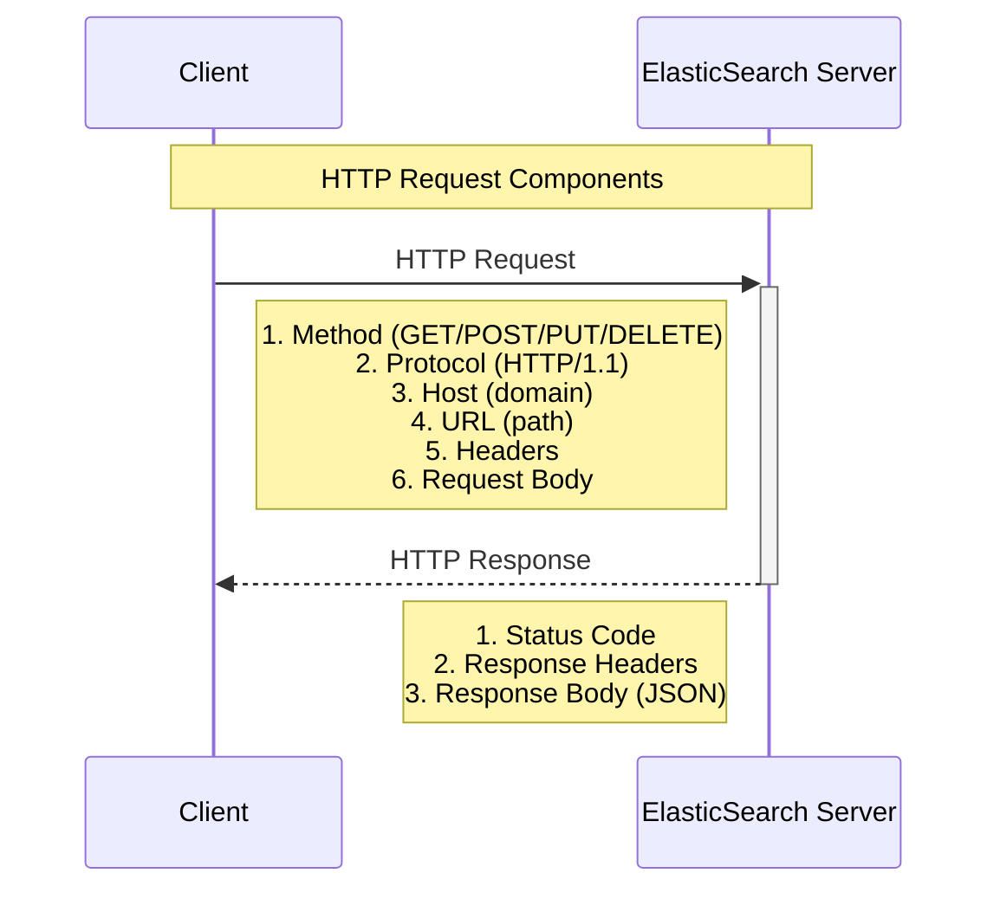

# ElasticSearch & RESTful APIs Guide


Source: [Elasticsearch for dummies](https://www.develer.com/wp-content/uploads/2019/05/Elasticsearch-1.png)


## 📚 Introduction

ElasticSearch operates on a RESTful interface, making it accessible through standard HTTP requests. This modern architecture ensures scalability, flexibility, and language-agnostic integration capabilities.

### 🌟 Key Benefits

- Language-agnostic implementation
- Scalable and distributed architecture
- Simple HTTP-based communication
- Industry-standard REST principles

## 🔄 HTTP Request/Response Flow



## 📋 HTTP Request Components

### Methods

| Method | Purpose | Example |
|--------|---------|---------|
| `GET` | Retrieve data | `GET /index/_search` |
| `POST` | Create/Update data | `POST /index/_doc` |
| `PUT` | Create new data | `PUT /index/_doc/1` |
| `DELETE` | Remove data | `DELETE /index/_doc/1` |

### Components
- Protocol (HTTP/1.1)
- Host (domain)
- URL (resource path)
- Headers (metadata)
- Request Body (optional)

## 🏗️ REST Architecture

REST (Representational State Transfer) is an architectural style that defines a set of constraints for creating web services.

## 📝 Example Queries

### Search Query
```bash
curl -H "Content-Type: application/json" \
     -X GET \
     "http://127.0.0.1:9200/shakespeare/_search?pretty" \
     -d '{
          "query": {
              "match_phrase": {
                  "text_entry": "to be or not to be"
              }
          }
     }'
```

### Data Insertion
```bash
curl -H "Content-Type: application/json" \
     -X PUT \
     "http://127.0.0.1:9200/movies/movie/109487" \
     -d '{
          "genre": ["IMAX", "Sci-Fi"],
          "title": "Interstellar",
          "year": 2014
     }'
```

## 🚀 Getting Started

1. **Installation**: Follow the [official ElasticSearch installation guide](https://www.elastic.co/guide/en/elasticsearch/reference/current/install-elasticsearch.html)
2. **Configuration**: Configure your ElasticSearch instance
3. **First Query**: Try the example queries above
4. **Learn More**: Explore the documentation below

## 📚 Additional Resources

- [Official ElasticSearch Documentation](https://www.elastic.co/guide/index.html)
- [REST API Reference](https://www.elastic.co/guide/en/elasticsearch/reference/current/rest-apis.html)
- [Query DSL Documentation](https://www.elastic.co/guide/en/elasticsearch/reference/current/query-dsl.html)

---

<div align="center">
Made with ❤️ for the ElasticSearch community
</div>
