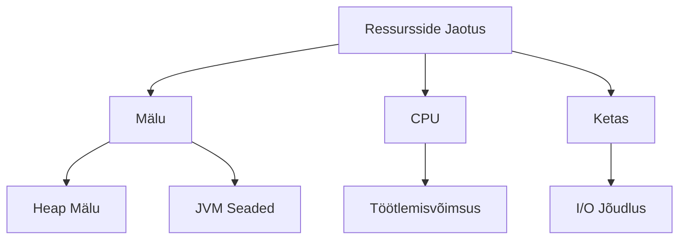
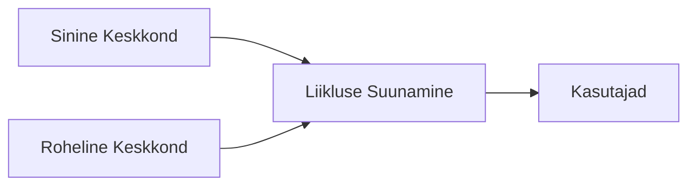

# Elasticsearch Deployment ja CI/CD

## Core Components of Cluster Design

| Component            | Description                              | Importance        |
|----------------------|------------------------------------------|-------------------|
| Node Roles           | Master-eligible, Data, Coordinating     | Critical          |
| Cluster Settings     | Cluster name, discovery mechanism       | High              |
| Shard Distribution   | Even distribution across nodes          | Medium            |

## Ressursside Jaotus



## Kõrge Käideldavus

### Fault Tolerance Measures

| Method             | Purpose                  | Implementation               |
|--------------------|--------------------------|------------------------------|
| Replication        | Data redundancy          | Configuring index replicas   |
| Node Monitoring    | Health monitoring        | Automated monitoring         |
| Backup             | Data recovery            | Regular snapshots            |

## Deployment meetodid

### Sinine-Roheline Juurutus (Blue-Green Deployment)



### Kanari Juurutus (Canary Release)

| Faas | Kirjeldus | Kasutajate % |
|------|-----------|--------------|
| 1 | Esialgne testimine | 5% |
| 2 | Laiendatud testimine | 20% |
| 3 | Täielik juurutus | 100% |

## CI/CD Integratsioon

### Automatiseeritud Pipeline

| Etapp | Tegevused | Tööriistad |
|-------|-----------|------------|
| Ehitus | Koodi kompileerimine | Jenkins, GitLab CI |
| Testimine | Automaattestid | JUnit, TestNG |
| Juurutus | Keskkonna uuendamine | Ansible, Terraform |

### Näidis Pipeline Kood

```yaml
pipeline:
  stages:
    - build
    - test
    - deploy
  
  build:
    script:
      - gradle build
  
  test:
    script:
      - gradle test
  
  deploy:
    script:
      - ansible-playbook deploy.yml
```


*Implementing GitLab CI/CD with Docker Swarm, Portainer, and Private Registry in a Local Environment*

*Source: [Medium](https://medium.com)*

## Monitooring ja Hoiatused

### Põhilised Mõõdikud

| Mõõdik | Kirjeldus | Kriitilisus |
|--------|-----------|-------------|
| CPU Kasutus | Protsessori koormus | Kõrge |
| Mälu Kasutus | Heap ja RAM kasutus | Kõrge |
| Indeksi Tervis | Killustamise olek | Keskmine |
| Päringute Latentsus | Vastuse aeg | Kõrge |

## Parimad Praktikad

1. Kasuta alati replikatsiooni tootmiskeskkonnas
2. Seadista automaatne varundamine
3. Rakenda turvaline autentimine
4. Jälgi jõudlusmõõdikuid
5. Tee regulaarseid koormusteste
