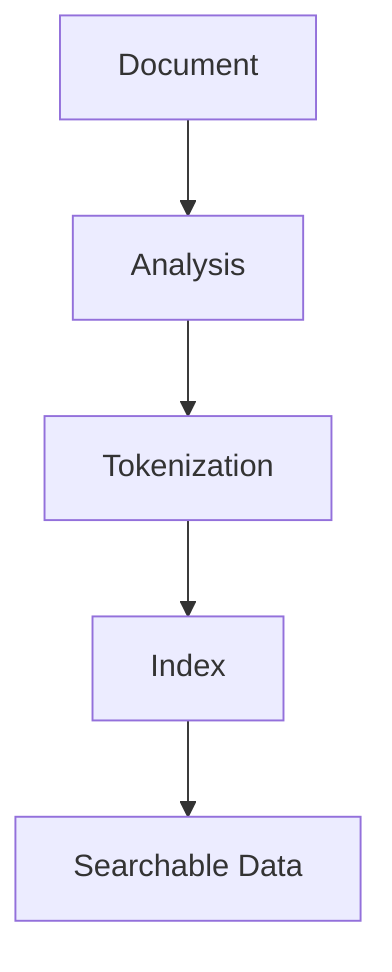
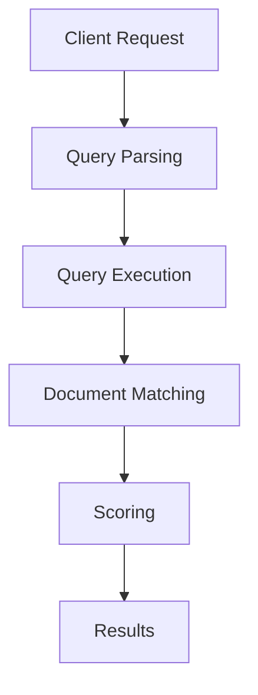

# Loeng 3: Elasticsearchi Otsing ja Päringud

## Basic Search Concepts (Põhilised otsingukontseptsioonid)


*Source: [Maruti Tech](https://cdn-gcp.new.marutitech.com)*

Põhilised otsingukontseptsioonid Elasticsearchis moodustavad otsingufunktsionaalsuse aluse, võimaldades kasutajatel tõhusalt andmeid oma indeksitest kätte saada. Siin on ülevaade:

| Component | Elasticsearch | Traditional Search |
|---------|--------------|-------------------|
| Indexing | Real-time, distributed | Batch processing |
| Scale | Horizontal | Vertical |
| Query Language | Query DSL (JSON) | SQL or Custom |
| Performance | Optimized for search | General purpose |
| Schema | Dynamic, flexible | Fixed |

## Indexing (Indekseerimine)

Indekseerimine on protsess, mille käigus teie andmed salvestatakse Elasticsearchi struktureeritud formaadis. Elasticsearch korraldab andmeid indeksitesse, mis on sarnaste omadustega dokumentide loogilised kogumid. Iga dokument esindab üht andmeüksust ja see salvestatakse JSON-formaadis.

- **Index (Indeks)**: Indeks on nagu andmebaas traditsioonilistes relatsioonilistes andmebaasides. See on kogum dokumente, millel on ühsugused omadused.
- **Document (Dokument)**: Dokument on põhiline üksus, mida saab indekseerida. See on JSON-formaadis ja sisaldab andmeväljasid koos vastavate väärtustega.



## Query Types Overview (Päringutüübid)

| Query Type | Description | Example Use Case | Complexity |
|------------|-------------|-----------------|------------|
| Match Query | Full text search with analysis | Product descriptions | Low |
| Term Query | Exact value matching | Categories, IDs | Low |
| Range Query | Numeric/date intervals | Prices, dates | Medium |
| Bool Query | Combined conditions | Complex filters | High |
| Fuzzy Query | Approximate matching | Spell correction | Medium |
| Prefix Query | Starts with pattern | Autocomplete | Low |

## Querying (Päringud)

Kui andmed on indekseeritud, saate teha otsinguid konkreetsete dokumentide leidmiseks või andmete kokkuvõtteks. Elasticsearch pakub võimsat Query DSL-i (Domain Specific Language), et koostada päringu.

- **Query DSL (Päringu DSL)**: Elasticsearchi päringu DSL on JSON-põhine keel, mida kasutatakse päringute määratlemiseks. See pakub laia valikut päringutüüpe ja valikuid andmete filtreerimiseks, agregeerimiseks ja sorteerimiseks.

### Common Query Examples

```json
// Match Query
{
  "query": {
    "match": {
      "title": "elasticsearch"
    }
  }
}

// Term Query
{
  "query": {
    "term": {
      "status": "published"
    }
  }
}

// Range Query
{
  "query": {
    "range": {
      "price": {
        "gte": 100,
        "lte": 200
      }
    }
  }
}
```

## Aggregation Types and Use Cases

| Aggregation Type | Purpose | Example Use Case | Output Type |
|-----------------|---------|------------------|-------------|
| Terms | Group by value | Popular categories | Buckets |
| Date Histogram | Time-based grouping | Monthly trends | Time buckets |
| Sum | Total value | Total sales | Single value |
| Avg | Average value | Average rating | Single value |
| Stats | Statistical analysis | Price statistics | Multiple values |
| Cardinality | Unique count | Unique visitors | Single value |

## Searching (Otsing)

Otsing Elasticsearchis hõlmab dokumentide kättesaamist, mis vastavad konkreetsetele kriteeriumidele. Elasticsearch toetab erinevat tüüpi otsinguid, sealhulgas:

- **Match Query (Match-päring):** Otsib dokumente, mis sisaldavad määratud terminit või termineid.
- **Term Query (Term-päring):** Otsib dokumente, mis sisaldavad täpset terminit kindlal väljal.
- **Range Query (Vahemiku päring):** Otsib dokumente, mille väljad sisaldavad väärtusi määratud vahemikus.
- **Bool Query (Booli päring):** Võimaldab kombineerida mitmeid päringu tingimusi (AND, OR, NOT).



## Aggregations (Agregeerimised)

Agregeerimised Elasticsearchis võimaldavad teil oma andmeid analüüsida ja saada ülevaateid. Agregeerimisi saab kasutada meetrikate arvutamiseks, histogrammide loomiseks ja palju muudeks.

```json
// Terms Aggregation Example
{
  "aggs": {
    "top_categories": {
      "terms": {
        "field": "category.keyword",
        "size": 10
      }
    }
  }
}

// Date Histogram Example
{
  "aggs": {
    "sales_over_time": {
      "date_histogram": {
        "field": "date",
        "calendar_interval": "month"
      }
    }
  }
}
```

## Relevance Scoring Components

| Component | Description | Impact on Score |
|-----------|-------------|----------------|
| TF (Term Frequency) | How often term appears in field | Higher = Better |
| IDF (Inverse Document Frequency) | How rare the term is | Rarer = Better |
| Field Length | Length of the field | Shorter = Better |
| Boost Values | Custom importance multiplier | Manual control |

## Relevance Scoring and Boosting (Relevantsuse skoorimine ja tõstmine)

Elasticsearch arvutab iga päringu tagastatud dokumendi jaoks relevantsuse skoori, mis näitab, kui hästi see vastab otsingu kriteeriumidele. Relevantsuse skoori mõjutavad tegurid nagu terminite sagedus, välja pikkus ja terminite haruldus.

```json
// Boosting Example
{
  "query": {
    "multi_match": {
      "query": "elasticsearch guide",
      "fields": [
        "title^3",
        "description"
      ]
    }
  }
}
```


*Source: [Maruti Tech](https://cdn-gcp.new.marutitech.com)*

## Advanced Query Scenarios

| Scenario | Query Type | Example |
|----------|------------|---------|
| Full-Text Search | Match | Product descriptions |
| Exact Match | Term | SKUs, IDs |
| Range Search | Range | Prices, Dates |
| Complex Search | Bool | Multiple conditions |
| Fuzzy Search | Fuzzy | Spell corrections |
| Prefix Search | Prefix | Autocomplete |

## Best Practices Summary

1. Use the right query type for your use case
2. Implement proper analyzers for text fields
3. Optimize aggregations for large datasets
4. Use caching when appropriate
5. Monitor and tune relevance scoring
