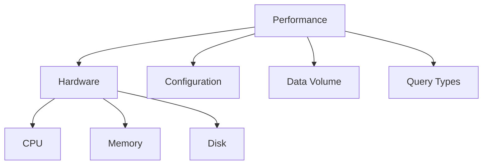

# Lecture 6: Elasticsearch Performance Tuning

## 1. Performance Basics

### What affects performance?



### Key Metrics Table

| Metric     | Good Value   | Warning Signs        |
|------------|--------------|----------------------|
| CPU Usage  | < 75%        | Constantly > 85%     |
| Memory     | < 85% heap   | Over 90% heap        |
| Disk I/O   | < 80%        | Queue forming        |
| Query Time | < 500ms      | > 1 second           |

## 2. Monitoring Tools

### Basic Health Check
```bash
# Check cluster health
GET _cluster/health

# Check node stats
GET _nodes/stats

# View slow queries
GET _nodes/stats/indices/search
```

### Warning Signs
- Red cluster status
- High CPU usage
- Slow search response
- Out of memory errors

## 3. Common Problems & Solutions

### Problem 1: Slow Searches
✅ Quick Fixes:
- Add more filters
- Use index patterns
- Limit search fields

### Problem 2: High Memory Usage
✅ Quick Fixes:
- Increase heap size
- Reduce field count
- Use doc values

### Problem 3: Indexing is Slow
✅ Quick Fixes:
- Use bulk requests
- Increase refresh interval
- Reduce replicas temporarily

## 4. Hardware Guidelines

### Minimum Requirements
- CPU: 8 cores
- RAM: 32GB
- Disk: SSD preferred
- Network: 1Gbps+

### Sizing Table

| Data Size | RAM Needed | CPU Cores | Nodes |
|-----------|------------|-----------|-------|
| < 100GB   | 32GB       | 8         | 3     |
| < 500GB   | 64GB       | 16        | 5     |
| > 1TB     | 128GB      | 32        | 7+    |

## 5. Quick Fixes Checklist

□ Check cluster health  
□ Monitor memory usage  
□ Review slow logs  
□ Optimize mappings  
□ Update settings  

### Basic Settings Template
```json
{
  "index": {
    "number_of_shards": 5,
    "number_of_replicas": 1,
    "refresh_interval": "30s"
  }
}
```

## Tips for Success

1. **Start Monitoring Early**
   - Set up monitoring before problems occur
   - Keep historical data
   - Set alerts for key metrics

2. **Regular Maintenance**
   - Check logs daily
   - Review performance weekly
   - Update settings monthly

3. **Before Production**
   - Test with real data
   - Benchmark performance
   - Plan for growth

## Emergency Steps

If performance drops suddenly:

1. Check cluster health
2. Review recent changes
3. Look at monitoring
4. Check disk space
5. Review error logs

## Need More Help?

Common error messages and solutions:

| Error             | Likely Cause    | Quick Fix          |
|-------------------|-----------------|--------------------|
| Circuit Breaker   | Memory issue    | Increase heap      |
| Too Many Requests | High load       | Add nodes          |
| Timeout           | Slow query      | Optimize search    |

## Additional Resources

- Official Elasticsearch docs
- Performance testing tools
- Community forums

Remember: Performance tuning is iterative. Start with the basics and improve gradually.
