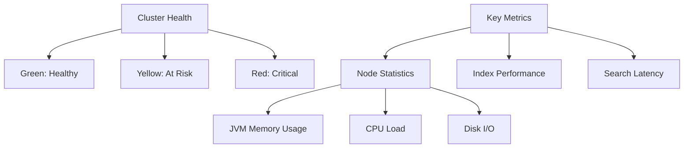

# Lecture 7: Elasticsearch Monitoring and Alerting

## Introduction
Monitoring the health and performance of an Elasticsearch cluster is critical for maintaining system reliability and efficiency. This lecture introduces the key tools and techniques for monitoring Elasticsearch and setting up alerting mechanisms.

## Monitoring Tools

### 1. Elasticsearch Monitoring API

| Feature         | Description                                             |
|-----------------|---------------------------------------------------------|
| Main Purpose    | Built-in API for monitoring cluster health and performance |
| Key Metrics     | Node statistics, index performance, JVM memory usage     |
| Usage           | API queries for troubleshooting and performance optimization |

### 2. Prometheus

| Feature         | Description                                             |
|-----------------|---------------------------------------------------------|
| Type            | Open-source monitoring and alerting system              |
| Capabilities    | Collects metrics and stores them in a time-series database |
| Integration     | Configurable to connect with Elasticsearch API           |

### 3. Grafana

| Feature         | Description                                             |
|-----------------|---------------------------------------------------------|
| Purpose         | Visualization and analytics platform                    |
| Capabilities    | Custom dashboards and alerts                            |
| Usage           | Connects with Prometheus for real-time visualization    |

## Key Metrics



### Cluster Health Indicators

| Status | Description              | Action Required     |
|--------|--------------------------|---------------------|
| 🟢 Green  | Fully functional         | Regular monitoring  |
| 🟡 Yellow | Some issues detected     | Investigation needed |
| 🟥 Red    | Critical issues detected | Immediate intervention |

## Advanced Features

### Anomaly Detection

```javascript
// Example anomaly detection rule
{
  "monitor": {
    "name": "JVM memory anomaly",
    "type": "metric",
    "schedule": "0 */5 * * * ?",
    "inputs": [{
      "search": {
        "indices": [".monitoring-es-*"],
        "query": {
          "bool": {
            "must": [
              {"range": {"timestamp": {"gte": "now-1h"}}},
              {"term": {"type": "jvm_memory"}}
            ]
          }
        }
      }
    }],
    "triggers": [{
      "name": "High JVM memory usage",
      "severity": "high",
      "condition": {
        "script": {
          "source": "ctx.results[0].hits.hits[0]._source.jvm.mem.heap_used_percent > 85"
        }
      }
    }]
  }
}
```

### Recommended Alert Thresholds

| Metric           | Warning Threshold | Critical Threshold |
|------------------|-------------------|--------------------|
| CPU Usage        | > 75%             | > 90%              |
| Memory Usage     | > 80%             | > 90%              |
| Disk Usage       | > 75%             | > 85%              |
| Search Latency   | > 500ms           | > 1000ms           |
