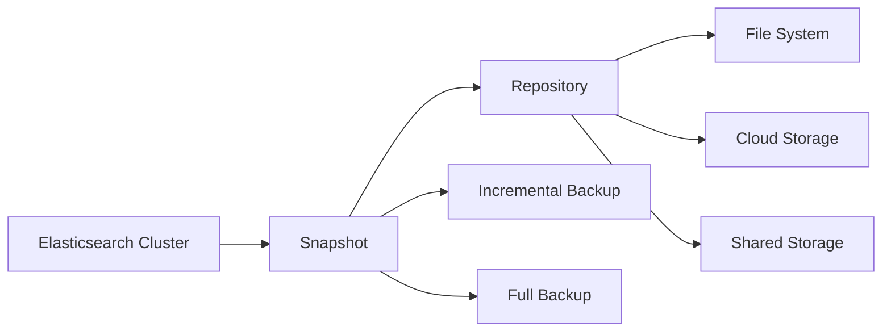
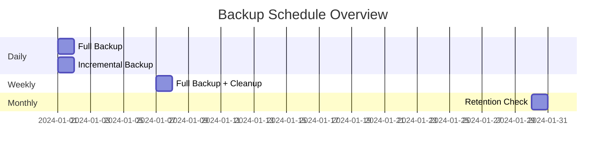

# Elasticsearch Backup & Restore: Complete Documentation Suite

## Basic Concepts Visualization



## Key Terms

- **Snapshot**: A point-in-time backup of indices and cluster state.
- **Repository**: The storage location where snapshots are saved.
- **Incremental Backup**: A backup that only includes changes since the last snapshot.
- **Recovery Point Objective (RPO)**: The maximum acceptable data loss.
- **Recovery Time Objective (RTO)**: The maximum acceptable downtime.

## Quick Start Tutorial

1. **Configure Repository**
```json
PUT /_snapshot/my_backup
{
  "type": "fs",
  "settings": {
    "location": "/mount/backups/my_backup"
  }
}
```

2. **Create First Snapshot**
```json
PUT /_snapshot/my_backup/snapshot_1
{
  "indices": "index1,index2",
  "ignore_unavailable": true,
  "include_global_state": false
}
```

3. **Basic Restore**
```json
POST /_snapshot/my_backup/snapshot_1/_restore
```

---

# Technical Documentation

## Repository Configuration

### Repository Types

| Repository Type        | Configuration         | Description                             | Example                                      |
|------------------------|-----------------------|-----------------------------------------|----------------------------------------------|
| Shared File System      | `type: "fs"`          | Local or shared filesystem storage      | ```PUT /_snapshot/my_fs_backup { "type": "fs", "settings": { "location": "/backup" }}``` |
| Amazon S3              | `type: "s3"`          | Amazon S3 cloud storage                 | ```PUT /_snapshot/my_s3_backup { "type": "s3", "settings": { "bucket": "my-bucket" }}``` |
| HDFS                   | `type: "hdfs"`         | Hadoop distributed filesystem           | ```PUT /_snapshot/my_hdfs_backup { "type": "hdfs", "settings": { "uri": "hdfs://..." }}``` |
| Azure                  | `type: "azure"`        | Azure Blob storage                      | ```PUT /_snapshot/my_azure_backup { "type": "azure", "settings": { "container": "my-container" }}``` |
| Google Cloud Storage   | `type: "gcs"`          | Google Cloud Storage                    | ```PUT /_snapshot/my_gcs_backup { "type": "gcs", "settings": { "bucket": "my-bucket" }}``` |

## File System Repository

```json
PUT /_snapshot/fs_backup
{
  "type": "fs",
  "settings": {
    "location": "/mount/backups",
    "compress": true,
    "max_snapshot_bytes_per_sec": "50mb",
    "max_restore_bytes_per_sec": "50mb"
  }
}
```

## S3 Repository

```json
PUT /_snapshot/s3_backup
{
  "type": "s3",
  "settings": {
    "bucket": "my-bucket",
    "region": "us-east-1",
    "base_path": "elasticsearch/snapshots"
  }
}
```

## Snapshot Management

### Snapshot Lifecycle


*Source: [Opster](https://opster.com)*

### Snapshot Creation Options
```json
PUT /_snapshot/my_backup/snapshot_2
{
  "indices": "index1,index2",
  "ignore_unavailable": true,
  "include_global_state": false,
  "partial": false,
  "metadata": {
    "taken_by": "admin",
    "taken_because": "backup before upgrade"
  }
}
```

---

# Administrator's Manual


*Introduction to hot-warm-cold-frozen architecture*

*Source: [Opster Guide: Elasticsearch Hot-Warm-Cold-Frozen Architecture](https://opster.com/guides/elasticsearch/capacity-planning/elasticsearch-hot-warm-cold-frozen-architecture/)*

## Backup Strategy Planning

### RPO and RTO Considerations
- Define recovery objectives
- Plan backup frequency
- Choose appropriate repository type
- Configure retention policies

### Automated Backup Configuration
```json
PUT /_slm/policy/nightly-snapshots
{
  "schedule": "0 30 1 * * ?", 
  "name": "<nightly-snap-{now/d}>",
  "repository": "my_backup",
  "config": {
    "indices": ["*"],
    "ignore_unavailable": true,
    "include_global_state": false
  },
  "retention": {
    "expire_after": "30d",
    "min_count": 5,
    "max_count": 50
  }
}
```


*Source: [Opster](https://opster.com)*


*Source: [Opster](https://opster.com)*


*Source: [Opster](https://opster.com)*

## Monitoring and Maintenance

### Snapshot Status Monitoring
```json
GET /_snapshot/_status
GET /_snapshot/my_backup/snapshot_1/_status
```

### Repository Maintenance
```json
POST /_snapshot/my_backup/_cleanup
POST /_snapshot/my_backup/_verify
```

---

# Troubleshooting Guide

## Common Issues and Solutions

### Failed Snapshots
1. Check repository accessibility.
2. Verify storage space.
3. Review cluster health.
4. Check network connectivity.

### Failed Restores
1. Verify snapshot availability.
2. Check index name conflicts.
3. Verify cluster state.
4. Review error logs.

## Monitoring Dashboard



---

# Quick Reference

## Essential Commands

### Repository Management
```bash
# Create repository
PUT /_snapshot/my_backup
# Verify repository
POST /_snapshot/my_backup/_verify
# Delete repository
DELETE /_snapshot/my_backup
```

### Snapshot Operations
```bash
# Create snapshot
PUT /_snapshot/my_backup/snapshot_1
# Check status
GET /_snapshot/my_backup/snapshot_1/_status
# Delete snapshot
DELETE /_snapshot/my_backup/snapshot_1
```

### Restore Operations
```bash
# Full restore
POST /_snapshot/my_backup/snapshot_1/_restore
# Selective restore
POST /_snapshot/my_backup/snapshot_1/_restore
{
  "indices": "index1",
  "rename_pattern": "index(.+)",
  "rename_replacement": "restored_index$1"
}
```
