# Vaatlus ja Seire Alused

**Eeldused:** Linux CLI, põhilised võrgumõisted

**Platvorm:** Platvormist sõltumatu (kontseptsioonid)

**Dokumentatsioon:** [observability.dev](https://observability.dev/)

## Õpiväljundid

- Selgitad, miks süsteeme tuleb jälgida
- Eristád logimist, seiret ja vaatlust
- Mõistad mõõdikute, logide ja jälgede rolli
- Kirjeldad USE ja RED meetodeid
- Oskad valida õigeid tööriistu

---

## 1. Mis on Logimine?

Logimine on süsteemis toimuvate sündmuste salvestamise protsess. See on nagu süsteemi päevik - salvestab kõike kasutajate sisselogimistest süsteemi vigadeni ja turvanõrkusteni.

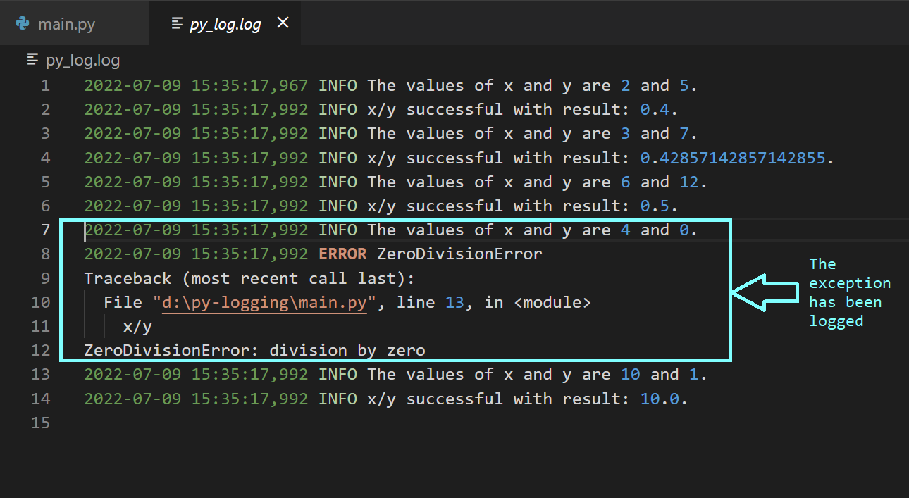

### Logimise Eesmärk

**Süsteemi seire ja diagnostika.** Logid annavad reaalajas ülevaate süsteemi käitumisest. Kui rakendus aeglustub, näitavad logid täpselt, milliseid päringuid ta töötleb, kui kaua iga operatsioon võtab ja kus tekivad pudelikaelad.

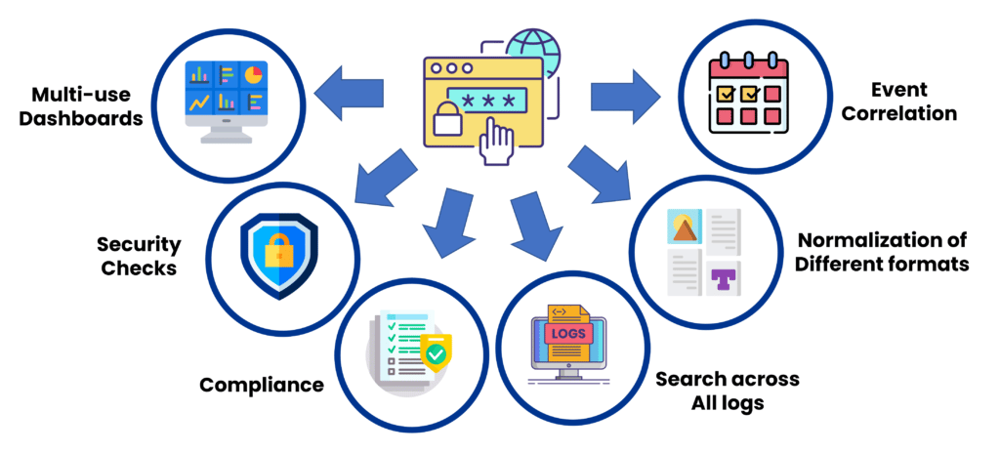

**Veaotsing ja arendus.** Arendajad vajavad detailset teavet, et mõista, miks rakendus mingil juhul ebaõnnestus. Stack trace'id, muutujate väärtused ja täitmise kulg - kõik see on logides.

**Auditeerimine ja vastavus.** Paljud regulatsioonid (GDPR, HIPAA, SOX) nõuavad detailset jälgimist, kes millalegi juurdepääsu sai ja mida tegi.

**Turvalisuse jälgimine.** Turvalogid näitavad sisselogimiskatseid, õiguste muudatusi, kahtlaseid päringuid. Need on esimene kaitseline, mis aitab tuvastada rünnakuid varakult.

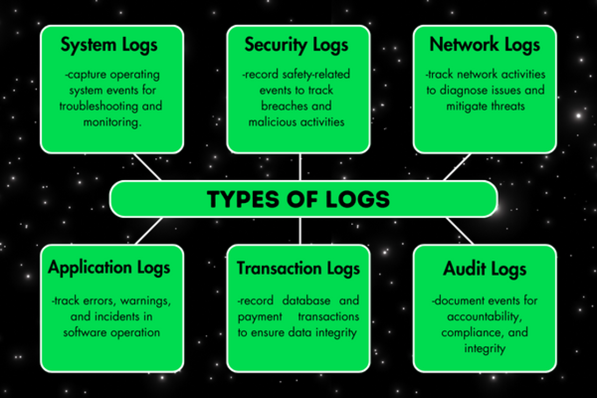

### Parimad Tavad Logimises

**Tsentraliseeritud logimine** tähendab, et kõik logid suunatakse ühte kohta. Selle asemel et logida SSH-ga 50 serverisse ja otsida seal lokaalsetest failidest, kasutage lahendust nagu ELK Stack või Loki.

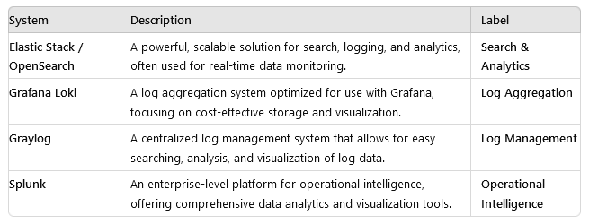

**Struktureeritud logid** kasutavad JSON formaati, mis muudab analüüsi lihtsamaks. **Logide rotatsioon** hoiab failid mõistliku suurusega. **Log level'id** aitavad filtreerida (DEBUG, INFO, WARN, ERROR, FATAL).

---

## 2. Mis on Seire?

Seire hõlmab süsteemi jõudluse, kättesaadavuse ja üldise tervise pidevat jälgimist. Erinevalt logimisest, mis salvestab diskreetseid sündmusi, keskendub seire mõõdikutele ja näitajatele, mis peegeldavad süsteemi töökorda ajas.

### Reede Õhtu Õudusunenägu

Kujutage ette: reede, kell 18:00. Teie e-pood. Black Friday. Äkki hakkavad kasutajad kaebama:

```
18:05 - Twitter: "Teie leht ei lae!"
18:07 - Email: "Maksed ei tööta!"
18:10 - CEO: "MIS TOIMUB?!"
18:12 - Sina: "...ma ei tea 😰"
```

**Tulemus:** 2 tundi downtime. 50,000 eurot kadunud müüki. Kliendid vihased. CEO veel vihane-m.

### Olulised Süsteemi Mõõdikud

**Süsteemi elutähtsad näitajad:**
- **LoadAvg ja CPU kasutus** - CPU on süsteemi aju
- **Mälu/ketta kasutus** - Mälu (RAM) on lühiajaline, ketas pikaajaline mälu
- **Võrgu jõudlus (bps/pps)** - Kui kiiresti andmed liiguvad
- **Ketta koormus** - Kui palju salvestusseadmed töötavad

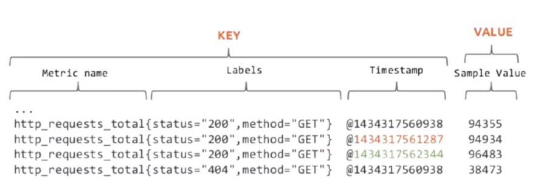

### Mõõdik = Aegrida

Mõõdikud on seiresüsteemide põhitoode ning neid jäädvustatakse sageli aegridadena. Mõelge aegridadest kui sündmuste ajateljest - iga andmepunkt jutustab loo sellest, mis konkreetsel hetkel toimub.

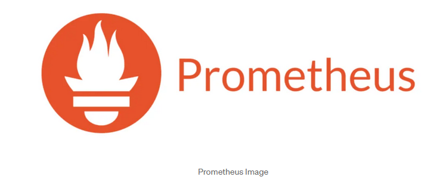

**Ajaline orientatsioon** - Igal andmepunktil on ajatempel. **Ainult lisamine** - Kui andmepunkt on lisatud, seda enam ei muudeta. **Värske andmete fookus** - Reaalajas andmed on kõige olulisemad.

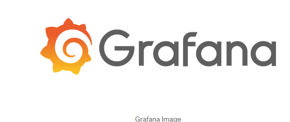

---

## 3. Seire Tööriistad

Seire tööriistad on teie usaldusväärsed kaaslased süsteemide tervise ja jõudluse jälgimisel.

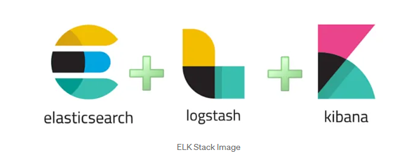

### Populaarsete Tööriistade Võrdlus

| Tööriist | Parim kasutus | Põhiomadused |
|----------|---------------|--------------|
| **Nagios** | Infrastruktuur | Usaldusväärne, klassikaline |
| **Zabbix** | Ettevõtted | Kõik-ühes lahendus |
| **Prometheus** | Pilvetehnoloogiad | Kubernetes, mikroteenused |
| **Grafana** | Visualiseerimine | Ilusad juhtpaneelid |

### Teavitusmeetodid

Tõhus teavitamine on seiresüsteemide süda - oluline on tagada, et teid teavitatakse õigel ajal ja õigel viisil.

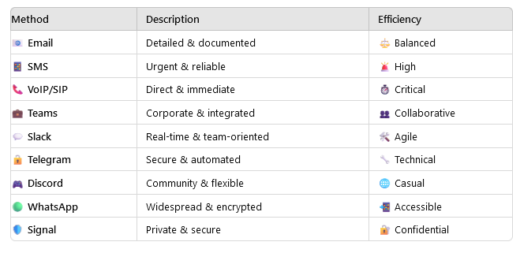

**Teavituskanalid:**
- **Email** - Aeglane, aga jätab jälje
- **Slack/Teams** - Kiire, meeskond näeb
- **SMS/Telefon** - Äratab sind öösel, ainult Critical!
- **PagerDuty** - Professionaalne on-call süsteem

### Parimad Tavad Seires

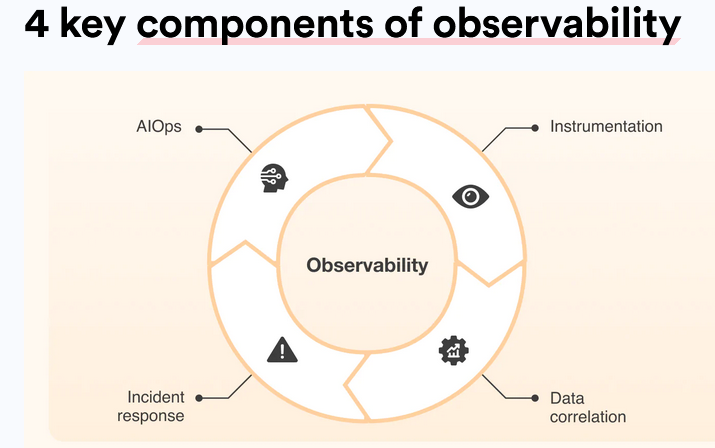

**Selged mõõdikud ja hoiatused:**
- Määratlege konkreetsed künnised
- Seadke tähendusrikkad hoiatused
- Vältige hoiatuste väsimust
- Dokumenteerige hoiatuste reaktsioonid

**Regulaarne ülevaatusprotsess:**
- Analüüsige seireandmeid
- Kohandage künniseid vastavalt vajadusele
- Uuendage seirereegleid

---

## 4. Mis on Vaatlus?

Vaatlus (observability) läheb seirest kaugemale. Kui seire vastab küsimusele "kas süsteem töötab?", siis vaatlus vastab küsimustele "miks see töötab nii?" ja "mis täpselt toimub?".

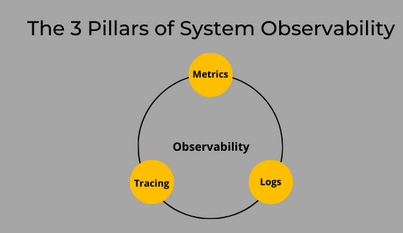

### Vaatluse Kolm Sammast

**Logid** annavad diskreetse sündmuste ajaloo. **Mõõdikud** on numbrilised aegread. **Jäljed** kaardistas päringute kulgu läbi hajutatud süsteemi.

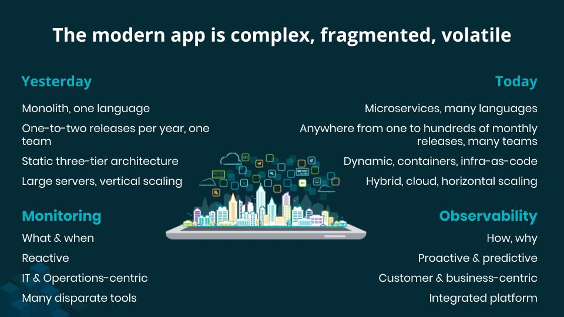

Need kolm koos annavad täieliku pildi. Kui kasutaja kaebab aeglast lehekülge:
- **Jäljed** näitavad, et päring võttis 5 sekundit
- **Jäljed** näitavad, et 4.5 sekundit kulus andmebaasi päring
- **Logid** näitavad, et andmebaas tegi täistabeli skaneerimise
- **Mõõdikud** näitavad, et andmebaasi CPU oli 100%

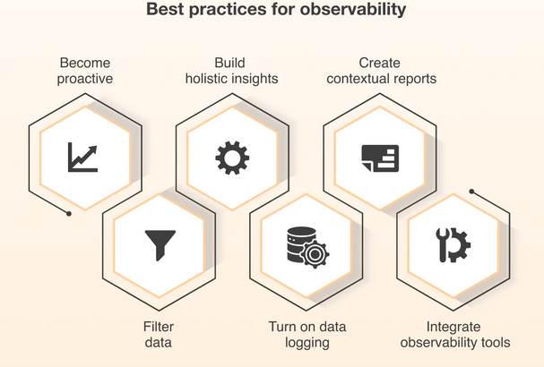

### Vaatluse Parimad Tavad

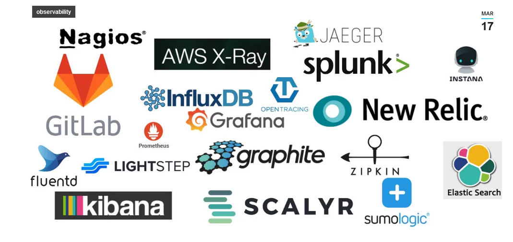

**Ühine lähenemine:**
- Integreerige kõik andmeallikad
- Tagage järjepidev mõõdikute kogumine
- Kasutage standardiseeritud analüüsimeetodeid

**Keskendumine ärimõjule:**
- Jälgige kriitilisi tehinguid
- Jälgige kasutajakogemust
- Mõõtke ärimõõdikuid

---

## 5. Mis on Jälgimine?

Jälgimine (tracing) jälgib päringute liikumist läbi erinevate teenuste või komponentide hajutatud süsteemides, eriti mikroteenuste arhitektuurides.

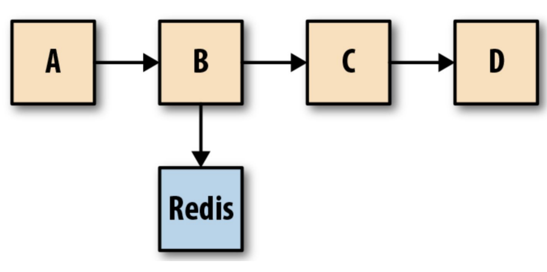

### Võtmevõimed

**Täitmisaja mõõtmine** - Operatsiooni kestuse jälgimine, aeglaste komponentide tuvastamine.

**Päringute profileerimine** - Päringumustrite analüüsimine, ressursikasutuse mõõtmine.

**Sõltuvuste kaardistamine** - Teenuste ühenduste avastamine, päringuvoogude visualiseerimine.

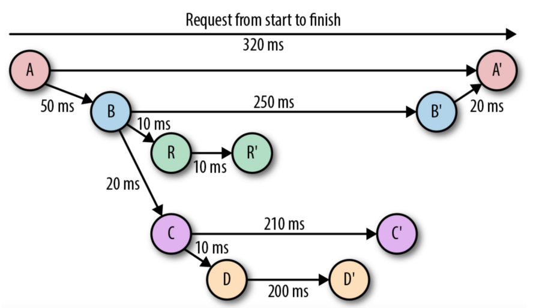

**Jälgimise tööriistad:**
- **Zipkin** - Hajutatud jälgimissüsteem
- **Grafana Tempo** - Skaleeritav jälgimise tagataust
- **OpenTelemetry** - Avatud lähtekoodiga raamistik

---

## 6. Intsidentide Haldamine

Hoolimata parimast seirest ja vaatlusest, ikka juhtuvad intsidendid. Oluline on, kuidas te neile reageerite.

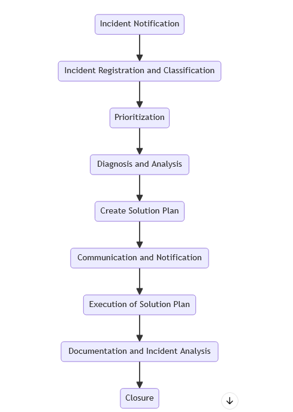

### Intsidendiprotsess

**Tuvastamine** → **Klassifitseerimine** → **Uurimine** → **Lahendamine** → **Dokumenteerimine** → **Postmortem**

**Võtmeisikud:**
- **Arendustiim** - Vigade parandamine
- **Käitusvõistkond** - Hoiab serverid töös
- **SRE spetsialistid** - Tagavad süsteemide töökindluse
- **ITIL raamistik** - Reeglistik kaose haldamiseks

---

## 7. Turvalisus ja Vastavus

Logimine ja seire pole ainult tehniline küsimus - need on ka õiguslik nõue paljudes valdkondades.

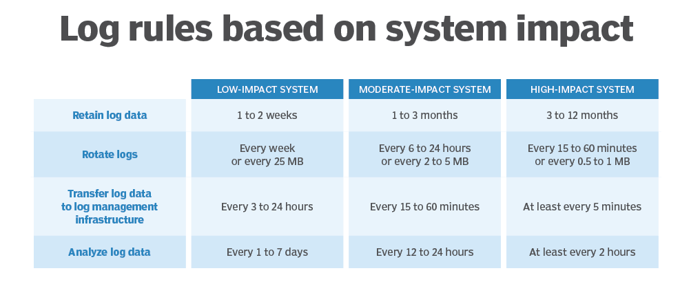

### GDPR ja Isikuandmed

Euroopa Liidu Üldine Andmekaitse Määrus nõuab:
- Logivad kõik juurdepääsud isikuandmetele
- Kustutavad isikuandmed nõudmisel
- Teavitavad andmelekkest 72 tunni jooksul

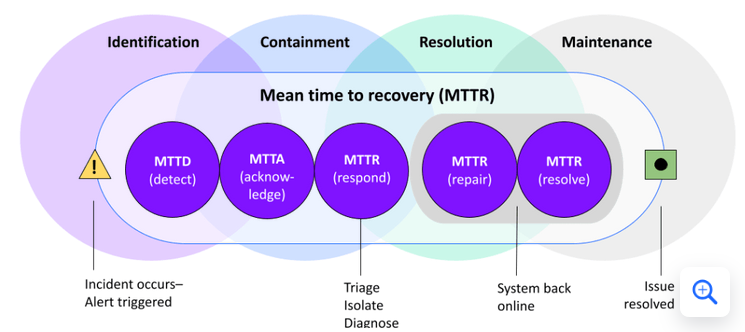

### Turvaseire

**SIEM** (Security Information and Event Management) on spetsialiseeritud seire turvalogide jaoks. **Korrelatsioonreeglid** otsivad mustreid - ebaõnnestunud login'id + õnnestunud login = võimalik kompromiteerimine.

---

## 8. Kuidas Professionaalselt Probleeme Lahendada

Kui IT-s midagi katkeb, on veaotsing teie supervõime!

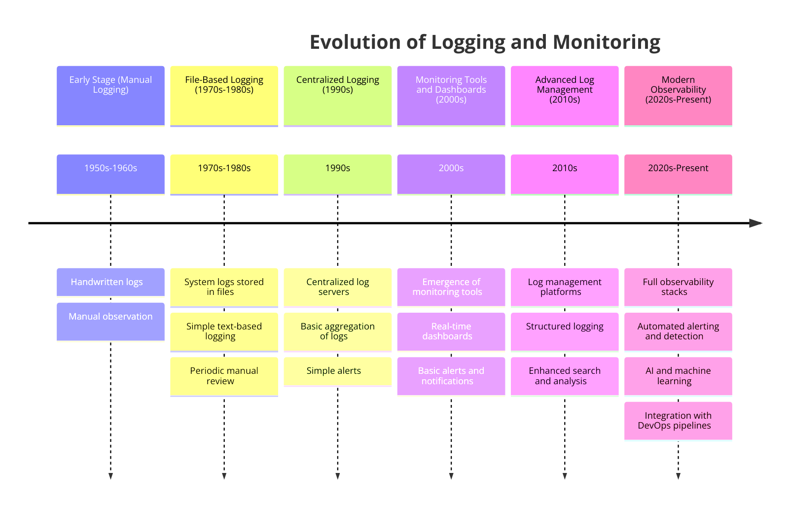

### 3-Sammuline Plaan

**1. Esialgne detektiivitöö** - Tuvastage sümptomid, kontrollige logisid, süvenege seire juhtpaneelidesse.

**2. Leidke juurpõhjus** - Otsige mustreid logides, analüüsige mõõdikuid, leidke seoseid.

**3. Lahendage ja kinnitage** - Rakendage lahendused, testige, kirjutage kõik üles.

### Levinud Takistused

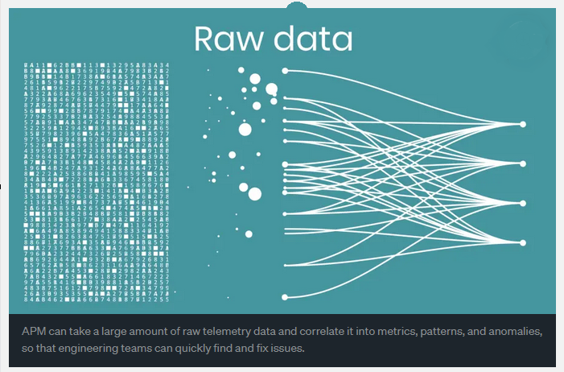

- **Puuduvad logid** - Tunnete end pimedana
- **Pole mõõdikuid** - Lendate ilma instrumentideta
- **Kehv korrelatsioon** - Ei suuda ühendada punkte
- **Nõrk dokumentatsioon** - Märkmete puudumine = õppetundide puudumine

---

## 9. Logimise ja Seire Evolutsioon

Alustades lihtsatest tekstifailidest kuni võimsate tööriistadeni, mis tunduvad maagilised - logimine ja seire on läbinud pika tee.

### Varajased Päevad

**Põhitööriistad:**
- Tekstilised logifailid
- Põhilised süsteemikäsud (`tail`, `grep`)
- Käsitsi ülevaatus
- Piiratud seire

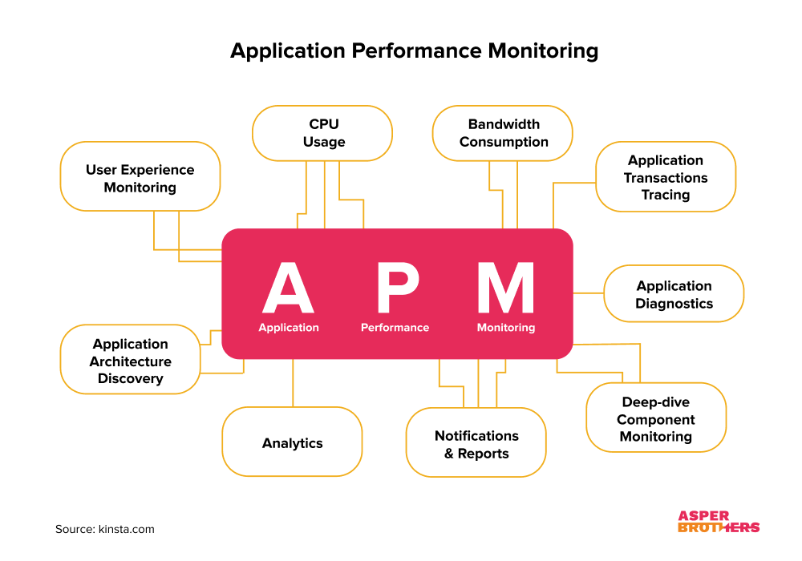

### Kaasaegne Ajastus

**Järgmise taseme tööriistad:**
- **Prometheus** - Avatud lähtekoodiga võimsus
- **ELK Stack** - Logide meisterlikkus
- **Grafana** - Kõik-ühes visualiseeringud

### Üleminek Vaatlusele

Üleminek põhiliselt seirelt täielikule vaatlusele on nagu binoklitest teleskoobile üleminek.

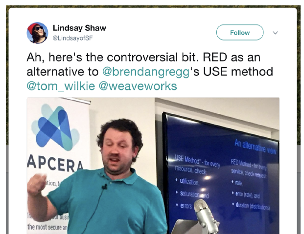

### Peamised Vaatlusmeetodid

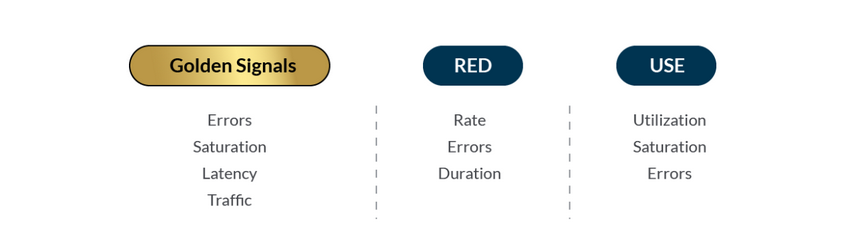

**USE meetod** (Utilization, Saturation, Errors) - Kasuta süsteemiressursside jälgimiseks.

**RED meetod** (Rate, Errors, Duration) - Kasuta API-de ja teenuste jälgimiseks.

**Golden Signals** - Latency, Traffic, Errors, Saturation.

### Ressursside Haldamine

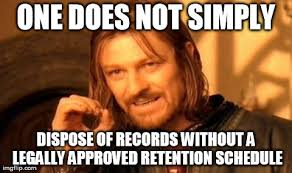

Ressursside haldamine on nagu eelarvehaldur teie süsteemi jaoks:
- Jälgige kasutust
- Jälgige küllastust
- Ennustage vajadusi
- Skaleerige arukalt

---

## 10. Kaasaegne Logihaldus

Logid on nagu teie süsteemi salajane päevik, salvestades kõike, mis toimub.

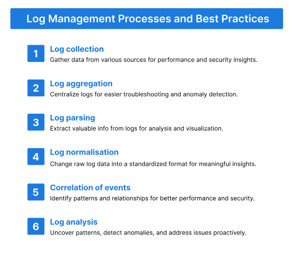

### Parimad Tööriistad

**Splunk** - Täiustatud analüüs, masinõpe, reaalajas jälgimine.

**ELK Stack komponendid:**
- **Elasticsearch** - Otsingumootor
- **Logstash** - Kogub ja töötleb
- **Kibana** - Visualiseerimine

**Loki** - Lihtsam alternatiiv ELK-ile, Grafana integratsioon.

---

## Kokkuvõte

### Peamised Õppetunnid

**Seire on kohustuslik.** Ilma selleta oled pime. Esimene incident õpetab seda valulikul viisil.

**Kolm sammast:** Logid (mis juhtus?), Mõõdikud (kui palju?), Jäljed (kus aeglustub?).

**Meetodid:** USE süsteemidele, RED teenustele. Need 4-7 mõõdikut annavad 80% infost.

**Tööriistad:** Prometheus + Grafana on hea algus. Lihtne, võimas, tasuta.

**Hoiatused:** Vähe, aga õigeid. Actionable. Õige tõsiduse tasemed.

### Järgmine Samm

1. **Prometheus loeng** - Kuidas Prometheus töötab, PromQL, arhitektuur
2. **Prometheus labor** - Paigaldad, seadistad, lood hoiatusi

**Eesti DevOps tarkus:** "Parim aeg seire lisamiseks oli eile. Teine parim aeg on täna."

---

## Kasulikud Ressursid

**Lugemine:**
- [Google SRE Book](https://sre.google/books/) - Tasuta, must-read
- [Monitoring 101](https://www.datadoghq.com/blog/monitoring-101-collecting-data/)
- [USE Method](http://www.brendangregg.com/usemethod.html)

**Järgmine:**
- Prometheus loeng - Deep dive Prometheus'esse
- Prometheus labor - Hands-on praktika
