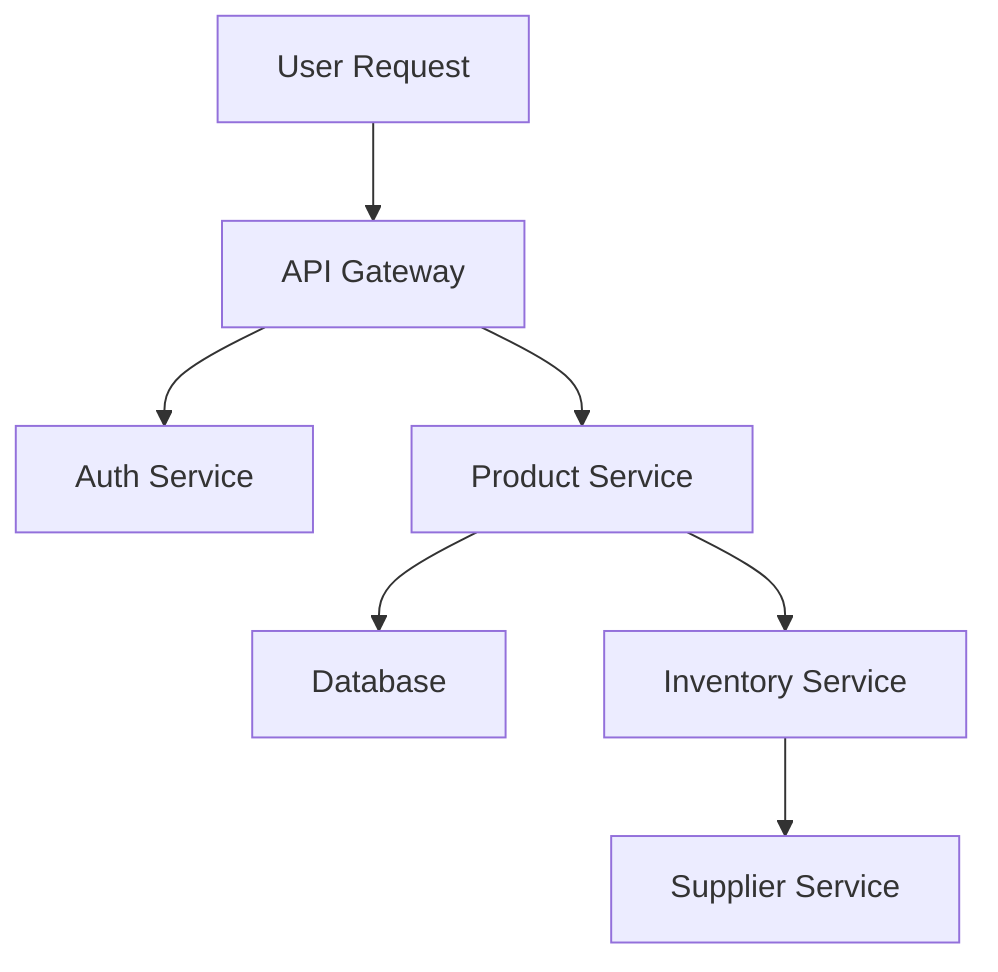
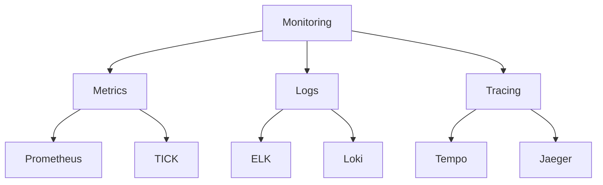
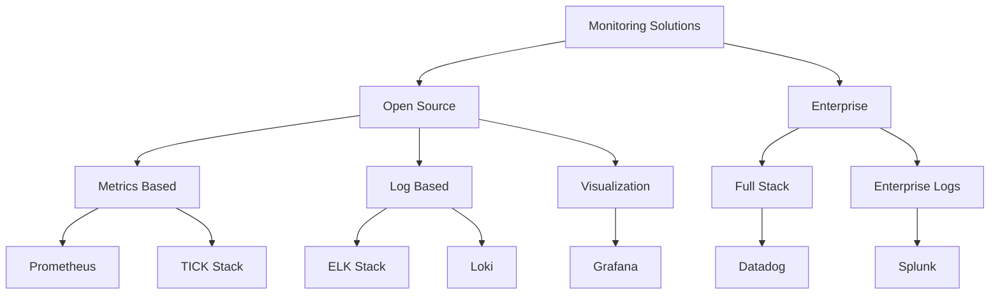
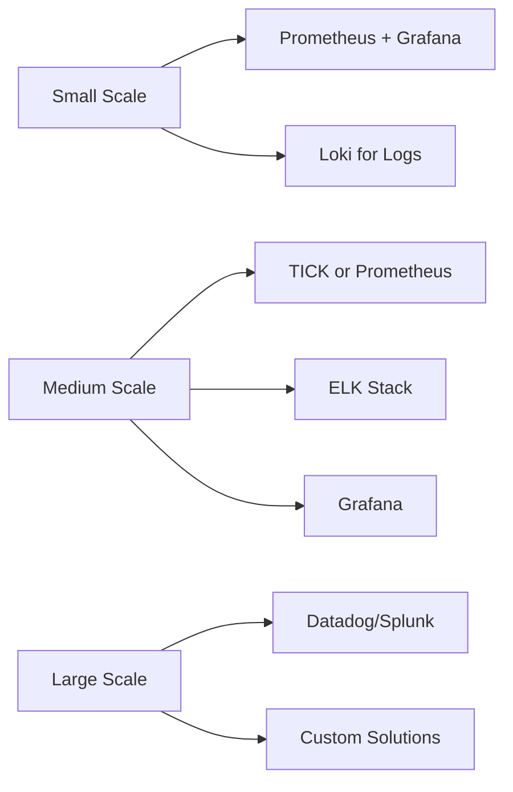
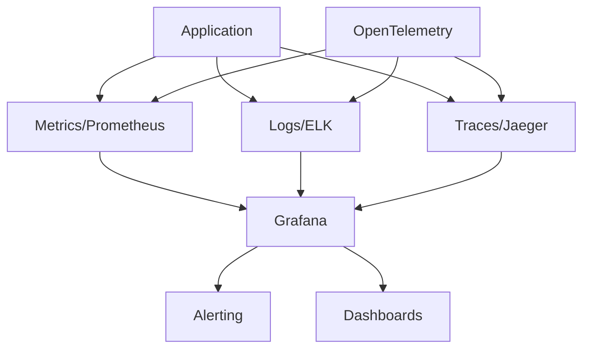
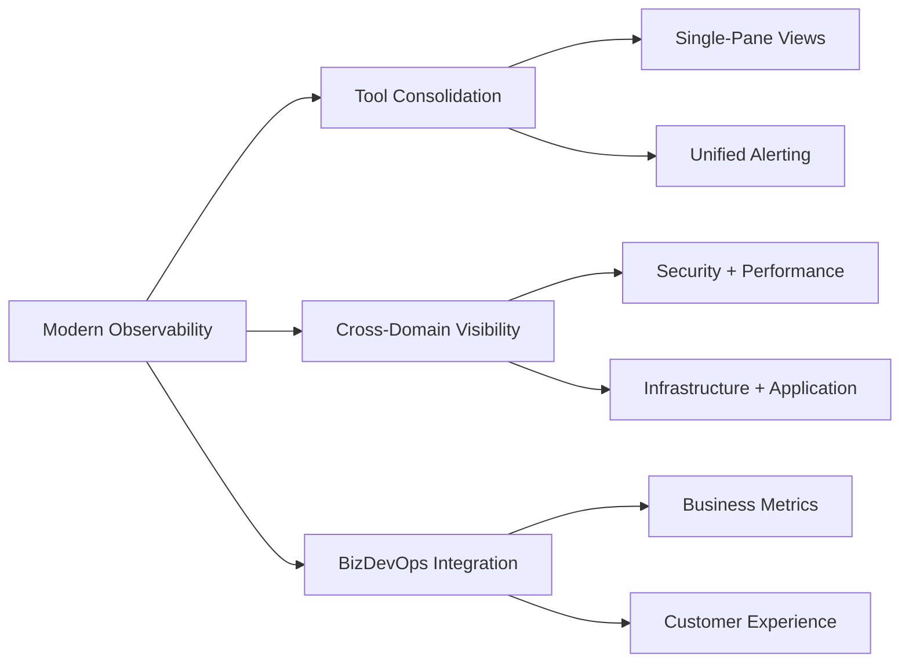
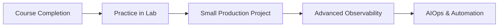

## Final Assessment Guidance

### Preparing for Your Course Assessment

#### Key Concepts to Review
- The differences between monitoring and observability
- The three pillars: metrics, logs, and traces
- Strengths and weaknesses of each monitoring stack
- Implementation considerations for different environments
- Cost and scaling factors for each solution

#### Practice Questions
1. Compare and contrast Prometheus and the TICK Stack for IoT monitoring
2. How would you implement log aggregation in a microservices environment?
3. Describe a complete observability solution for a cloud-native application
4. What factors would influence your choice between ELK and Loki?
5. How does distributed tracing complement metrics and logging?

#### Final Project Guidelines
Your final project should demonstrate your ability to:
- Select appropriate monitoring tools for a specific use case
- Configure basic collection, storage, and visualization
- Create meaningful dashboards that tell a story
- Implement effective alerting with minimal noise
- Document your solution and justify your choices

#### Evaluation Criteria
- **Technical accuracy**: Correct implementation of tools
- **Design decisions**: Appropriate tool selection
- **Effectiveness**: Dashboards that provide actionable insights
- **Completeness**: Coverage of key system components
- **Documentation**: Clear explanation of your approach

Good luck with your assessment! Remember that the goal is to demonstrate your understanding of observability concepts and your ability to apply them in real-world scenarios.## Course Summary

This course provided a comprehensive exploration of modern observability and monitoring solutions, equipping you with the knowledge to make informed decisions for your specific environment.

### What We Covered

#### Core Monitoring Stacks
- **Prometheus**: Metrics collection optimized for Kubernetes
- **TICK Stack**: Time-series platform for IoT and custom metrics
- **ELK Stack**: Powerful log processing and analysis
- **Grafana**: Visualization platform connecting multiple data sources
- **Distributed Tracing**: Transaction flow visualization with Jaeger/Tempo

#### Practical Skills Developed
- Deploying and configuring monitoring tools
- Creating effective dashboards and alerts
- Correlating signals across metrics, logs, and traces
- Scaling observability solutions for enterprise needs
- Implementing modern observability practices

#### Key Takeaways
- Observability is more than monitoring—it's about gaining actionable insights
- The right solution depends on your specific requirements and environment
- Open-source options provide robust capabilities with community support
- Enterprise solutions offer integration and support at a premium
- Future trends point toward unified observability and intelligence## Advanced Observability & Tracing

### Observability Pillars
| Pillar | Description | Key Tools | Benefits |
|--------|-------------|-----------|----------|
| **Metrics** | Numeric representations of data measured over time | Prometheus, TICK Stack | • System health overview • Performance trends • Alerting capabilities |
| **Logs** | Timestamped records of discrete events | ELK Stack, Loki | • Detailed event information • Debugging context • Audit trails |
| **Traces** | End-to-end transaction flow visualization | Jaeger, Tempo, Zipkin | • Request path visualization • Bottleneck identification • Service dependencies |

### Distributed Tracing Deep Dive

#### Key Tracing Concepts:
- **Spans**: Individual operations within a trace
- **Context Propagation**: Passing trace information between services
- **Sampling**: Capturing representative subset of traces
- **Correlation**: Connecting traces with logs and metrics
- **Service Graphs**: Automatically generated topology maps

#### Leading Tracing Tools:

| Tool | Strengths | Ecosystem | When to Choose |
|------|-----------|-----------|----------------|
| **Jaeger** | • Open source • Strong Kubernetes integration | CNCF, works with Prometheus | ✅ Kubernetes environments ✅ Microservices architecture |
| **Zipkin** | • Simpler architecture • Broad language support | Spring Cloud, works with many frameworks | ✅ Existing Spring stack ✅ Simpler deployments |
| **Tempo** | • Grafana native • Efficient storage | Grafana ecosystem, works with Loki | ✅ Already using Grafana ✅ High-volume tracing |
| **AWS X-Ray** | • AWS integration • Serverless support | AWS ecosystem | ✅ AWS-hosted applications ✅ Lambda functions |

#### OpenTelemetry Framework
- Universal standard for telemetry data
- Vendor-neutral instrumentation
- Reduces tool switching costs
- Supported by major cloud providers# Observability & Monitoring Course - Final Overview

## Core Solutions We'll Study

### Prometheus

- Metrics collection and alerting
- Perfect for Kubernetes monitoring
- Pull-based architecture

### TICK Stack

- Time-series data platform
- **Components:**
  - Telegraf: Data collection
  - InfluxDB: Time-series database
  - Chronograf: Visualization
  - Kapacitor: Processing and alerting

### ELK Stack

- Logs processing and analysis
- **Components:**
  - Elasticsearch: Search & storage
  - Logstash: Log processing
  - Kibana: Visualization
  - Beats: Data shippers

### Grafana

- Visualization platform
- Multiple data source support
- Dashboarding solution

## Additional Solutions (Overview Only)

### Modern Alternatives
- **Grafana Loki**

  - Like Prometheus, but for logs
  - Lightweight and cost-effective

### Enterprise Solutions
- **Datadog**

  - Full-stack monitoring
  - Cloud-native platform

- **Splunk**

  - Enterprise log management
  - Security and analytics focus

## Detailed Comparison

| Solution | Type | Cost | Specific Use Cases | Best For | Infrastructure | Course Coverage |
|----------|------|------|-------------------|-----------|----------------|-----------------|
| Prometheus | Metrics | Free, Open Source | • Container monitoring • Microservices metrics • Auto-scaling | • Kubernetes environments • Cloud-native apps | • Small to large scale • Requires own infrastructure | Detailed |
| TICK | Metrics & Events | Free + Enterprise options | • IoT monitoring • System metrics • Network data | • Real-time analytics • Custom metrics | • Medium to large scale • Can be resource-heavy | Detailed |
| ELK | Logs | Free + Paid features | • Log analysis • Application monitoring • Search functionality | • Full-text search • Application logs • Business analytics | • Resource intensive • Scales well | Detailed |
| Grafana | Visualization | Free + Enterprise | • Dashboard creation • Metric visualization • Alert management | • Multi-source dashboards | • Light on resources • Works with any data source | Detailed |
| Loki | Logs | Free, Open Source | • Container logs • Application logs | • Kubernetes environments • Cost-sensitive setups | • Lightweight • Efficient storage | Overview |
| Datadog | Full-stack | Expensive, Commercial | • Full system monitoring • APM • Cloud monitoring | • Enterprise environments • Complex systems | • SaaS (no infrastructure needed) | Overview |
| Splunk | Logs & Analytics | Most Expensive, Enterprise | • Security monitoring • Compliance • Business intelligence | • Large enterprises • Security operations | • Very resource intensive • Complex setup | Overview |

### Cost Scale:
- **Free**: Prometheus, Community versions
- **Moderate**: ELK Stack (with paid features), TICK (enterprise), Grafana Enterprise
- **Expensive**: Datadog ($15-23 per host/month)
- **Very Expensive**: Splunk ($150+ per GB/day)

# Comprehensive Solution Overview

## 2. Core Solutions Comparison

| Solution | Type | Cost | Main Strength | Main Challenge | Best Use Case |
|----------|------|------|---------------|----------------|---------------|
| Prometheus | Metrics | Free | K8s Integration | Scaling Storage | Container Monitoring |
| TICK | Time Series | Mixed | Real-time Data | Complex Setup | IoT & Streaming |
| ELK | Logs | Mixed | Search Power | Resource Heavy | Log Analysis |
| Grafana | Visualization | Free+ | Multi-Source | Plugin Management | Universal Dashboards |
| Loki | Logs | Free | K8s Friendly | Limited Search | Container Logs |
| Datadog | Full Stack | $$ | Easy to Use | Expensive | Enterprise Cloud |
| Splunk | Enterprise | $$ | Power & Scale | Very Expensive | Large Enterprise |

## 3. Modern Monitoring Trends

### Current Trends
- 🔄 **Observability over Monitoring**: Shift from reactive monitoring to proactive observability with metrics, logs, and traces
- 🤖 **AI/ML Integration**: Automated anomaly detection and predictive analytics
- ☁️ **Cloud-Native Solutions**: Kubernetes-native monitoring tools
- 🔗 **OpenTelemetry Adoption**: Standardized instrumentation protocols
- 📊 **Real-Time Analytics**: Stream processing for immediate insights
- 🔍 **Distributed Tracing**: End-to-end request flow visualization

### Future Directions
- 🎯 **AIOps Integration**: AI-powered IT operations
- 🔐 **Enhanced Security Monitoring**: SecOps and DevSecOps integration
- 🌐 **Edge Monitoring**: Decentralized observability for edge deployments
- ⚡ **Real-Time Processing**: Sub-second detection and resolution
- 🤝 **Unified Observability Platforms**: Consolidated tooling
- 🧠 **Contextual Intelligence**: Business metrics correlation with technical telemetry
- 🌍 **eBPF Technology**: Kernel-level observability without code changes

## 4. Selection Guide

### By Organization Size

- **Small**: Low cost, community support, easy start
- **Medium**: Balanced features, mixed open/commercial, good scalability
- **Large**: Full support, enterprise features, comprehensive tools

## 5. Key Takeaways & Best Practices

### What You Should Remember
- **No One-Size-Fits-All**: Choose tools based on your specific requirements
- **Start with the Basics**: Implement core monitoring before advanced observability
- **Follow the Three Pillars**: Metrics, logs, and traces provide complete visibility
- **Consider Total Cost**: Factor in infrastructure, storage, and maintenance
- **Plan for Scale**: Today's solution should accommodate tomorrow's growth

### Common Implementation Pitfalls
- ⚠️ **Alert Fatigue**: Too many alerts lead to ignored critical notifications
- ⚠️ **Data Hoarding**: Collecting everything without purpose wastes resources
- ⚠️ **Tool Sprawl**: Using too many disconnected tools creates silos
- ⚠️ **Neglecting User Experience**: Technical dashboards that business users can't understand
- ⚠️ **Missing Context**: Failing to correlate signals across metrics, logs, and traces

### Monitoring Maturity Model

| Level | Focus | Characteristics | Tools |
|-------|-------|-----------------|-------|
| **Level 1: Basic** | Reactive | • Basic metrics • Manual checks • Ad-hoc troubleshooting | • Simple dashboards • System logs • Infrastructure metrics |
| **Level 2: Standardized** | Proactive | • Consistent metrics • Centralized logging • Defined alerts | • Prometheus • ELK Stack • Grafana |
| **Level 3: Advanced** | Comprehensive | • Custom instrumentations • Tracing • SLOs/SLIs | • APM tools • Distributed tracing • Custom metrics |
| **Level 4: Optimized** | Intelligence | • Anomaly detection • Predictive analytics • Automation | • AIOps • ML-based solutions • Advanced correlation |

## 6. Real-World Integration Example

### Modern Observability Architecture

1. **Data Collection Layer**
   - OpenTelemetry for standardized instrumentation
   - Agent-based and agentless collection
   - Push and pull mechanisms

2. **Storage Layer**
   - Time-series databases for metrics
   - Document stores for logs
   - Specialized trace storage

3. **Processing Layer**
   - Stream processing for real-time analysis
   - Correlation between signals
   - Aggregation and sampling

4. **Visualization Layer**
   - Unified dashboards
   - Cross-signal correlation views
   - Custom business views

5. **Action Layer**
   - Alert management
   - Incident response automation
   - Continuous feedback loop

### Practical Implementation Steps

| Phase | Focus | Actions | Tools |
|-------|-------|---------|-------|
| **1: Foundation** | Basic visibility | • Deploy metrics collection • Implement centralized logging • Create baseline dashboards | • Prometheus • ELK/Loki • Grafana |
| **2: Integration** | Connected signals | • Add distributed tracing • Correlate logs and metrics • Implement alerting | • Jaeger/Tempo • OpenTelemetry • AlertManager |
| **3: Advanced** | Comprehensive view | • Implement SLOs/SLIs • Add user experience monitoring • Service dependency mapping | • Custom SLO tooling • RUM solutions • Service mesh |
| **4: Intelligence** | Proactive posture | • Anomaly detection • Automated remediation • Predictive analytics | • ML-based tools • Automation platforms • AIOps solutions |

## 8. Future of Observability

### Emerging Technologies
| Technology | Description | Impact | Timeline |
|------------|-------------|--------|----------|
| **eBPF Monitoring** | Kernel-level tracing without code changes | Revolutionary efficiency for kernel-level observability | Now - 2 years |
| **AIOps** | AI-powered IT operations and anomaly detection | Automated root cause analysis and predictive alerts | Now - 3 years |
| **Continuous Verification** | Automated testing in production | Faster deployment with fewer incidents | 1-3 years |
| **Service Mesh Observability** | Built-in monitoring for service mesh architectures | Simplified collection of telemetry data | Now - 2 years |
| **Observability as Code** | Infrastructure-as-code for monitoring | Automated, versioned monitoring setup | Now - 2 years |
| **Low-Code Observability** | Simplified configuration for non-specialists | Wider adoption across organizations | 1-3 years |

### Integration Trends

### Open Source Future
- **OpenTelemetry Dominance**: Becoming the standard for instrumentation
- **Real-Time Analytics Engines**: Stream processing for immediate insights
- **GitOps for Observability**: Version-controlled monitoring setup
- **Observability Meshes**: Federated collection and aggregation

### Enterprise Roadmap
1. **Move from Monitoring to Observability**
   - From reactive to proactive stance
   - From siloed tools to unified platforms
   
2. **Implement Continuous Observability**
   - Shift left: Design for observability
   - Bake into CI/CD pipelines
   
3. **Progress to AIOps and Automation**
   - Anomaly detection
   - Automated remediation
   - Noise reduction

4. **Achieve Business-Technical Alignment**
   - Connect technical metrics to business outcomes
   - Cost optimization through targeted observability

## 9. Next Steps & Continuing Education

### Skill Development Path

### Recommended Learning Resources
| Resource Type | Recommendations |
|---------------|-----------------|
| **Documentation** | • [Prometheus Documentation](https://prometheus.io/docs/) • [OpenTelemetry Docs](https://opentelemetry.io/docs/) • [Grafana Tutorials](https://grafana.com/tutorials/) |
| **Communities** | • [CNCF Slack](https://cloud-native.slack.com/) • [Monitoring Weekly Newsletter](https://monitoring.love/) • [r/devops](https://www.reddit.com/r/devops/) |
| **Certifications** | • [CKA - Certified Kubernetes Administrator](https://www.cncf.io/certification/cka/) • [Prometheus Certification (Linux Foundation)](https://training.linuxfoundation.org/) • [AWS/Azure/GCP Monitoring Certifications](https://aws.amazon.com/certification/) |
| **Conferences** | • [KubeCon + CloudNativeCon](https://www.cncf.io/kubecon-cloudnativecon-events/) • [Monitorama](https://monitorama.com/) • [o11yfest](https://o11yfest.org/) |

### Practical Projects for Reinforcement
1. **Personal Dashboard**: Create a comprehensive dashboard for your own systems
2. **Alert Tuning Challenge**: Implement and refine meaningful alerts (reduce noise)
3. **Full-Stack Visibility**: Instrument a simple application with metrics, logs, and traces
4. **Cost Analysis**: Compare storage and compute costs across different solutions
5. **SLO Implementation**: Define and track Service Level Objectives for a critical service

### Instructor's Final Recommendations
- **Start small**: Focus on one system and do it well before expanding
- **Embrace automation**: Use IaC for your monitoring configuration
- **Consider business impact**: Connect technical metrics to business outcomes
- **Balance completeness and cost**: Collect what you need, not everything possible
- **Join the community**: Contribute back and share your learnings