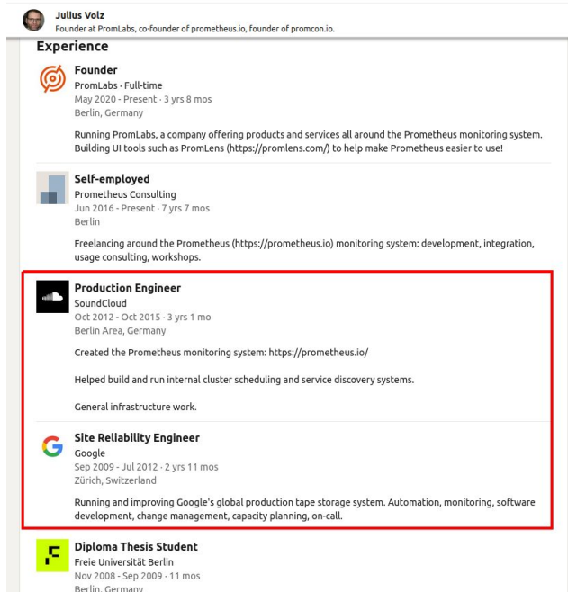
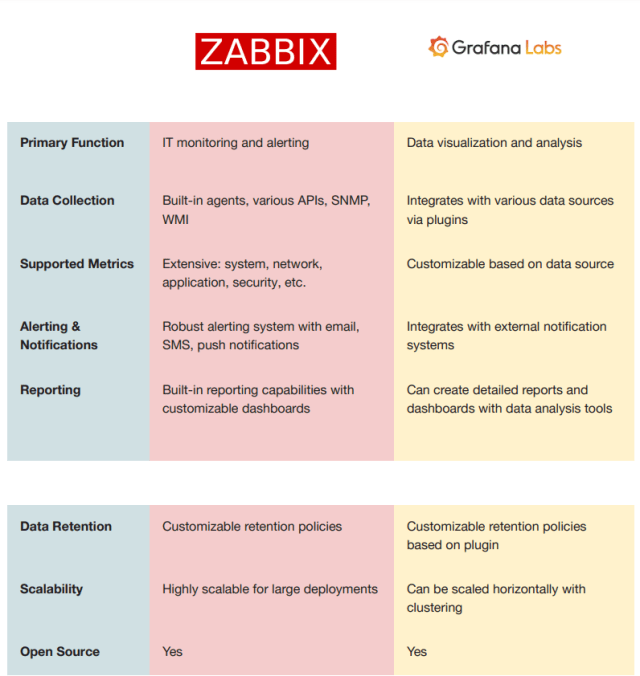
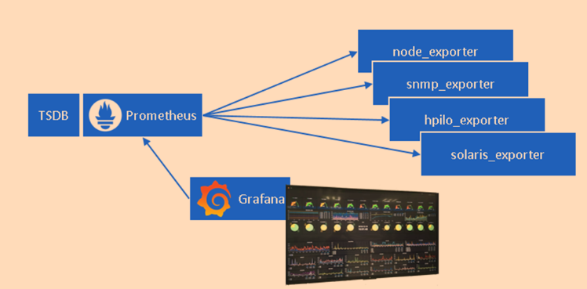
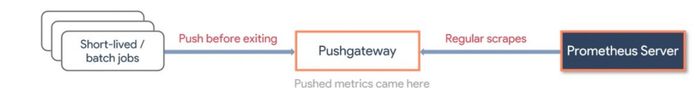
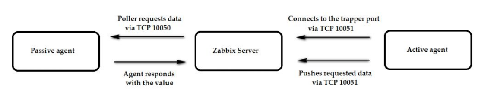
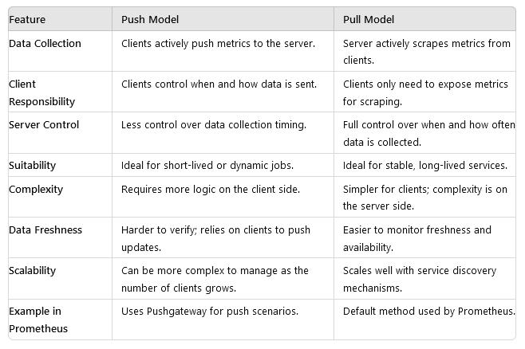
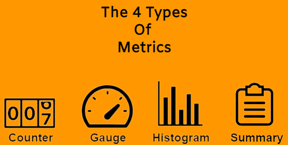
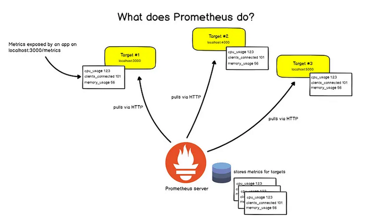
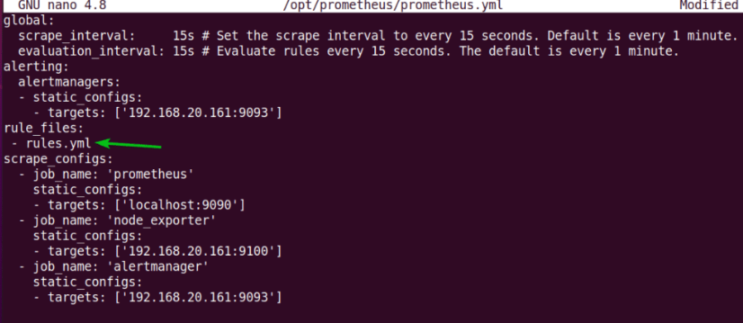

# Prometheus Alused

**Eeldused:** Vaatluse põhimõisted (logid, mõõdikud, jäljed), Linux CLI

**Platvorm:** Prometheus

**Dokumentatsioon:** [prometheus.io](https://prometheus.io) | [PromLabs Training](https://training.promlabs.com/)

## Õpiväljundid

Pärast seda loengut:
- Mõistad, miks Prometheus loodi ja milliseid probleeme see lahendab
- Oskad selgitada, kuidas Prometheus erineb traditsioonilistest seiretööriistadest
- Tead, millal Prometheus sobib ja millal mitte
- Mõistad aegrea andmemudelit ja selle tähtsust
- Oskad lugeda ja mõista lihtsamaid PromQL päringuid
- Tead, kuidas hoiatused töötavad

---

## Sissejuhatus: Miks Me Seda Vajame?

Alustame küsimusega: **miks me üldse vajame Prometheus'e?** Kas pole Nagios, Zabbix ja teised tööriistad juba olemas?

### Mikroteenuste Probleem

2010. aastatel hakkas toimuma suur muutus: monoliitrakendustest mikroteenustesse. Äkki pole teil enam 10 serverit, vaid 100 konteinerit. Need konteinerid tulevad ja lähevad automaatselt. Kubernetes skaleerib neid vastavalt koormusele.

**Vana seire ei sobinud:**
- Nagios: käsitsi konfigureerid iga serveri
- Zabbix: agent'id peavad olema eelnevalt seadistatud
- Mõlemad: ei tea konteinerite dünaamilisest elust midagi


*Prometheus - kreeka mütoloogias tule tooja.*

**SoundCloud seisis 2012. aastal sama probleemi ees.** Neil oli sadu mikroteenuseid, mis muutusid pidevalt. Julius Volz ja tema meeskond otsustasid luua midagi uut - Prometheus sündis.



*Julius Volz, Prometheus'e kaaslooja SoundCloudis.*

**Allikad:**
- [Prometheus Dokumentatsioon](https://prometheus.io/docs/introduction/overview/)
- [PromLabs: What is Prometheus?](https://training.promlabs.com/training/introduction-to-prometheus/prometheus-an-overview/what-is-prometheus/)

---

## 1. Mis on Prometheus Põhimõtteliselt?

Nüüd kui teame MIKS Prometheus loodi, vaatame MIS ta on.

Prometheus on **avatud lähtekoodiga süsteemide seire ja hoiatuste tööriistakomplekt**. Aga see definitsioon ei ütle palju. Vaatame, mis teeb selle eriliseks.

### Kolm Põhierinevust

**1. Prometheus KÜSIB ise** (pull mudel)

Traditsiooniline seire: server ootab, et rakendused saadaksid mõõdikuid.
```
[Rakendus] --saadab--> [Seire server]
```

Prometheus: ise küsib regulaarselt.
```
[Prometheus] --küsib--> [Rakendus /metrics]
```

Miks see parem on? Prometheus otsustab ise, millal ja kui sageli koguda. Kui rakendus on maas, Prometheus näeb seda kohe.

**2. Kõik on aegread** (time-series)

Iga mõõdik on tegelikult aegrida - väärtuste jada ajas. Mitte lihtsalt "CPU on 45%", vaid "CPU oli 43%, siis 45%, siis 47%..."

See võimaldab näha trende, ennustada probleeme, mõista mustreid.

**3. Võimas päringukeel** (PromQL)

Te ei küsi lihtsalt "mis on CPU kasutus?". Te küsite "kui palju on CPU kasutus kasvanud viimase 5 minuti jooksul võrreldes eelmise tunniga, grupeerituna serveri järgi?".


*Prometheus töövoog: rakendused → scraping → TSDB → päringud → hoiatused. (Allikas: [PromLabs Training](https://training.promlabs.com/training/introduction-to-prometheus/prometheus-an-overview/what-is-prometheus/))*

### Kuidas See Välja Näeb?

Prometheus'el on sisseehitatud kasutajaliides, kus saate teha päringuid ja näha graafikuid:


*Prometheus UI - PromQL päringud ja graafikud. (Allikas: [PromLabs Training](https://training.promlabs.com/training/introduction-to-prometheus/prometheus-an-overview/what-is-prometheus/))*

---

## 2. Mis Prometheus EI OLE - Ootuste Haldamine

Enne kui läheme sügavamale, on oluline mõista, mida Prometheus POLE. See hoiab ära hilisemad pettumused.

### Levinud Väärarusaamad

**"Prometheus ei ole pikaajaline salvestus"**

Prometheus hoiab mõõdikuid tavaliselt 15-30 päeva. Miks? Sest see on optimeeritud kiireks pärimiseks, mitte aastaste trendide jaoks.

Kui vajate aastaid andmeid (näiteks "kuidas meie CPU kasutus on muutunud viimase 3 aasta jooksul?"), vajate lisalahendust nagu Thanos või Cortex.

**"Prometheus ei ole logihaldussüsteem"**

Mäletate eelmisest loengust kolme sammast? Logid, mõõdikud, jäljed. Prometheus on AINULT mõõdikute jaoks.

Kui vajate logide analüüsi, kasutage ELK Stack'i või Loki'd (mis on spetsiaalselt disainitud töötama koos Prometheus'ega).

**"Prometheus ei ole distributed tracing"**

Distributed tracing (Jaeger, Tempo) näitab, kuidas üks päring liigub läbi 10 mikroteenuse. Prometheus näitab, kui kiiresti need mikroteenused töötavad, aga mitte päringute teed.



*Zabbix (kõike-ühes) vs Prometheus + Grafana (parimad tööriistad igale tööle).*

### Millal Prometheus Sobib?

Nüüd kui teame, mida Prometheus POLE, vaatame millal ta sobib:

✅ **Mikroteenused** - Dünaamilised, paljud teenused  
✅ **Kubernetes** - Konteinerid tulevad ja lähevad  
✅ **DevOps kultuur** - Meeskond tahab kontrolli  
✅ **Mõõdikud-kesksed** - Fookus on numbrilistel näitajatel  

### Millal Prometheus EI SOBI?

❌ **Ainult logid** - Kui te ei vaja mõõdikuid, ainult logide otsingut  
❌ **Pikaajalised trendid** - Kui vajate 5-aastaseid ajaloolisi andmeid  
❌ **Fully-managed** - Kui tahate, et keegi teine seda haldaks  

**Allikad:**
- [Prometheus: Comparison to alternatives](https://prometheus.io/docs/introduction/comparison/)
- [PromLabs: What Prometheus is not](https://training.promlabs.com/training/introduction-to-prometheus/prometheus-an-overview/what-is-prometheus-not/)

---

## 3. Kuidas Prometheus Töötab - Arhitektuur

Nüüd kui mõistame Prometheus'e kohta süsteemis, vaatame, kuidas see tehnikaliselt töötab.

### Suur Pilt

Prometheus ei ole üks programm - see on tööriistakomplekt mitmest komponendist. Vaatame korraga suurt pilti:


*Prometheus arhitektuur: server, exporterid, Pushgateway, AlertManager, visualiseerimine. (Allikas: [PromLabs Training](https://training.promlabs.com/training/introduction-to-prometheus/prometheus-an-overview/system-architecture/))*

### Komponendid Üksikasjalikult

Vaatame igat komponenti ja mõistame, MIKS see on vajalik.

**Prometheus Server - Süda**

See on peamine komponent. Ta teeb kolme asja:
1. **Kogub mõõdikuid** - HTTP GET päringuga `/metrics` endpoint'ilt
2. **Salvestab andmebaasi** - Spetsiaalse aegrea andmebaasi (TSDB)
3. **Hindab hoiatusi** - Kontrollib, kas mõni künnisest on ületatud

**Exporterid - Tõlkijad**

Probleem: Teie Linux server ei tea, mis on Prometheus. MySQL ei tea. Nginx ei tea.

Lahendus: Exporter on väike programm, mis:
1. Loeb süsteemi statistikat (näiteks Linux `/proc` failidest)
2. Muudab need Prometheus formaati
3. Pakub `/metrics` endpoint'i



*Prometheus ökosüsteem: TSDB keskel, erinevad exporterid ümber, Grafana visualiseerimiseks.*

Näiteks **Node Exporter** Linux serveris:
- Loeb CPU kasutust
- Loeb mälu kasutust
- Loeb ketta kasutust
- Pakub kõike seda port 9100 `/metrics` endpoint'is

**Pushgateway - Erijuht**

Mäletame: Prometheus KÜSIB ise. Aga mis juhtub, kui töö on lühike?

Näide: Cronjob, mis töötab 30 sekundit ja lõpeb. Prometheus ei jõua teda scrape'ida!

Lahendus: Töö SAADAB mõõdikud Pushgateway'sse. Prometheus scrape'ib Pushgateway'd.



*Pushgateway: lühiajalised batch job'id saadavad mõõdikud, Prometheus loeb hiljem.*

**AlertManager - Intelligentne Teavitaja**

Prometheus tuvastab probleemi ("CPU > 90%"). Aga kuidas teavitada?

AlertManager teeb rohkem kui lihtsalt emaili saatmine:
- **Grupeerib** - 10 sarnast hoiatust → 1 email
- **Summutab** - Maintenance? Summuta hoiatused 2 tunniks
- **Marsruudib** - Andmebaasi hoiatused → DBA meeskonnale
- **Eskaleerib** - Keegi ei vastanud? Saada järgmisele

**Service Discovery - Automaatne Avastamine**

Kubernetes'es tulevad ja lähevad pod'id automaatselt. Kuidas Prometheus neid leiab?

Service Discovery: Prometheus küsib Kubernetes API-lt "millised pod'id on olemas?" ja hakkab neid automaatselt jälgima.

### Pull vs Push - Kuidas Lihtsalt Mõista

See on oluline kontseptsioon, seega pühendame sellele eraldi tähelepanu.



*Zabbix agent SAADAB (push) vs Prometheus KÜSIB (pull).*

**Push mudel (Zabbix, Nagios):**
```
[Server] → [Agent] "Tere, siin on minu CPU kasutus 45%"
[Seire] → "Ok, salvestatud"
```

Probleem: Kui agent on maas, sa ei tea sellest midagi. Ta lihtsalt ei saada enam.

**Pull mudel (Prometheus):**
```
[Prometheus] → [Server] "Mis on su CPU kasutus?"
[Server] → "45%"
```

Eelis: Kui server ei vasta, Prometheus NÄEB seda kohe. Hoiatus: "Target down!"



*Push vs Pull võrdlus: omadused, plussid, miinused.*

**Allikad:**
- [Prometheus Architecture](https://prometheus.io/docs/introduction/overview/#architecture)
- [PromLabs: System Architecture](https://training.promlabs.com/training/introduction-to-prometheus/prometheus-an-overview/system-architecture/)

---

## 4. Aegrea Andmemudel - Andmete Süda

Nüüd teame, kuidas Prometheus kogub andmeid. Aga kuidas ta neid SALVESTAB? See on võti kogu Prometheus'e mõistmiseks.

### Miks Aegread?

Tavaliselt andmebaasis on read: kasutaja nimi, email, vanus.

Prometheus'es on aga AEGREAD - sama väärtus, aga erinevatel aegadel:

```
CPU kasutus 10:00 → 45%
CPU kasutus 10:01 → 47%
CPU kasutus 10:02 → 43%
CPU kasutus 10:03 → 50%
```

Miks? Sest meid huvitab MUUTUS ajas:
- Kas CPU kasutus TÕUSEB?
- Kui kiiresti?
- Mis hetkel täpselt hakkas tõusma?

### Andmemudeli Ehitus

Iga aegrida koosneb kolmest osast:

**1. Mõõdiku nimi** - Mis see on?
```
http_requests_total
```

**2. Label'id** - Millised üksikasjad?
```
{method="GET", path="/api/users", status="200"}
```

**3. Väärtus + ajatempel** - Mitu ja millal?
```
1234 @2025-11-11T14:23:45Z
```

Kokku:
```
http_requests_total{method="GET", path="/api/users", status="200"} 1234 @14:23:45
```


*Andmemudel: metric name + labels = series identity. Samples = (timestamp, value). (Allikas: [PromLabs Training](https://training.promlabs.com/training/introduction-to-prometheus/prometheus-an-overview/time-series-data-model/))*

### Label'id - Võti Võimsusele

Label'id teevad Prometheus'e võimsaks. Miks?

Kujutage ette: teil on 3 serverit, 2 API endpoint'i, 2 HTTP method'it.

**Ilma label'ideta:**
```
server1_api_users_get_requests
server1_api_users_post_requests
server1_api_posts_get_requests
... 12 erinevat mõõdikut!
```

**Label'itega:**
```
http_requests_total{server="server1", path="/api/users", method="GET"}
http_requests_total{server="server1", path="/api/users", method="POST"}
... 1 mõõdik, 12 erinevat kombinatsiooni!
```


*Üks mõõdik, erinevad label kombinatsioonid = mitu aegrida graafikul. (Allikas: [PromLabs Training](https://training.promlabs.com/training/introduction-to-prometheus/prometheus-an-overview/time-series-data-model/))*

Nüüd saate küsida:
- "Kui palju GET päringuid?"
- "Kui palju päringuid `/api/users` endpoint'ile?"
- "Kui palju päringuid server1'le?"

Kõik samast mõõdikust!

### Kardnaalsus - Ohumärk

**Kardnaalsus** = unikaalsete aegridade arv.

Näide:
- 3 serverit × 2 path'i × 2 method'it = **12 aegrida**

See on OK. Aga kui lisate label'i `user_id`:
- 3 serverit × 2 path'i × 2 method'it × 10,000 kasutajat = **120,000 aegrida**

⚠️ **OHTLIK!** Kõrge kardnaalsus võib Prometheus'e maha võtta.

**Reegel:** Label'id peavad olema **madalapindne** (low-cardinality):
- ✅ `server` (3-10 väärtust)
- ✅ `method` (GET, POST, PUT, DELETE - 4 väärtust)
- ❌ `user_id` (tuhanded väärtused)
- ❌ `email` (tuhanded väärtused)

### 4 Mõõdikutüüpi

Prometheus tunneb 4 tüüpi mõõdikuid. Miks see oluline on? Sest see määrab, kuidas neid INTERPRETEERIDA ja PÄRIDA.



*Counter, Gauge, Histogram, Summary - igaühel oma kasutus.*

**Counter - Ainult Kasvab**

Näide: HTTP päringute KOGUARV. See ainult kasvab. Kunagi ei vähene.

```
http_requests_total: 1000
5 minutit hiljem: 1150
5 minutit hiljem: 1280
```

Kuidas saada päringuid sekundis? `rate()` funktsioon laboris!

**Gauge - Tõuseb ja Langeb**

Näide: CPU kasutus. See muutub konstantselt üles-alla.

```
cpu_usage_percent: 45
1 minut hiljem: 67
1 minut hiljem: 52
```

Gauge'i kasutate OTSE - ei vaja rate().

**Histogram ja Summary**

Need on keerulisemad. Mõõdavad JAOTUST. Näiteks: vastuse ajad.

Te ei taha lihtsalt "keskmine vastuse aeg 200ms". Te tahate teada:
- 50% päringutest < 100ms
- 95% päringutest < 500ms
- 99% päringutest < 2s

Histogram ja Summary võimaldavad seda. Detailid laboris!

**Allikad:**
- [Prometheus Metric Types](https://prometheus.io/docs/concepts/metric_types/)
- [PromLabs: Data Model](https://training.promlabs.com/training/introduction-to-prometheus/prometheus-an-overview/time-series-data-model/)

---

## 5. Kuidas Mõõdikud Liiguvad - Formaat

Nüüd teame, kuidas Prometheus SALVESTAB mõõdikuid. Aga kuidas need mõõdikud LIIGUVAD rakendusest Prometheus'esse?

Mäletate arhitektuurist: Prometheus teeb HTTP GET päringu `/metrics` endpoint'ile. Aga mis FORMAAT on see, mida ta sealt saab?

### Lihtne Tekstiformaat

Prometheus kasutab väga lihtsat tekstiformaati. Miks tekst, mitte JSON või XML?

1. **Inimloetav** - Võite teha `curl http://server:9100/metrics` ja näha kohe
2. **Lihtne parsida** - Ei vaja keerukat parser'it
3. **Efektiivne** - Vähem overhead'i kui JSON

### Näide: Mis Näeb Välja /metrics?

```
# HELP http_requests_total The total number of HTTP requests.
# TYPE http_requests_total counter
http_requests_total{method="GET",path="/api/users",status="200"} 1234
http_requests_total{method="POST",path="/api/users",status="201"} 567

# HELP cpu_usage_percent Current CPU usage in percent.
# TYPE cpu_usage_percent gauge
cpu_usage_percent 45.2
```



*Prometheus scrape'ib /metrics HTTP GET-iga (iga 15s), parsib tekstiformaati, salvestab TSDB-sse.*

Vaatame iga osa:

**HELP rida** - Inimestele:
```
# HELP http_requests_total The total number of HTTP requests.
```
See on lihtsalt kirjeldus. Prometheus ei kasuta seda, aga see aitab mõista, mis mõõdik on.

**TYPE rida** - Prometheus'ele:
```
# TYPE http_requests_total counter
```
See ütleb "see on Counter". Prometheus teab nüüd, et peab kasutama `rate()` funktsiooni.

**Mõõdiku rida** - Tegelikud andmed:
```
http_requests_total{method="GET",path="/api/users",status="200"} 1234
```
- Mõõdiku nimi: `http_requests_total`
- Label'id: `{method="GET",path="/api/users",status="200"}`
- Väärtus: `1234`

### Kuidas TE Pakkute Neid Mõõdikuid?

Nüüd mõistate formaati. Aga kuidas TEIE rakendus pakub `/metrics` endpoint'i?

**Valik 1: Kasuta Prometheus Client Library't**

Prometheus pakub raamatukogusid paljudele keeltele. Python näide:

```python
from prometheus_client import Counter, start_http_server

# Loo counter
requests = Counter('http_requests_total', 'Total HTTP requests')

# Iga päring
@app.route('/')
def hello():
    requests.inc()  # Kasvata counter'it
    return 'Hello!'

# Start /metrics endpoint port 8000
start_http_server(8000)
```

Nüüd kui lähete `http://localhost:8000/metrics`, näete:
```
# HELP http_requests_total Total HTTP requests
# TYPE http_requests_total counter
http_requests_total 42.0
```

**Valik 2: Kasuta Exporter'it**

Kui teie rakendus juba eksisteerib ja te ei saa koodi muuta? Kasutage exporter'it!

Näiteks Linux server:
1. Paigaldate **Node Exporter** (väike Go programm)
2. Node Exporter loeb `/proc`, `/sys` jne
3. Pakub `/metrics` port 9100

Prometheus loeb sealt:
```
node_cpu_seconds_total{cpu="0",mode="idle"} 123456
node_memory_MemAvailable_bytes 8589934592
node_disk_io_time_seconds_total{device="sda"} 789
```

**Laboris** te paigaldate Node Exporter'i ja näete täpselt, kuidas see töötab!

**Allikad:**
- [Exposition Formats](https://prometheus.io/docs/instrumenting/exposition_formats/)
- [Client Libraries](https://prometheus.io/docs/instrumenting/clientlibs/)
- [PromLabs: Metrics Transfer Format](https://training.promlabs.com/training/introduction-to-prometheus/prometheus-an-overview/metrics-transfer-format/)

---

## 6. Päringukeel PromQL - Mõõdikute Käsitlemine

Nüüd on meil mõõdikud Prometheus'es. Kuidas neid KASUTADA? Siin tuleb sisse PromQL.

### Miks Vajame Spetsiaalset Päringkeelt?

Mõelge sellele: SQL on andmebaasidele, mis PromQL on aegridadele.

Te ei küsi lihtsalt "mis on CPU kasutus?". Te küsite:
- "Kui palju on CPU kasutus KASVANUD viimase tunni jooksul?"
- "Milline server kasutab KÕIGE ROHKEM mälu?"
- "Kui paljud päringud EBAÕNNESTUVAD iga teenuse kohta?"

Need on keerulised küsimused. PromQL on disainitud just nendeks.


*PromQL: päringud TSDB vastu → tulemused visualiseerimiseks ja hoiatusteks. (Allikas: [PromLabs Training](https://training.promlabs.com/training/introduction-to-prometheus/prometheus-an-overview/query-language/))*

### PromQL Põhitõed

**Lihtne päring** - Mõõdiku nimi:
```promql
http_requests_total
```
Tagastab KÕIK selle mõõdiku aegread. Võib olla sadu!

**Filtreerimine** - Vali label'ite järgi:
```promql
http_requests_total{method="GET"}
```
Ainult GET päringud.

```promql
http_requests_total{method="GET", status="200"}
```
GET päringud, mis õnnestusid.

**Miks see oluline on?** Ilma filtreerimata saate liiga palju andmeid. Filtreerides saate täpselt seda, mida vajate.

### rate() - Kõige Olulisem Funktsioon

Siin tulevad mõõdikutüübid mängu. Mäletate Counter'it? See ainult kasvab.

Probleem: `http_requests_total` on näiteks 1,234,567. See number ei ütle midagi!

Lahendus: `rate()` arvutab KASVU sekundis.

```promql
rate(http_requests_total[5m])
```

See ütleb: "Võta viimased 5 minutit. Arvuta, kui palju counter kasvas. Jaga 300 sekundiga."

Tulemus: **päringuid sekundis**!

Näide:
- 10:00 → 1000 päringut
- 10:05 → 1300 päringut
- Kasv: 300 päringut / 300 sekundit = **1 päring/sekund**

### Agregeerimine - Kokku Võtmine

Sageli tahate näha kogusummat. `sum()` funktsioon:

```promql
sum(rate(http_requests_total[5m]))
```

Kõik päringud kokku (kõik serverid, kõik path'id, kõik method'id).

**Grupeerimine** - Aga kui tahate näha PER METHOD:

```promql
sum by (method) (rate(http_requests_total[5m]))
```

Tulemus:
```
{method="GET"} 10 päringut/sekund
{method="POST"} 5 päringut/sekund
{method="DELETE"} 1 päring/sekund
```

### Praktilised Näited

**Veamäär** - Kui suur osa päringutest ebaõnnestub?

```promql
(
  sum(rate(http_requests_total{status=~"5.."}[5m]))
  /
  sum(rate(http_requests_total[5m]))
) * 100
```

See jagab 5xx vead kõigi päringute arvuga. Tulemus on veamäär protsentides.

**CPU kasutus** - Protsentides:

```promql
100 - (avg(rate(node_cpu_seconds_total{mode="idle"}[5m])) * 100)
```

Idle aeg on "mitte-kasutatud" aeg. 100 - idle = kasutatud!

### PromQL on Suur Teema

Siin näidatud on ainult PÕHITÕED. PromQL on võimas ja kompleksne.

**Õppimiseks:**
- ⭐ [PromQL Cheat Sheet](https://promlabs.com/promql-cheat-sheet/) - Kiire käsiraamat
- ⭐ [PromQL Examples](https://logz.io/blog/promql-examples-introduction/) - Praktilised näited

**Laboris** te kirjutate päringuid praktikas ja näete tulemusi reaalajas!

**Allikad:**
- [Prometheus Querying Basics](https://prometheus.io/docs/prometheus/latest/querying/basics/)
- [PromLabs: Query Language](https://training.promlabs.com/training/introduction-to-prometheus/prometheus-an-overview/query-language/)

---

## 7. Hoiatused - Automaatne Reaktsioon

Nüüd oskame mõõdikuid koguda ja pärida. Aga me ei saa vaadata juhtpaneele 24/7! Vajame HOIATUSI, mis teavitavad automaatselt.

### Kuidas Hoiatused Töötavad?

Prometheus hindab **reegleid** regulaarselt (iga minut). Kui reegel on TÕENE, käivitub hoiatus.

Näide:
```yaml
- alert: HighCPUUsage
  expr: cpu_usage_percent > 80
  for: 5m
```

See tähendab:
1. Iga minut Prometheus hindab: `cpu_usage_percent > 80`
2. Kui TÕENE ja kestab 5 minutit → hoiatus käivitub
3. Prometheus saadab AlertManager'ile
4. AlertManager saadab emaili/Slack'i/PagerDuty'sse



*Prometheus.yml - YAML formaat konfiguratsioonile (scrape configs, rule files).*

### Miks "for: 5m"?

Kujutage ette: CPU hüppab sekundiks 85%-le. Kas see on probleem? Tõenäoliselt mitte.

`for: 5m` ütleb: "Oota 5 minutit. Kui CPU on IKKA veel üle 80%, SIIS hoiata."

See vältib **false positive'e** - valehoiatusi.

### AlertManager - Intelligentne Vahemees

Prometheus tuvastab probleemi. Aga AlertManager teeb rohkem:

**Grupeerimine** - 10 serverit, kõigil kõrge CPU:
- Ilma: 10 emaili
- AlertManager'iga: 1 email "10 serverit on kõrge CPU'ga"

**Summutamine** (Silencing) - Maintenance?
"Summuta kõik hoiatused server1'lt järgmiseks 2 tunniks"

**Marsruutimine** (Routing) - Erinevad hoiatused erinevatele inimestele:
- Andmebaasi hoiatused → DBA meeskond
- API hoiatused → Backend meeskond
- Kriitilised hoiatused → Kõigile + PagerDuty

**Laboris** te loote hoiatuse, testige seda ja näete, kuidas AlertManager töötab!

**Allikad:**
- [Prometheus Alerting](https://prometheus.io/docs/alerting/latest/overview/)
- [PromLabs: Integrated Alerting](https://training.promlabs.com/training/introduction-to-prometheus/prometheus-an-overview/integrated-alerting/)

---

## 8. Service Discovery - Automaatne Target'ite Leidmine

Viimane oluline teema: kuidas Prometheus LEIAB, mida jälgida?

### Probleem: Dünaamilised Keskkonnad

Kubernetes'es:
- 10:00 - on 5 pod'i
- 10:15 - auto-scaling: nüüd 8 pod'i
- 10:30 - deployment: vanad pod'id surevad, uued tekivad
- 10:45 - tagasi 5 pod'i

Kui te KÄSITSI konfigureeriks iga pod'i, oleks see võimatu!

### Lahendus: Service Discovery

Prometheus küsib Kubernetes API-lt: "Millised pod'id on praegu?"

Kubernetes vastab: "Siin on nimekiri..."

Prometheus: "OK, scrape'in neid!"


*Service Discovery: Prometheus küsib Kubernetes/Consul/DNS-lt target'e → scrape'ib dünaamiliselt. (Allikas: [PromLabs Training](https://training.promlabs.com/training/introduction-to-prometheus/prometheus-an-overview/service-discovery-integration/))*

### Toetatud Mehhanismid

- **Kubernetes** - Pod'id, teenused
- **Consul** - Service registry
- **DNS** - Domeenide resolvingmine
- **File** - JSON fail (testimiseks)

**Laboris** kasutame `static_configs` (käsitsi nimekiri), sest see on lihtsam õppida. Aga tõelises Kubernetes'es kasutaksite `kubernetes_sd_configs`.

**Allikad:**
- [Service Discovery Configuration](https://prometheus.io/docs/prometheus/latest/configuration/configuration/#scrape_config)
- [PromLabs: Service Discovery](https://training.promlabs.com/training/introduction-to-prometheus/prometheus-an-overview/service-discovery-integration/)

---

## 9. Lihtne Käitamine - Praktilisus

Üks Prometheus'e tugevusi on LIHTSUS. Vaatame, miks see on oluline.

### Üks Binaar, Üks Konfifail

Prometheus ei vaja:
- ❌ Java Runtime (nagu Elasticsearch)
- ❌ Node.js (nagu mõned monitoring tööriistad)
- ❌ Python interpreter
- ❌ Eraldi andmebaasi

Lihtsalt:
```bash
./prometheus --config.file=prometheus.yml
```

Ja see töötab!

### Lokaalne Salvestus

Mõned seiretööriistad vajavad keerukat:
- Eraldi andmebaasi (MySQL, PostgreSQL)
- Shared storage (NFS, SAN)
- Keerulisi klastereid

Prometheus: salvestab lihtsalt oma kettale. `./data/` kaustas.

### High Availability (HA)

"Aga kui mu Prometheus kukub?"

Lahendus: Käivita 2 Prometheus'e. Mõlemad jälgivad samu target'e.


*HA setup: 2 Prometheus instantsi scrape'ivad paralleelselt, AlertManager deduplikeerib. (Allikas: [PromLabs Training](https://training.promlabs.com/training/introduction-to-prometheus/prometheus-an-overview/simple-operation/))*

Ei mingit keerukat synci, replikatsiooni. Lihtsalt 2 sõltumatut Prometheus'e!

**Allikad:**
- [Prometheus Installation](https://prometheus.io/docs/prometheus/latest/installation/)
- [PromLabs: Simple Operation](https://training.promlabs.com/training/introduction-to-prometheus/prometheus-an-overview/simple-operation/)

---

## 10. Efektiivsus - Kuidas See Nii Kiire On?

Viimane teema: kuidas Prometheus suudab käsitleda miljoneid aegridu?

### Optimeeritud Salvestus

Prometheus kasutab spetsiaalset aegrea andmebaasi (TSDB), mis on optimeeritud:

**Memory-mapped files** - Andmed on kettal, aga OS cacheb need automaatselt RAM'is. Kiire nagu RAM, aga ei võta kogu mälu!

**Kompressioon** - Aegrea andmed on väga korduvad. Prometheus kompresseerib:
- Sample (~1.3 baiti per väärtus!)
- Label'id (dictionary encoding)

### Võimekus

Üks Prometheus instance suudab:
- ✅ Miljoneid aegridu
- ✅ Tuhandeid target'e
- ✅ Tuhandeid sample'id sekundis

**Kui vaja rohkem:**
- **Federation** - Üks Prometheus kogub teistelt Prometheus'elt
- **Thanos** - Pikaajaline salvestus + ühendab mitu Prometheus'e
- **Cortex** - Fully managed, horizontaalselt skaleeruv

**Laboris** näete, kui KIIRESTI Prometheus pärib. Tuhandeid mõõdikuid, vastus millisekutites!

**Allikad:**
- [Prometheus Storage](https://prometheus.io/docs/prometheus/latest/storage/)
- [PromLabs: Efficient Implementation](https://training.promlabs.com/training/introduction-to-prometheus/prometheus-an-overview/efficient-implementation/)

---

## Kokkuvõte - Mis Me Õppisime

### Suur Pilt

1. **Miks Prometheus?** - Mikroteenused ja Kubernetes vajasid uut lähenemist
2. **Pull mudel** - Prometheus küsib ise, annab kontrolli
3. **Aegread** - Kõik on time-series, võimaldab trende näha
4. **Label'id** - Võimsad dimensioonid, paindlik filtreerimine
5. **PromQL** - Spetsialiseeritud keel aegrea päringuteks
6. **Hoiatused** - Automaatne probleem tuvastamine
7. **Lihtne** - Üks binaar, ei vaja keerukat infrastruktuuri

### Põhimõtted Meeles Pidada

✅ **Prometheus on mõõdikute jaoks** - Mitte logid, mitte traces  
✅ **Pull mudel annab kontrolli** - Prometheus otsustab, millal koguda  
✅ **Label'id on võimsad** - Aga vältida kõrget kardnaalsust  
✅ **rate() on sõber** - Counter'id vajavad rate() funktsiooni  
✅ **PromQL on võimas** - Aga vajab õppimist  

### Millal Prometheus Sobib?

✅ Mikroteenused ja konteinerid  
✅ Kubernetes  
✅ Dünaamilised keskkonnad  
✅ DevOps kultuur  
✅ Mõõdikud-kesksed (numbers matter)  

### Millal Prometheus EI SOBI?

❌ Ainult logid  
❌ Pikaajalised trendid (aastad)  
❌ Fully-managed lahendus  
❌ 100% täpsus (arveldus)  

### Järgmised Sammud

**1. Prometheus Labor - Nüüd praktikas!**

Laboris te:
- Paigaldate Prometheus'e (Docker)
- Lisate Node Exporter'i (Linux mõõdikud)
- Kirjutate PromQL päringuid
- Loote Grafana juhtpaneelid
- Seadistate hoiatused

**2. Õppige PromQL-i**
- [PromQL Cheat Sheet](https://promlabs.com/promql-cheat-sheet/) - Kiire käsiraamat
- [PromQL Examples](https://logz.io/blog/promql-examples-introduction/) - Praktilised näited

**3. Uurige Sügavamalt**
- [Prometheus Best Practices](https://prometheus.io/docs/practices/)
- [PromLabs Training](https://training.promlabs.com/) - Tasuta kursused
- [Prometheus Examples](https://github.com/prometheus/prometheus/tree/main/documentation/examples)

### Eesti DevOps Tarkus

> "Prometheus on nagu tööriistakast: õpi põhitööriistu (rate, sum, avg), alusta lihtsast (Node Exporter), ehita järk-järgult (lisa exportereid vajadusel). Ära ürita kõike korraga jälgida - see viib kaosesse!"

---

## Kasulikud Ressursid

**Ametlik dokumentatsioon:**
- 🌐 [prometheus.io](https://prometheus.io) - Alusta siit
- 📚 [Prometheus Docs](https://prometheus.io/docs/) - Täielik dokumentatsioon
- 📖 [PromQL Basics](https://prometheus.io/docs/prometheus/latest/querying/basics/)

**Õppematerjalid:**
- 🎓 [PromLabs Training](https://training.promlabs.com/) - TASUTA kursused (soovitame!)
- 📄 [PromQL Cheat Sheet](https://promlabs.com/promql-cheat-sheet/) - Prindi välja!
- 💡 [PromQL Examples](https://logz.io/blog/promql-examples-introduction/) - Praktiline

**Kogukond:**
- 💬 [Prometheus Slack](https://slack.cncf.io/) - #prometheus kanal
- 🐙 [GitHub](https://github.com/prometheus/prometheus) - Source code
- 🎥 [PromCon](https://www.youtube.com/c/PrometheusIo) - Konverentsi videod

**Järgmine:**
- ⚡ **Prometheus Labor** - Hands-on aeg!
