## Zabbix. Paigaldamine ja seadistamine

## Ajalugu

- Zabbix on avatud lähtekoodiga jälgimis- ja olekute jälgimissüsteem, mille kirjutas Aleksei Vladõšev
- Zabbix sai alguse 1998. aastal Läti pangas siseprojektina
- 7. aprillil 2001 avaldati süsteem GPL litsentsi all
- Esimene stabiilne versioon — 1.0 ilmus 23. märtsil 2004
- Aprillis 2005 loodi Läti ettevõte SIA Zabbix projekti haldamiseks


---

## Arhitektuur


---

## Andmete kogumine

[](https://blog.zabbix.com/zabbix-integration-with-big-data-systems-in-large-scale-environment/8844/)


[Rohkem leiad: Zabbix integration with Big Data systems in large-scale environment](https://blog.zabbix.com/zabbix-integration-with-big-data-systems-in-large-scale-environment/8844/)

---

## Andmete kogumise meetodid

- Pull
  - Teenuste kontrollid
  - Passiivne agent
  - SSH/Telnet
- Push
  - Aktiivne agent
  - Zabbix Trapper ja SNMP Traps
  - Logifailide jälgimine

---

## Aktiivne/passiivne agent


---

## Nõuded

### Riistvara konfiguratsioonide näited

| Nimi | Platvorm | CPU/Mälu | Andmebaas | Jälgitavate seadmete arv |
|------|----------|---------|-----------|--------------------------|
| Väike | Ubuntu Linux | PII 350MHz 256MB | MySQL MyISAM | 20 |
| Keskmine | Ubuntu Linux 64 bit | AMD Athlon 3200+ 2GB | MySQL InnoDB | 500 |
| Suur | Ubuntu Linux 64 bit | Intel Dual Core 6400 4GB | RAID10 MySQL InnoDB või PostgreSQL | >1000 |
| Väga suur | RedHat Enterprise | Intel Xeon 2xCPU 8GB | Fast RAID10 MySQL InnoDB, PostgreSQL või Oracle | >10000 |

---

## Zabbixi paigaldamine (1)

```bash
# Paigaldame Zabbixi hoidla
$ rpm -Uvh https://repo.zabbix.com/zabbix/6.4/rhel/8/x86_64/zabbix-release-6.4-1.el8.noarch.rpm
$ dnf clean all

# Paigaldame zabbix-serveri, zabbix-agendi, zabbix-frontend
$ dnf module switch-to php:7.4
$ dnf install zabbix-server-mysql zabbix-web-mysql zabbix-apache-conf zabbix-sql-scripts 
zabbix-selinux-policy zabbix-agent

# Paigaldame MySQL
$ dnf install mysql-server
$ systemctl start mysqld.service
```

CentOS 8

---

## Zabbixi paigaldamine (2)

```bash
# Andmebaasi initsialiseerimine
$ mysql -uroot 
mysql> create database zabbix character set utf8 collate utf8_bin;
mysql> create user zabbix@localhost identified by 'password';
mysql> grant all privileges on zabbix.* to zabbix@localhost;
mysql> set global log_bin_trust_function_creators = 1;
mysql> quit;

# Zabbixi andmeskeemi import ja log_bin_trust_function_creators väljalülitamine
$ zcat /usr/share/zabbix-sql-scripts/mysql/server.sql.gz | mysql --default-character-set=utf8mb4 -uzabbix -p zabbix
$ mysql -uroot
mysql> set global log_bin_trust_function_creators = 0;
mysql> quit; 

# Zabbixi serveri andmebaasi parooli seadistamine
$ vim /etc/zabbix/zabbix_server.conf
DBPassword=password
# Teenuse käivitamine

$ systemctl restart zabbix-server zabbix-agent httpd php-fpm
$ systemctl enable zabbix-server zabbix-agent httpd php-fpm
```

CentOS 8

---

## Zabbixi paigaldamine (1)

```bash
# Paigaldame Zabbixi hoidla
$ wget https://repo.zabbix.com/zabbix/6.4/ubuntu/pool/main/z/zabbix-release/zabbix-release_6.4-1+ubuntu22.04_all.deb
$ dpkg -i zabbix-release_6.4-1+ubuntu22.04_all.deb
$ apt update

# Paigaldame zabbix-serveri, zabbix-agendi, zabbix-frontend
$ apt install zabbix-server-mysql zabbix-frontend-php zabbix-apache-conf zabbix-sql-scripts zabbix-agent

# Paigaldame MySQL
$ apt install mysql-server
$ systemctl start mysql.service
```

Ubuntu 22

---

## Zabbixi paigaldamine (2)

```bash
# Andmebaasi initsialiseerimine
$ mysql -uroot 
mysql> create database zabbix character set utf8 collate utf8_bin;
mysql> create user zabbix@localhost identified by 'password';
mysql> grant all privileges on zabbix.* to zabbix@localhost;
mysql> set global log_bin_trust_function_creators = 1;
mysql> quit;

# Zabbixi andmeskeemi import ja log_bin_trust_function_creators väljalülitamine
$ zcat /usr/share/zabbix-sql-scripts/mysql/server.sql.gz | mysql --default-character-set=utf8mb4 -uzabbix -p zabbix
$ mysql -uroot
mysql> set global log_bin_trust_function_creators = 0;
mysql> quit; 

# Zabbixi serveri andmebaasi parooli seadistamine
$ vim /etc/zabbix/zabbix_server.conf
DBPassword=password

# Teenuse käivitamine
$ systemctl restart zabbix-server zabbix-agent apache2
$ systemctl enable zabbix-server zabbix-agent apache2
```

Ubuntu 22

---

## Esmane seadistamine (1)
http://Server-IP/zabbix


---

## Esmane seadistamine (2)
http://Server-IP/zabbix


---

## Esmane seadistamine (3)
http://Server-IP/zabbix


---

## Esmane seadistamine (4)
http://Server-IP/zabbix


---

## Esmane seadistamine (5)
http://Server-IP/zabbix


---

## Esmane seadistamine (6)
http://Server-IP/zabbix


---

## Kontroll
http://Server-IP/zabbix (Admin/zabbix)


---

## Seire seadistamine


---

## Zabbix-agendi paigaldamine

```bash
# Paigaldame Zabbixi hoidla ja seadistame zabbix-agent
$ rpm -Uvh https://repo.zabbix.com/zabbix/5.0/rhel/7/x86_64/zabbix-release-5.0-1.el7.noarch.rpm
$ yum install zabbix-agent

# Määrame serveri
$ vim /etc/zabbix/zabbix_agentd.conf
ServerActive=10.0.0.30

# Käivitame teenuse
$ systemctl enable zabbix-agent
$ systemctl start zabbix-agent
```

Näide CentOS 7 puhul

---

## Zabbixi põhimõistete ülevaade

- Host / Seade – Mõõdikute allikas. Loogiline mõiste. 1 füüsiline seade võib olla esindatud mitme jälgitava seadmena
- Item / Andmeelement – Mõõdik või mistahes andmed. See, mida server saab seadmelt
- Trigger / Päästik – Kirjeldab, milliseid andmeelemendi väärtusi loeme rikkeks
- Action / Tegevus – Viis sündmustele reageerimiseks. Näiteks teavituse saatmine päästiku käivitumisel

---

## Automaatse avastamise ja tegevuste seadistamine (1)
Avastamisreeglite seadistamine

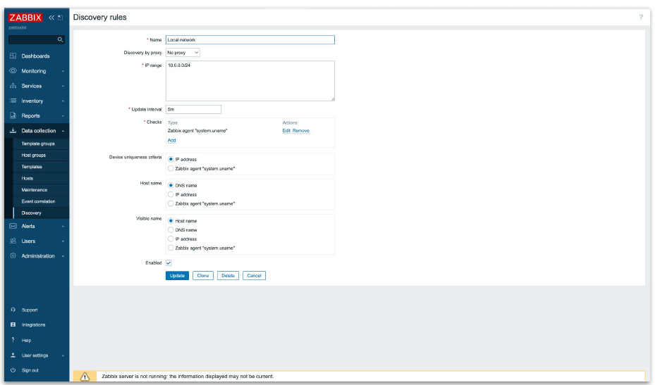
---

## Automaatse avastamise ja tegevuste seadistamine (2)
Tegevuste seadistamine

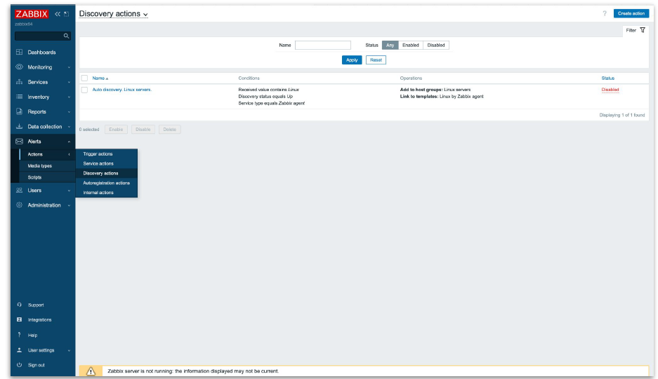
---

## Automaatse avastamise ja tegevuste seadistamine (3)
Tegevuste seadistamine

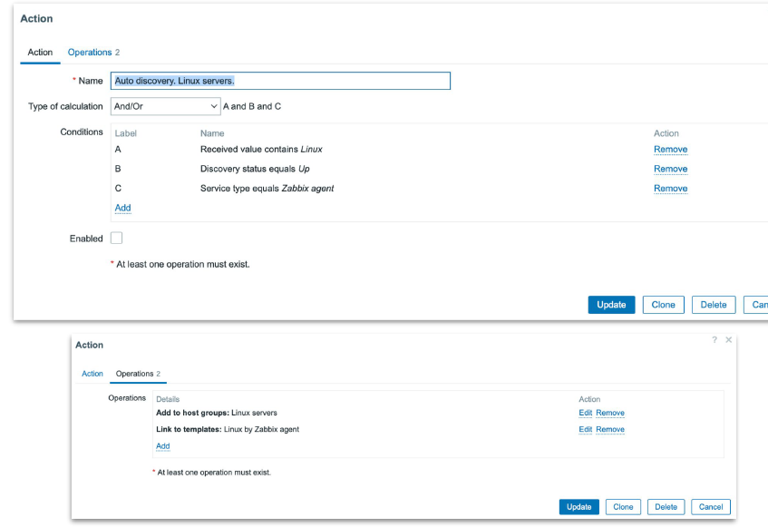

---

## Seadme konfigureerimine
Seadmete seadistamine

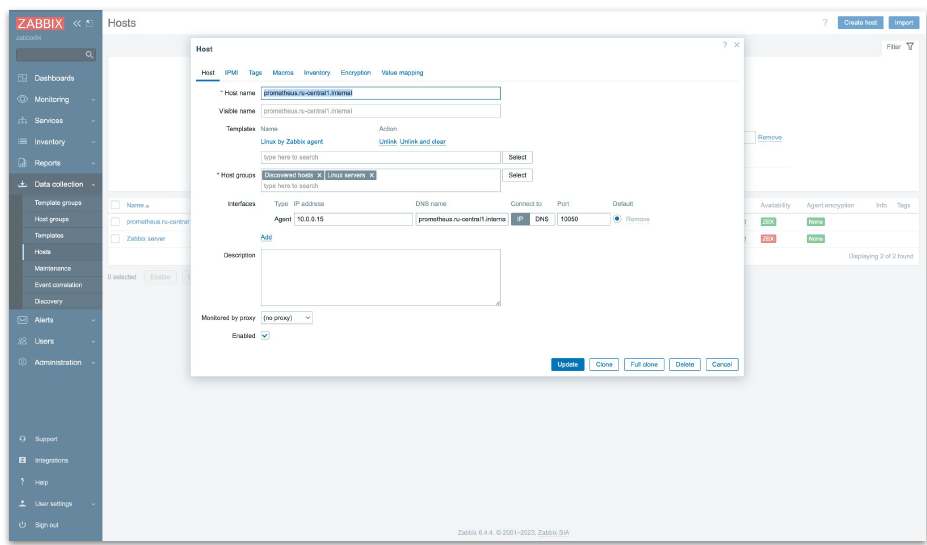

---

## Andmeelemendi lisamine
Andmeelementide seadistamine

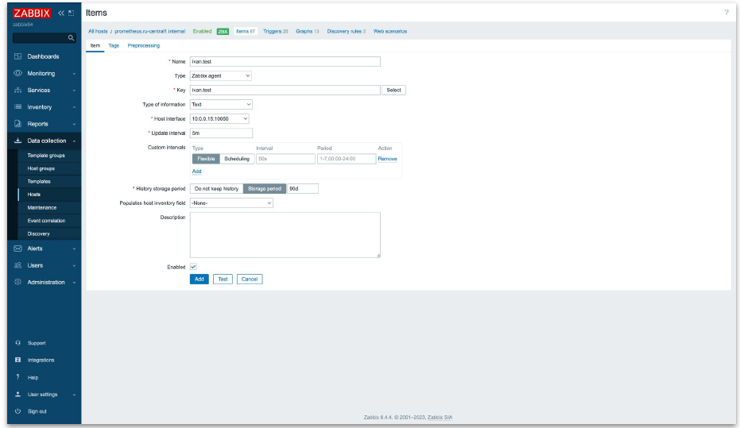

---

## Trigger konfigureerimine
Triggeri seadistamine

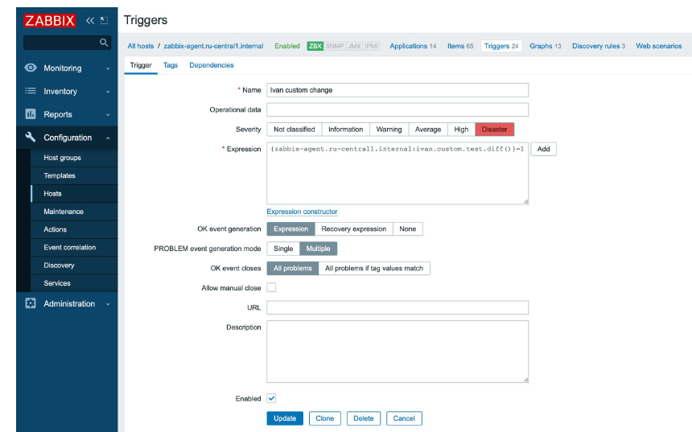

---

## Teavituste seadistamine

- Kontrollige globaalseid meediumitüüpide seadistusi
  - Administration -> Media types (versioonis 6.4 — Alerts -> Media types)
  - Määrake kõik vajalik: SMTP e-posti jaoks, Telegrami tokenid, SMS-lüüs
- Seadistage kasutajate teavitusmeetodid
  - Administration -> User -> Media (versioonis 6.4 — Users -> User -> Media)
  - Määrake e-posti aadress, Telegrami kasutajanimi, SMS-i telefoninumber
- Seadistage tegevus päästiku jaoks
  - Administration -> Actions -> Trigger actions
    (versioonis 6.4 — Alerts -> Actions -> Trigger actions)
  - Vahekaart Action: saate määrata sõnumi saatmise tingimused
  - Vahekaart Operations: määrake kellele ja kuhu sõnumid saata, eskalatsiooni sammud

---
## Graafikud ja komplekssed ekraanid

## Teemad
- Graafikud
- Võrgukaardid
- Paneelid
- Refleksioon

## Graafikud


**Lihtsad graafikud**
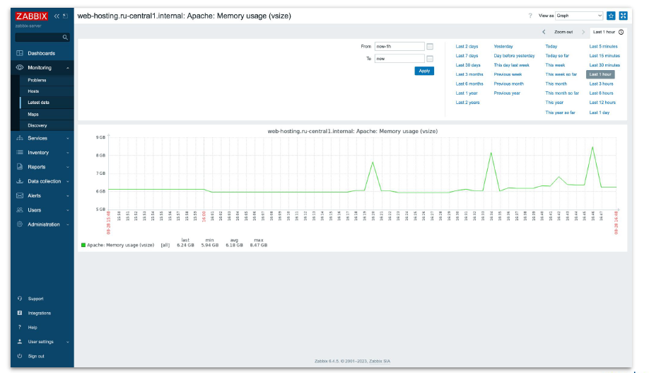
Teenivad andmeelemendiga kogutud andmete visualiseerimiseks

**Kasutaja graafikud**
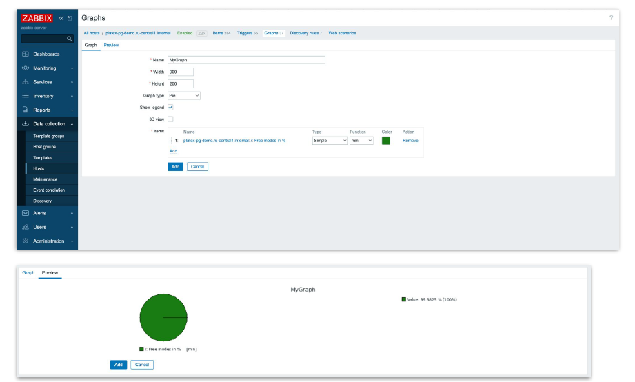
Pakuvad individuaalse seadistamise võimalust

**Situatsioonilised graafikud**
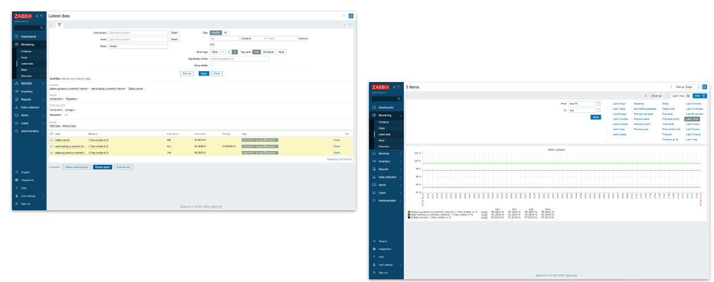
Graafikud mitme andmeelemendi võrdlemiseks "lennult"

## Võrgukaardid

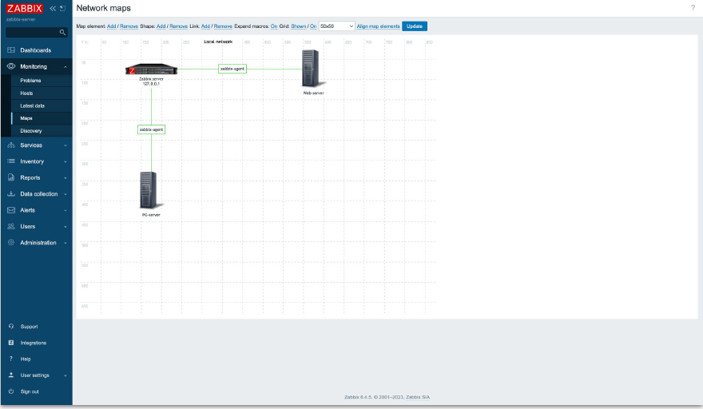
Infrastruktuuri visualiseerimine

## Paneelid


Visualiseerimisplatvorm erinevate tööriistadega (graafikud/kaardid/jne)

---
# Häirete seadistamine

## Teemad

- Teavituste saatmise põhimõtted
- Teavituste edastamise kanalid
- Häirete seadistamine Zabbix'is
- Refleksioon

## Põhilised lähenemisviisid teavituste saatmiseks

### Parameetrite valik

- Tuleb valida parameetrid, mille alusel saadetakse teavitusi
- KÕIGI parameetrite valimine on halb praktika
- Parameetrite valik sõltub peamiselt teenusest ja ärinõuetest


### Käivitamislävi

- Määrake käivitamislävi pärast meetrika jälgimist
- Arvestage meetrika tippväärtusi ja nende kestust
- Sageli on vaja rohkem kui ühte käivitusläve
- Võimalik on seadistada mitu teavitustasandit sama meetrika jaoks


### Kas teavitused sisse lülitada või mitte?

- Teavituste arvu tuleb vähendada
- Kui teavitusele ei reageerita, on parem see välja lülitada, et vältida edaspidi liigset teavitamist
- Kui mõne parameetri osas on kahtlusi, on parem teavitused sisse lülitada, vähemalt alguses

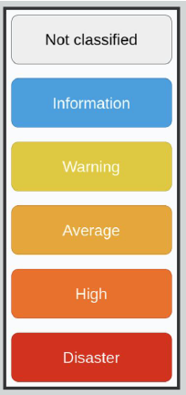

### Olulisuse tase

Olulisuse tase määrab probleemi prioriteedi:
- Parameetrid jaotatakse tavaliselt kahte põhirühma:
  - Kõrge prioriteet — kriitilised probleemid
  - Madal prioriteet — probleemid, millele tuleks tähelepanu pöörata
- Värvikodeering sündmuste visuaalseks kuvamiseks
- Erinevate teavituskanalite seadistamine erinevate olulisustasemete jaoks
- Võimalik seadistada kohandatud olulisuse tasemeid

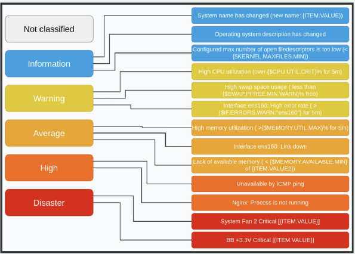

### Eskalatsioon

Eskalatsioon on protseduur, mis juhib tähelepanu konkreetsele probleemile, kui praegune lahenduskäik ei ole rahuldav:
- Probleemi ja eskalatsiooni põhjuse selge sõnastamine
- Probleemi prioriteedi muutmise põhjus
- Tüüpprobleemide eskaleerimistasemete eelnev planeerimine
- Eskalatsiooniprotsesside seadistamine vastavalt probleemi tasemele

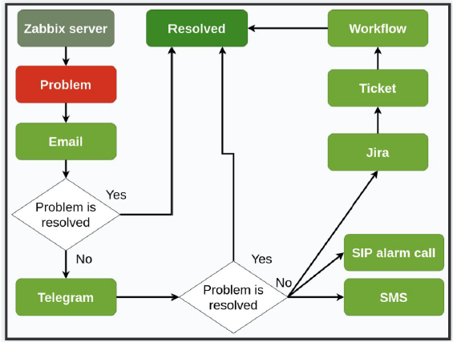

### Eeskirjad ja juhendid

- Kõigi võimalike stsenaariumide jaoks eeskirjade ja juhendite koostamine
- Vajaliku teabe edastamine teavituste adressaatidele
- Eeskirjade ja juhendite pidev täiustamine
- Teavituste seadistamine on lõputu protsess! Seda tuleb meeles pidada

### Häirete testimine

- Vajadus jälgida ja kontrollida teavitussüsteemi ennast
- Tööriistad teavitussüsteemi kontrollimiseks (skriptid, testparameetrid ja päästikud)

### Häirete deduplikatsioon

- Vältige teavitusi üksikutele töötajatele
- Kasutage rühmateavitusi
- Kasutage päästikute sõltuvusi

### Häirete ajakava

- Erinevate teavituskanalite jaotamine päeva ja nädalapäevade kaupa
- Perioodilisi teavitusi samal ajal saab välistada

## Teavituskanalid

### E-post

- Saatmine SMTP kaudu (oma või muu server)
- Teavitused meililistidele ja konkreetsetele kasutajatele
- Kirja malli kohandamine
- Lisateave kirjas
- Mittepealetükkivus

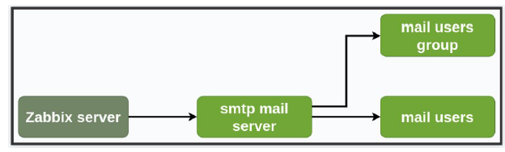
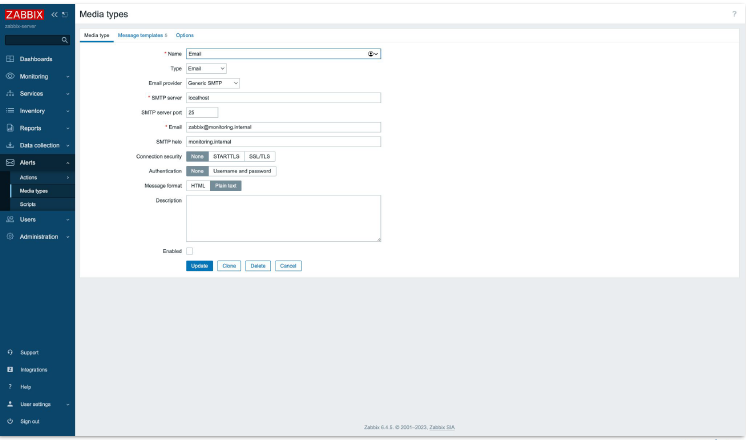

### Telegram

https://git.zabbix.com/projects/ZBX/repos/zabbix/browse/templates/media/telegram

- Saatmine veebihaagi kaudu
- Teavituste kiirus
- Adressaatide mugav haldamine (teavitused kanalisse või privaatsõnumisse)
- Lihtsustatud seadistamine (alates Zabbix'i 5. versioonist)

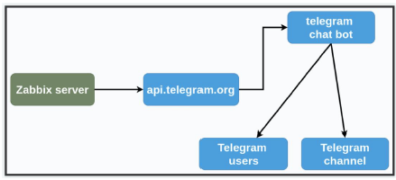
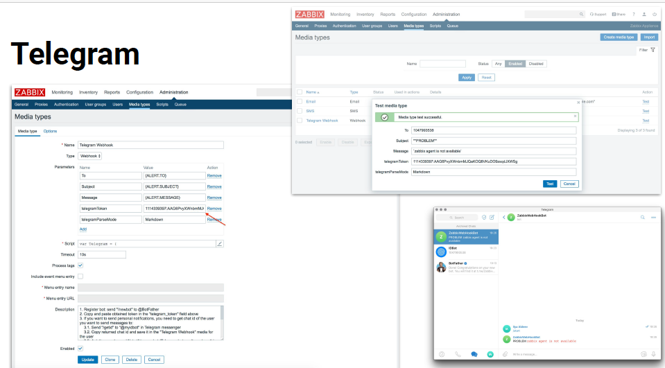

### Teised sõnumirakendused

https://git.zabbix.com/projects/ZBX/repos/zabbix/browse/templates/media

- Teavitusmeetodi universaalsus (veebihaak)
- Erinevused sõnumimallide vormingus
- Lisavõimalused (graafikutega pildid, emotikonid, värviline esiletõstmine)

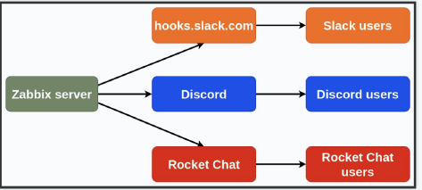
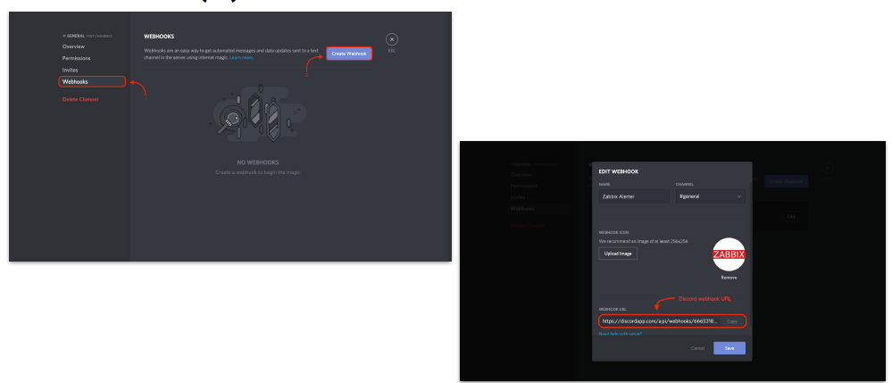
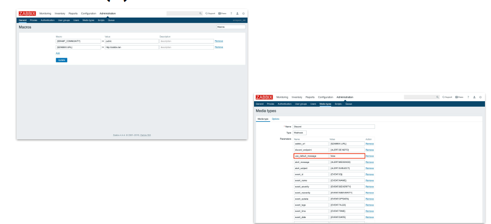
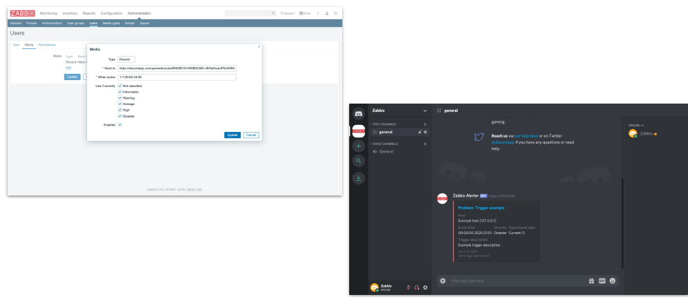
### SMS (saatmine läbi lüüsi)

- Teavituste kiirus
- Teavituste universaalsus (sõltumata telefonimudelist)
- Suhteline usaldusväärsus
- Piirangud sõnumite sisule
- Nõuab tasuliste teenuste kasutamist

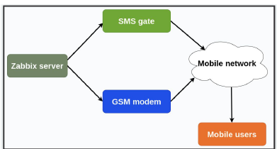

### SMS (saatmine läbi GSM-modemi)

- Tõrkekindel skeem tõsise avarii korral
- Nõuab modemi töö ja ühenduse kontrollimist
- Skeem ei sõltu objekti sidekanalitest
- Vajab samuti varundamist
- Nõuab tasuliste teenuste kasutamist

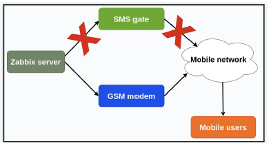

### Push-teavitused

- Kaasaegne ja võib olla mugav
- Nõuab tasuliste teenuste kasutamist

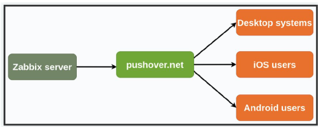

### Piletid teenindustoes

- Mugav ja operatiivne
- Probleemi tuvastamise ja lahendamise protsessi kontroll
- Täiendav eskalatsioon ja teave probleemi kohta
- Võimalik tõhusalt delegeerida ja jagada probleemi töögrupi ülesanneteks

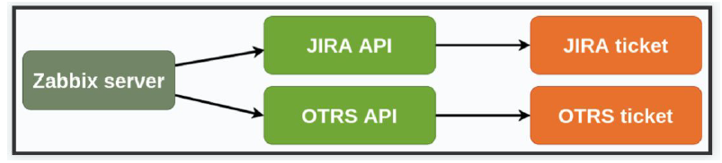

### Kõne sõnumiga

- Tõhus teavitamine — äratab keda iganes! (kuigi see pole kindel...)
- Nõuab väga täpset eskalatsiooni seadistust, muidu riskitakse kiire ja püsiva väljalülitamisega
- Nõuab kolmanda osapoole sidevahendeid (kui ettevõttel pole oma analoogseid)

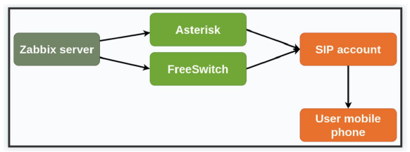

## Häirete seadistamine Zabbix'is

### Teavituste loogika

Zabbix'is toimub teavituste seadistamine järgmise loogika alusel:
1. Server jälgib elementi (Item)
2. Päästik (Trigger) aktiveerub, kui element vastab teatud tingimustele
3. Probleem (Problem) luuakse, kui päästik on aktiveeritud
4. Tegevus (Action) käivitatakse, mis saadab teavituse
5. Tegevus dokumenteeritakse tegevuste logis (Action log)

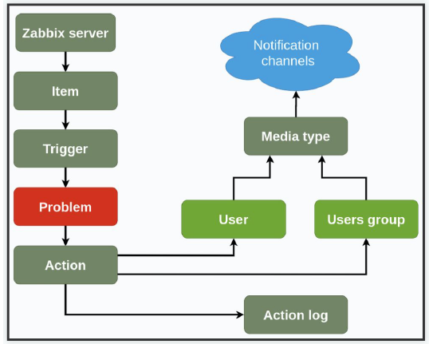

### Lahendatud probleemi käsitlemine

Sarnane loogika kehtib ka lahendatud probleemide puhul, kus teavitatakse kasutajaid, kui probleem on lahendatud.

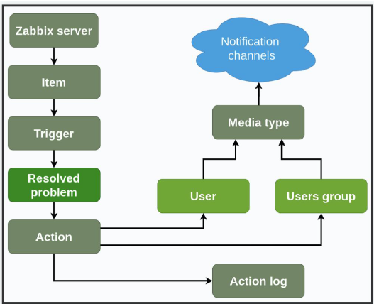

### Teavituste silumine

- Kontrollige Media type tööd Test nupuga
- Kontrollige Action seadistusi
- Kontrollige sündmusi Action log'is
- Kontrollige, kas vajalik Media type on vajalikul kasutajal
- 
---
## Portaalide ja andmebaaside monitoorimine

[](https://www.zabbix.com/)

## Teemad

- Veebiserverite monitoorimine
- Andmebaaside monitoorimine (lähenemisviisid)
- MySQL monitoorimine
- PostgreSQL monitoorimine

---

## Veebiserverite monitoorimine

## Veebportaali monitoorimise mõõdikud (1)

- Serveri põhisüsteemid
  - CPU
  - RAM
  - Kõvaketas
  - Võrk
  - Turvalisus
- Kuidas monitoorime?
  - zabbix-agent serveril + Zabbix standardmallid
  - Prometheus Node exporter + Zabbix standardmallid

[Learn more about Browser Monitoring](https://blog.zabbix.com/an-introduction-to-browser-monitoring/29245/)

<!-- Image followed by a link reference -->
<p align="center">
  
  <br>
  <a href="https://blog.zabbix.com/an-introduction-to-browser-monitoring/29245/">Read our Introduction to Browser Monitoring</a>
</p>

<!-- Badge style link -->
[](https://blog.zabbix.com/an-introduction-to-browser-monitoring/29245/)
You can use any of these examples in your REA

---

## Veebportaali monitoorimise mõõdikud (2)

- Veebiserver
  - Veebiteenuse staatus
  - Portide kättesaadavus
  - Päringud sekundis (RPS)
  - HTTP-lõpetamiskoodid
  - Veebserveri vead
  - SSL sertifikaadid
  - Reageerimisaeg
- Kuidas monitoorime?
  - zabbix-agent serveril + Zabbix standardmallid
  - Simple check Zabbix serverilt
  - Veebistsenaariumid monitooritud serveritelt
  - Kohandatud kasutajaparameetrid (UserParameter)
  - Logisõnumid

---

## Veebportaali monitoorimise mõõdikud (3)

- Rakendusserver
  - Veebserveri teenuse olek
  - Teenuste olekud
  - Päringud sekundis (php, redis, rabbitMQ, muud)
  - Puhvri kasutamine
  - Järjekorra kasutamine
  - Protsesside arv ja olek
  - Teenuste vead logides
- Kuidas monitoorime?
  - zabbix-agent serveril + Zabbix standardmallid
  - Simple check Zabbix serverilt
  - Kohandatud kasutajaparameetrid (UserParameter)
  - Logisõnumid

---

## Veebportaali monitoorimise mõõdikud (4)

- Ärimõõdikud
  - külastused
  - konversioon
  - müügid
  - rakenduse allalaadimised
- Kuidas monitoorime?
  - Kohandatud kasutajaparameetrid
  - Arvutatud andmeelemendid

---

## Näide: Apache monitoorimine (1)

```bash
# status_module mooduli ühendamine
$ apachectl -M | grep status_module
status_module (shared)
# Kui moodul pole ühendatud - tuleb leida ja redigeerida status.conf
# (status.conf sisu - järgmisel slaidil)
$ ls /etc/apache2/mods-available | grep status.conf
status.conf
# Konfiguratsiooni kontrollimine ja mooduli sisselülitamine
$ apachectl -t
$ a2enmod status
$ systemctl restart apache2
$ systemctl status apache2
```

Ubuntu (eeldades, et Zabbix-agent on juba paigaldatud ja käivitatud)

---

## Näide: Apache monitoorimine (2)

```apache
# status.conf
<IfModule mod_status.c>
 # Allow server status reports generated by mod_status,
 # with the URL of http://servername/server-status
 # Uncomment and change the "192.0.2.0/24" to allow access from other hosts.
 <Location /server-status>
 SetHandler server-status
 Require local
 Require ip 127.0.0.1/32
 </Location>
 # Keep track of extended status information for each request
 ExtendedStatus On
 # Determine if mod_status displays the first 63 characters of a request or
 # the last 63, assuming the request itself is greater than 63 chars.
 # Default: Off
 #SeeRequestTail On
 <IfModule mod_proxy.c>
 # Show Proxy LoadBalancer status in mod_status
 ProxyStatus On
 </IfModule>
</IfModule>
```

status.conf

---

## Näide: Apache monitoorimine (3)

```bash
# Mooduli testimine
$ curl http://127.0.0.1/server-status?auto
localhost
ServerVersion: Apache/2.4.29 (Ubuntu) OpenSSL/1.1.1
ServerMPM: prefork
Server Built: 2022-03-16T16:53:42
CurrentTime: Thursday, 10-Aug-2023 22:45:35 UTC
RestartTime: Thursday, 10-Aug-2023 22:45:33 UTC
ParentServerConfigGeneration: 1
ParentServerMPMGeneration: 0
ServerUptimeSeconds: 2
ServerUptime: 2 seconds
Load1: 0.00
Load5: 0.00
Load15: 0.00
...
```

Konsoolist kontroll

---

## Zabbix-agendi seadistamine

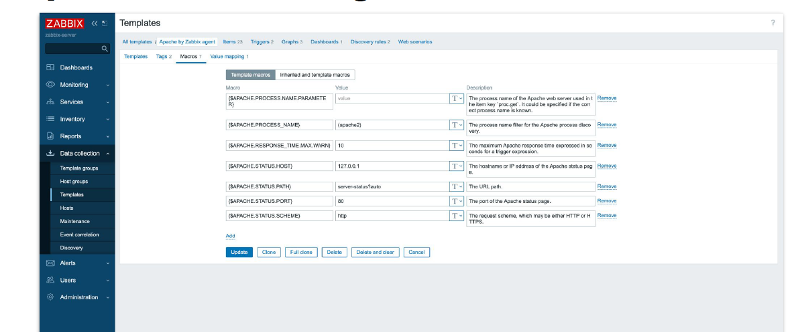
*PILT: Zabbix-agendi seadistamine*

---

## Näide: töölaud (dashboard)

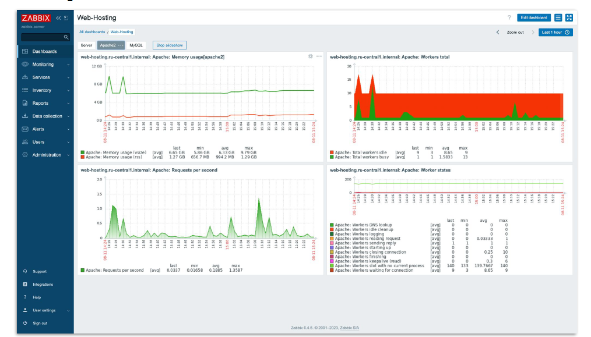
*PILT: Zabbix töölaua näide Apache ja MySQL monitoorimise graafikutega*
---

## Andmebaaside monitoorimine

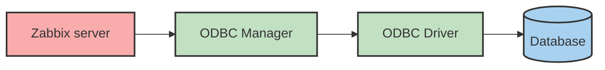
```mermaid
flowchart LR
    A[Zabbix server] --> B[ODBC Manager]
    B --> C[ODBC Driver]
    C --> D[(Database)]
style A fill:#f9acac,stroke:#333,stroke-width:2px
style B fill:#c2e0c2,stroke:#333,stroke-width:2px
style C fill:#c2e0c2,stroke:#333,stroke-width:2px
style D fill:#a8d1f0,stroke:#333,stroke-width:2px
```

**[Article: Out-of-the-box database monitoring](https://blog.zabbix.com/out-of-the-box-database-monitoring/13957/)**

---

## ODBC (Open Database Connectivity) monitoorimine. Zabbix sisseehitatud moodul

- **Eelised**
  - Zabbixisse sisse ehitatud
  - Toetab paljusid andmebaase (Oracle, MySQL, PostgreSQL, MSSQL, IBM DB2, MongoDB, Firebird jne)
  - Ametlikud mallid populaarsetele andmebaasidele (MySQL, MSSQL, Oracle) (alates veebruar 2020)
- **Puudused**
  - Töötab ainult serveril, kus on käivitatud zabbix-server ja zabbix-proxy, seetõttu on monitoorimiseks vajalik otsene ühendus andmebaasiga; NAT-i taga asuvate andmebaaside monitoorimine pole võimalik
  - Puudub ühenduste kogu (pool) tugi. Iga päring on uus ühendus andmebaasiga (versioonis 4.4 ilmus db.odbc.get, mistõttu on võimalik vähendada päringute arvu ja andmeid eeltöödelda)
  - Platvormist sõltuv lahendus (lahendust ei saa kasutada seal, kus pole Linux-servereid)

---

## Zabbix agent UserParameter abil

- **Eelised**
  - Töötab vahetult andmebaasi serveril (agendi aktiivne või passiivne režiim, aktiivse puhul NAT pole probleem)
  - Kiiresti ja suhteliselt lihtsalt saab luua oma lahenduse
  - Ristplatvormilisus tänu skriptidele erinevates keeltes
- **Puudused**
  - Puudub ühenduste kogu tugi. Iga skripti käivitamine on uus ühendus andmebaasiga
  - Paljude kogutavate mõõdikute ja kõrge küsitlemissageduse korral suureneb serveri koormus (CPU, RAM)
  - Puudub ühtne lahendus Windows/Linux/AIX ja erinevate andmebaaside jaoks
  - Lahenduse kasutamine võib olla võimatu infrastruktuuri piirangute või turvalisuspoliitika tõttu (näiteks väliste skriptide suhtes)
  - Vajalik täiendava tarkvara paigaldamine (näiteks Python)

<p align="center">
  <a href="https://blog.zabbix.com/zabbix-agent-user-parameters/7910/">
    
  </a>
  <br>
  <em>PILT: UserParameter eeliste ja puuduste loetelu</em>
  <br>
  <a href="https://blog.zabbix.com/zabbix-agent-user-parameters/7910/">Zabbix Agent User Parameters</a>
</p>

---

## Moodulid Zabbix Agendi jaoks (libzbxpgsql, libzbxredis, zabbix-modulemysql jne)

- **Eelised**
  - Töötavad vahetult andmebaasi serveril (agendi aktiivne või passiivne režiim, aktiivse puhul NAT pole probleem)
- **Puudused**
  - Töötavad ainult Linuxil
  - Iga moodul on mõeldud konkreetsele andmebaasile (pole ühtset moodulit kõigile populaarsetele andmebaasidele)
  - Paljude moodulite tugi on lõpetatud, moodulid ja mallid ei arene
  - Puudub ühenduste kogu tugi. Iga päring on uus ühendus andmebaasiga
  - Paljusid mooduleid tuleb ise lähtekoodi põhjal kompileerida, selleks on vaja kvalifitseeritud inseneri

---

## Välised agendid (mamonsu, DBforBIX, ZabbixDBA, zbxdb, zbxora jne)

- **Eelised**
  - Töötavad vahetult andmebaasi serveril (agendi aktiivne või passiivne režiim, aktiivse puhul NAT pole probleem)
  - Paljud agendid on ristplatvormilised, kuid mitte kõik pole testitud Windows/AIX-il
  - Paljud agendid toetavad ühenduste kogu
- **Puudused**
  - Mõned agendid on ammu hüljatud ja ei arene, puuduvad valmis mallid erinevate andmebaaside jaoks (DBforBIX, ZabbixDBA)
  - Mõnede agentide keerulised seadistused (DBforBIX, zbxdb)
  - Lahenduse kasutamine võib olla võimatu infrastruktuuri piirangute või turvalisuspoliitika tõttu (näiteks on nõutav PSK/SSL-krüpteerimine monitoorimisandmete edastamisel)
  - Vajalik täiendava tarkvara paigaldamine (näiteks Python, Java või Perl)

---

## Zabbix Agent 2

- **Eelised**
  - Töötavad vahetult andmebaasi serveril (agendi aktiivne või passiivne režiim, aktiivse puhul NAT pole probleem)
  - Kirjutatud Golangi keeles — ristplatvormil töötav, kuid ainult Linuxi ja Windowsi jaoks
  - Redis, Memcached, PostgreSQL, MySQL monitoorimise tugi "karbist". Hiljuti ilmus Oracle'i liides
  - Alates 17.09.2020 on olemas Windows-teenuse tugi [ZBXNEXT 6023]
- **Puudused**
  - Kirjutatud Golangi keeles — ebapiisavalt ristplatvormil töötav — AIX versioonid < 7.2 ei ole Golang kompileerija poolt toetatud, Solaris või FreeBSD on küsimärgi all
  - Seni on realiseeritud tugi kaugeltki mitte kõigile populaarsetele andmebaasidele (puudub MSSQL)
  - Ei toeta deemonina töötamist Linuxis


---

## Zabbix Agent DBMON

- **Eelised**
  - Ristplatvormil töötav (toetab kompileerimist Linuxi, Windowsi, AIX, Solarise jt jaoks)
  - Toetab Oracle, MySQL, PostgreSQL, MSSQL monitoorimist kõigil operatsioonisüsteemidel ilma täiendavate skriptideta
  - Kiire monitoorimine, väike CPU ja RAM ressursside kasutus
  - Valmis modulaarsed mallid Oracle, MySQL, PostgreSQL monitoorimiseks erinevatel operatsioonisüsteemidel
  - Minimaalsed agendi seadistused
  - Kompaktne lahendus minimaalse sõltuvusega
- **Puudused**
  - Seni veel arendamisel ja kõik "funktsioonid" ei pruugi olla kättesaadavad


---

## Näide: MySQL monitoorimine (1)

```bash
# Malli ettevalmistamine
$ vim /etc/zabbix/zabbix_agentd.d/template_db_mysql.conf

UserParameter=mysql.ping[*], mysqladmin -h"$1" -P"$2" ping

UserParameter=mysql.get_status_variables[*], mysql -h"$1" -P"$2" -sNX -e "show global status"

UserParameter=mysql.version[*], mysqladmin -s -h"$1" -P"$2" version

UserParameter=mysql.db.discovery[*], mysql -h"$1" -P"$2" -sN -e "show databases"

UserParameter=mysql.dbsize[*], mysql -h"$1" -P"$2" -sN -e "SELECT COALESCE(SUM(DATA_LENGTH + 
INDEX_LENGTH),0) FROM INFORMATION_SCHEMA.TABLES WHERE TABLE_SCHEMA='$3'"

UserParameter=mysql.replication.discovery[*], mysql -h"$1" -P"$2" -sNX -e "show slave status"
UserParameter=mysql.slave_status[*], mysql -h"$1" -P"$2" -sNX -e "show slave status"
```

Eeldame, et Zabbix-agent on juba paigaldatud ja käivitatud

---

## Näide: MySQL monitoorimine (2)

```bash
# Kasutaja loomine andmebaasis
$ mysql -uroot -p
> CREATE USER 'zbx_monitor'@'%' IDENTIFIED BY 'TTRy1bRRgLIB';
> GRANT USAGE,REPLICATION CLIENT,PROCESS,SHOW DATABASES,SHOW VIEW ON *.* TO 'zbx_monitor'@'%';
> quit

# Zabbix kasutaja kodukataloogi kontroll ja vajadusel loomine
$ cat /etc/passwd | grep zabbix
zabbix:x:990:986:Zabbix Monitoring System:/var/lib/zabbix:/sbin/nologin
$ mkdir /var/lib/zabbix

# Andmebaasiga ühendumise konfiguratsiooni loomine
$ vim /var/lib/zabbix/.my.cnf
[client]
user='zbx_monitor'
password='TTRy1bRRgLIB'

# Õiguste seadistamine
$ chown -R zabbix. /var/lib/zabbix
$ chmod 400 /var/lib/zabbix/.my.cnf
```

Monitoorimise kasutaja andmebaasis

---

## Discovery trapper

## Teemad
SNMP
LLD
Zabbix-sender/Zabbix-trapper
Refleksioon

## SNMP protokoll
**Simple Network Management Protocol (SNMP)** — standardne internetiprotokoll seadmete haldamiseks IP-võrkudes
* Võimalikud lugemis- ja kirjutamisoperatsioonid
* Kasutab haldusteabe baasi (MIB — Management Information Base, RFC-1213, -1212)


## SNMP: käskude näited

```bash
# Teenuse paigaldamine ja käivitamine
$ yum install net-snmp net-snmp-utils
$ systemctl start snmpd

# Käskude näited
$ snmpwalk -v 2c -c public localhost
$ snmpdf -v 2c -c public localhost
$ snmptable -v 2c -c public localhost ipAddrTable

# MIBs 
$ ls /usr/share/snmp/mibs/
```
CentOS 7

## SNMP: haldurilt agendile

## Haldurilt agendile

| Operatsioon | Kirjeldus |
|-------------|-----------|
| **GetRequest** | Päring muutuja või muutujate loendi väärtuse saamiseks. |
| **SetRequest** | Päring muutuja või muutujate loendi muutmiseks. Seotud muutujad määratakse päringu kehas. Agent peab kõik määratud muutujate muudatused täitma atomaarse operatsioonina. Haldurile tagastatakse Response (praeguste) uute muutujate väärtustega. |
| **GetNextRequest** | Päring saadaolevate muutujate ja nende väärtuste avastamiseks. Haldurile tagastatakse Response seotud muutujatega muutuja jaoks, mis on järgmine MIB baasis leksikograafilises järjekorras. |
| **GetBulkRequest** | GetNextRequest'i täiustatud versioon. Päring haldurilt objektile mitme GetNextRequest'i iteratsiooni jaoks. Haldur saab vastuse mitme seotud muutujaga, mille agent sai OID puud läbides alustades seotud muutujast (muutujatest) päringus. |

## Agendilt haldurile

| Operatsioon | Kirjeldus |
|-------------|-----------|
| **Response** | Tagastab seotud muutujad ja väärtused agendilt haldurile GetRequest, SetRequest, GetNextRequest, GetBulkRequest ja InformRequest jaoks. Veateated on tagatud vea oleku ja vea indeksi väljadega. Seda üksust kasutatakse vastusena nii Get- kui ka Set-päringutele, SNMPv1-s nimetatakse seda GetResponse. |
| **Trap** | Asünkroonne teatis agendilt haldurile. Sisaldab praegust sysUpTime väärtust, OID-d, mis määratleb trap'i tüübi, ja valikulisi seotud muutujaid. Kasulik kasutada juhtudel, kui andmed võivad ilmuda agendi serveri küsitluste vahel. |

## MIB mõisted

| Termin | Kirjeldus |
|--------|-----------|
| **Management Information Base (MIB, haldusteavet baas)** | Virtuaalne andmebaas, mida kasutatakse võrguobjektide haldamiseks. |
| **Object Identifier (OID)** | Objektide identifikaatorid MIB-is. Iga OID koosneb kahest osast: tekstinimest ja SNMP aadressist numbrilises vormis. |

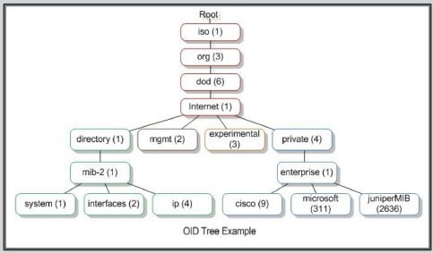

## SNMP ja Zabbix
* Zabbix toetab SNMP v1, 2c ja 3
* SNMPv3 toetab autentimist ja krüpteerimist
* Iga andmeelemendi kohta community, turvalisuse tase ja port
* Kasutaja makrode tugi SNMP community's
* SNMP päringuid töötlevad Zabbix pollerid
* Zabbix tarnitakse koos mitme eelnevalt määratletud SNMP mallga
* Zabbix toetab SNMP päringute paketttöötlust


## Discovery

## Hostide avastamine
* Paigaldame hostidele zabbix-agent, avame pordi 10050
* Määrame Server parameetri (soovitatav on luua ansible playbookid agenti paigaldamiseks uutele hostidele)
* Lisame avastamireegli Data Collection -> Discovery
* Aktiveerime või lisame toimingu tüübiga Discovery Actions kohas Alerts -> Actions -> Discovery actions


## Näide

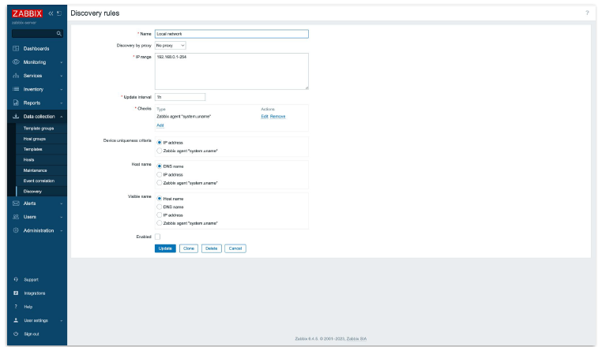

## Hostide avastamine SNMP kaudu
* Hostil on snmpd aktiveeritud, SNMP jaoks avatud tulemüür
* Lisame Discovery rule SNMP kontrolliga
* Lisame Action koos SNMP jaoks lingitud malliga

## Näide

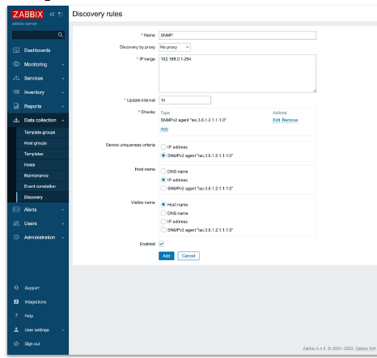

## LLD: madala taseme avastamine
* Võimalus luua kasutaja reegleid ja malle erinevate jälgimiskomponentide avastamiseks lõppsüsteemis:
  * kettad, failisüsteemid, võrguinterfaceäid
  * SQL tabelid
  * SQL päringute põhjal meetrikad
  * mis tahes muud mallipõhised meetrikad, mille saamine on võimalik skripti kaudu realiseerida

## LLD: komponendid
* Madala taseme avastamisreegel
* Andmeelementide prototüübid
* Triger prototüübid
* Graafiku prototüübid
* Võrgusõlmede prototüübid

## LLD: interaktsiooniskeem

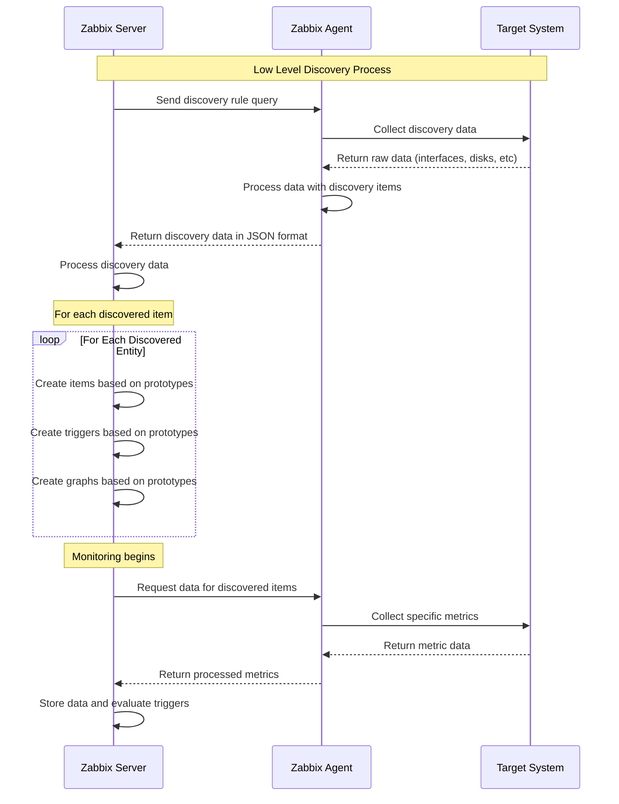
```mermaid
sequenceDiagram
    participant Z as Zabbix Server
    participant A as Zabbix Agent
    participant T as Target System
    
    Note over Z,T: Low Level Discovery Process
    
    Z->>A: Send discovery rule query
    A->>T: Collect discovery data
    T-->>A: Return raw data (interfaces, disks, etc)
    A->>A: Process data with discovery items
    A-->>Z: Return discovery data in JSON format
    
    Z->>Z: Process discovery data
    
    Note over Z: For each discovered item
    
    loop For Each Discovered Entity
        Z->>Z: Create items based on prototypes
        Z->>Z: Create triggers based on prototypes
        Z->>Z: Create graphs based on prototypes
    end
    
    Note over Z: Monitoring begins
    
    Z->>A: Request data for discovered items
    A->>T: Collect specific metrics
    T-->>A: Return metric data
    A-->>Z: Return processed metrics
    
    Z->>Z: Store data and evaluate triggers
```

## Prototüüpide loomine

* LLD reeglid tagastavad andmeid makrodes:
  * Failisüsteemid: {#FSNAME}, {#FSTYPE}
  * Interfaced: {#IFNAME}
  * SNMP: {#SNMPINDEX}, {#SNMPVALUE}, ...
* Võtme näide:
vfs.fs.size[{#FSNAME},free]
* LLD makrosid saab kasutada trigeri väljendites:
{vfs.fs.size[{#FSNAME},pused].last(0)} > {#MY_CUSTOM_MACRO}

## Näide


## Zabbix-sender

```bash
-c, --config config-file
-s, --host host

# hosti nimi Zabbixis (tõstutundlik)
-k, --key key

# võti, meetrika nimetus
-o, --value value

# meetrika väärtus või JSON LLD jaoks
-i, --input-file input-file

# sisendfail andmetega meetrikate paketi saatmiseks
Konsooliutiliit meetrikate saatmiseks (Zabbix trapperisse)
```
##  Näide: Zabbix Discovery Trapper JSON Data Processing

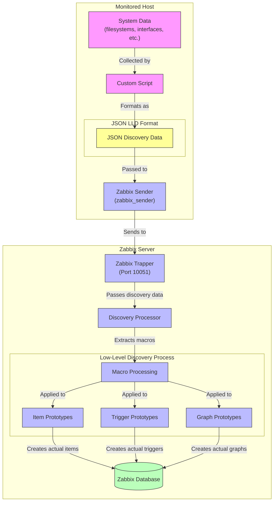
```mermaid
graph TD
    subgraph "Monitored Host"
        Script["Custom Script"]
        Data["System Data\n(filesystems, interfaces, etc.)"]
        
        subgraph "JSON LLD Format"
            JSON["JSON Discovery Data"]
        end
        
        ZS["Zabbix Sender\n(zabbix_sender)"]
    end
    
    subgraph "Zabbix Server"
        ZT["Zabbix Trapper\n(Port 10051)"]
        DP["Discovery Processor"]
        
        subgraph "Low-Level Discovery Process"
            Macros["Macro Processing"]
            ItemProto["Item Prototypes"]
            TriggerProto["Trigger Prototypes"]
            GraphProto["Graph Prototypes"]
        end
        
        DB[(Zabbix Database)]
    end
    
    Data -->|"Collected by"| Script
    Script -->|"Formats as"| JSON
    JSON -->|"Passed to"| ZS
    ZS -->|"Sends to"| ZT
    
    ZT -->|"Passes discovery data"| DP
    DP -->|"Extracts macros"| Macros
    Macros -->|"Applied to"| ItemProto
    Macros -->|"Applied to"| TriggerProto
    Macros -->|"Applied to"| GraphProto
    
    ItemProto -->|"Creates actual items"| DB
    TriggerProto -->|"Creates actual triggers"| DB
    GraphProto -->|"Creates actual graphs"| DB
    
    classDef script fill:#f9f,stroke:#333,stroke-width:1px;
    classDef json fill:#ff9,stroke:#333,stroke-width:1px;
    classDef zabbixComponent fill:#bbf,stroke:#333,stroke-width:1px;
    classDef database fill:#bfb,stroke:#333,stroke-width:1px;
    
    class Script,Data script;
    class JSON json;
    class ZS,ZT,DP,Macros,ItemProto,TriggerProto,GraphProto zabbixComponent;
    class DB database;
```

## Näide: Zabbix High Availability Data Flow

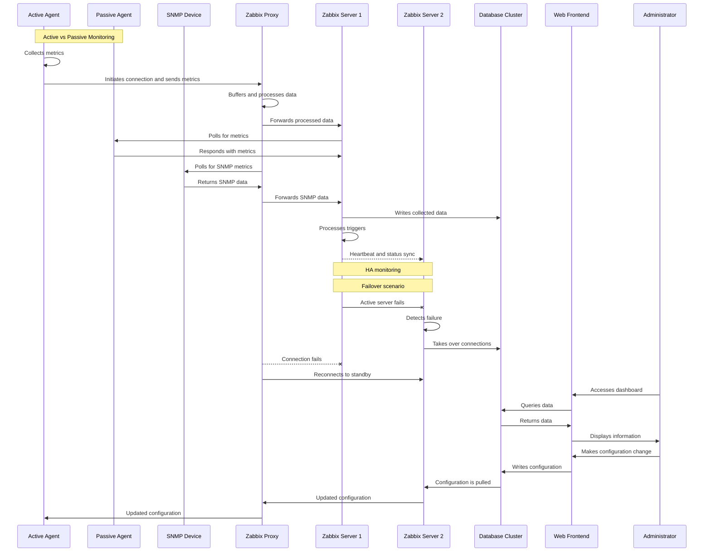
```mermaid
sequenceDiagram
    participant AA as Active Agent
    participant PA as Passive Agent
    participant SD as SNMP Device
    participant ZP as Zabbix Proxy
    participant ZS1 as Zabbix Server 1
    participant ZS2 as Zabbix Server 2
    participant DB as Database Cluster
    participant WEB as Web Frontend
    participant ADM as Administrator
    
    Note over AA,PA: Active vs Passive Monitoring
    
    AA->>AA: Collects metrics
    AA->>ZP: Initiates connection and sends metrics
    ZP->>ZP: Buffers and processes data
    ZP->>ZS1: Forwards processed data
    
    ZS1->>PA: Polls for metrics
    PA->>ZS1: Responds with metrics
    
    ZP->>SD: Polls for SNMP metrics
    SD->>ZP: Returns SNMP data
    ZP->>ZS1: Forwards SNMP data
    
    ZS1->>DB: Writes collected data
    ZS1->>ZS1: Processes triggers
    
    ZS1-->>ZS2: Heartbeat and status sync
    Note over ZS1,ZS2: HA monitoring
    
    Note over ZS1,ZS2: Failover scenario
    ZS1-xZS2: Active server fails
    ZS2->>ZS2: Detects failure
    ZS2->>DB: Takes over connections
    ZP--xZS1: Connection fails
    ZP->>ZS2: Reconnects to standby
    
    ADM->>WEB: Accesses dashboard
    WEB->>DB: Queries data
    DB->>WEB: Returns data
    WEB->>ADM: Displays information
    
    ADM->>WEB: Makes configuration change
    WEB->>DB: Writes configuration
    DB->>ZS2: Configuration is pulled
    ZS2->>ZP: Updated configuration
    ZP->>AA: Updated configuration
```
## Näide: Zabbix Enterprise Network Communication Paths

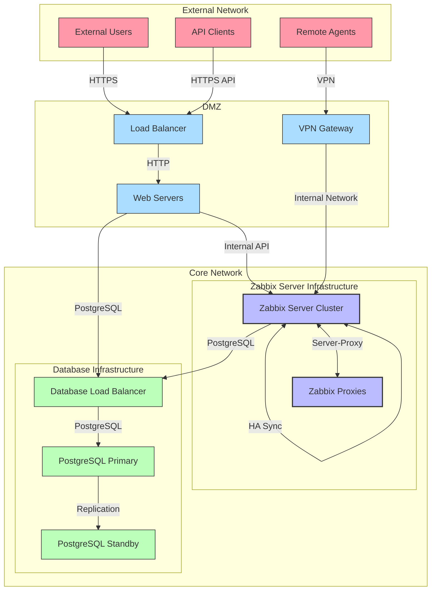
```mermaid
flowchart TB
    subgraph "External Network"
        EXT_USERS[External Users]
        API_CLIENTS[API Clients]
        REMOTE_AGENTS[Remote Agents]
    end
    
    subgraph "DMZ"
        LB[Load Balancer]
        WEB_NODES[Web Servers]
        VPN[VPN Gateway]
    end
    
    subgraph "Core Network"
        subgraph "Zabbix Server Infrastructure"
            ZS_CLUSTER[Zabbix Server Cluster]
            PROXIES[Zabbix Proxies]
        end
        
        subgraph "Database Infrastructure"
            DB_LB[Database Load Balancer]
            PG_PRIMARY[PostgreSQL Primary]
            PG_STANDBY[PostgreSQL Standby]
        end
    end
    
    EXT_USERS-->|HTTPS|LB
    API_CLIENTS-->|HTTPS API|LB
    REMOTE_AGENTS-->|VPN|VPN
    
    LB-->|HTTP|WEB_NODES
    VPN-->|Internal Network|ZS_CLUSTER
    
    WEB_NODES-->|PostgreSQL|DB_LB
    WEB_NODES-->|Internal API|ZS_CLUSTER
    
    ZS_CLUSTER-->|PostgreSQL|DB_LB
    ZS_CLUSTER<-->|HA Sync|ZS_CLUSTER
    ZS_CLUSTER<-->|Server-Proxy|PROXIES
    
    DB_LB-->|PostgreSQL|PG_PRIMARY
    PG_PRIMARY-->|Replication|PG_STANDBY
    
    classDef external fill:#f9a,stroke:#333,stroke-width:1px;
    classDef dmz fill:#adf,stroke:#333,stroke-width:1px;
    classDef core fill:#bbf,stroke:#333,stroke-width:2px;
    classDef database fill:#bfb,stroke:#333,stroke-width:1px;
    
    class EXT_USERS,API_CLIENTS,REMOTE_AGENTS external;
    class LB,WEB_NODES,VPN dmz;
    class ZS_CLUSTER,PROXIES core;
    class DB_LB,PG_PRIMARY,PG_STANDBY database;
```

## Näide: Enterprise Zabbix Architecture with High Availability 

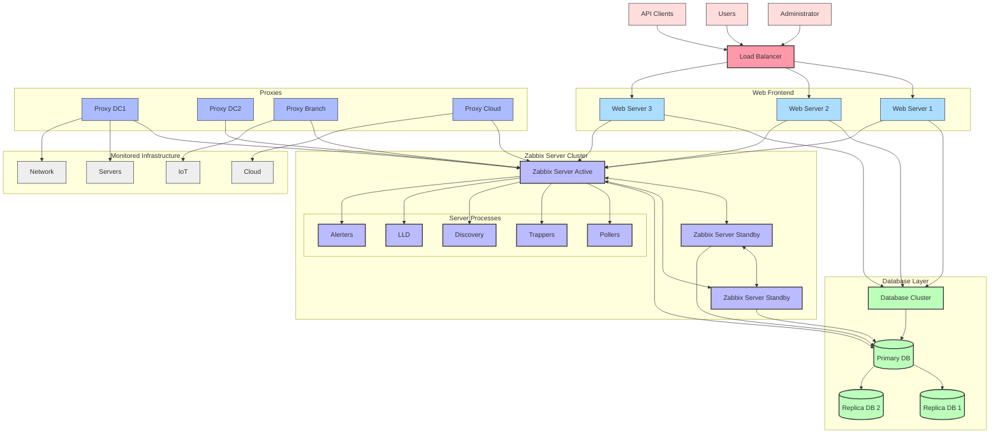
```mermaid
flowchart TB
LB[Load Balancer]
Admin[Administrator]
Users[Users]
API[API Clients]

subgraph "Web Frontend"
    WebUI1[Web Server 1]
    WebUI2[Web Server 2]
    WebUI3[Web Server 3]
end

subgraph "Zabbix Server Cluster"
    ZServer1[Zabbix Server Active]
    ZServer2[Zabbix Server Standby]
    ZServer3[Zabbix Server Standby]
    
    subgraph "Server Processes"
        Poller1[Pollers]
        Trapper1[Trappers]
        Discovery1[Discovery]
        LLD1[LLD]
        Alert1[Alerters]
    end
end

subgraph "Database Layer"
    DBCluster[Database Cluster]
    DB_Primary[(Primary DB)]
    DB_Replica1[(Replica DB 1)]
    DB_Replica2[(Replica DB 2)]
end

subgraph "Proxies"
    ProxyDC1[Proxy DC1]
    ProxyDC2[Proxy DC2]
    ProxyBranch[Proxy Branch]
    ProxyCloud[Proxy Cloud]
end

subgraph "Monitored Infrastructure"
    DC_Servers[Servers]
    DC_Network[Network]
    Cloud_Resources[Cloud]
    IOT_Devices[IoT]
end

Admin --> LB
Users --> LB
API --> LB

LB --> WebUI1
LB --> WebUI2
LB --> WebUI3

WebUI1 --> DBCluster
WebUI2 --> DBCluster
WebUI3 --> DBCluster

DBCluster --> DB_Primary
DB_Primary --> DB_Replica1
DB_Primary --> DB_Replica2

WebUI1 --> ZServer1
WebUI2 --> ZServer1
WebUI3 --> ZServer1

ZServer1 <--> ZServer2
ZServer1 <--> ZServer3
ZServer2 <--> ZServer3

ZServer1 --> DB_Primary
ZServer2 --> DB_Primary
ZServer3 --> DB_Primary

ZServer1 --> Poller1
ZServer1 --> Trapper1
ZServer1 --> Discovery1
ZServer1 --> LLD1
ZServer1 --> Alert1

ProxyDC1 --> ZServer1
ProxyDC2 --> ZServer1
ProxyBranch --> ZServer1
ProxyCloud --> ZServer1

ProxyDC1 --> DC_Servers
ProxyDC1 --> DC_Network
ProxyCloud --> Cloud_Resources
ProxyBranch --> IOT_Devices

classDef loadBalancer fill:#f9a,stroke:#333,stroke-width:2px;
classDef users fill:#fdd,stroke:#333,stroke-width:1px;
classDef webServers fill:#adf,stroke:#333,stroke-width:1px;
classDef zabbixServers fill:#bbf,stroke:#333,stroke-width:2px;
classDef databases fill:#bfb,stroke:#333,stroke-width:2px;
classDef proxies fill:#abf,stroke:#333,stroke-width:1px;
classDef infra fill:#eee,stroke:#333,stroke-width:1px;

class LB loadBalancer;
class Admin,Users,API users;
class WebUI1,WebUI2,WebUI3 webServers;
class ZServer1,ZServer2,ZServer3,Poller1,Trapper1,Discovery1,LLD1,Alert1 zabbixServers;
class DBCluster,DB_Primary,DB_Replica1,DB_Replica2 databases;
class ProxyDC1,ProxyDC2,ProxyBranch,ProxyCloud proxies;
class DC_Servers,DC_Network,Cloud_Resources,IOT_Devices infra;
```