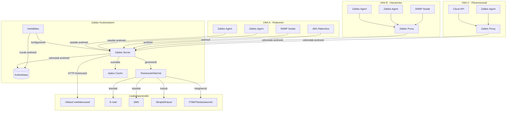
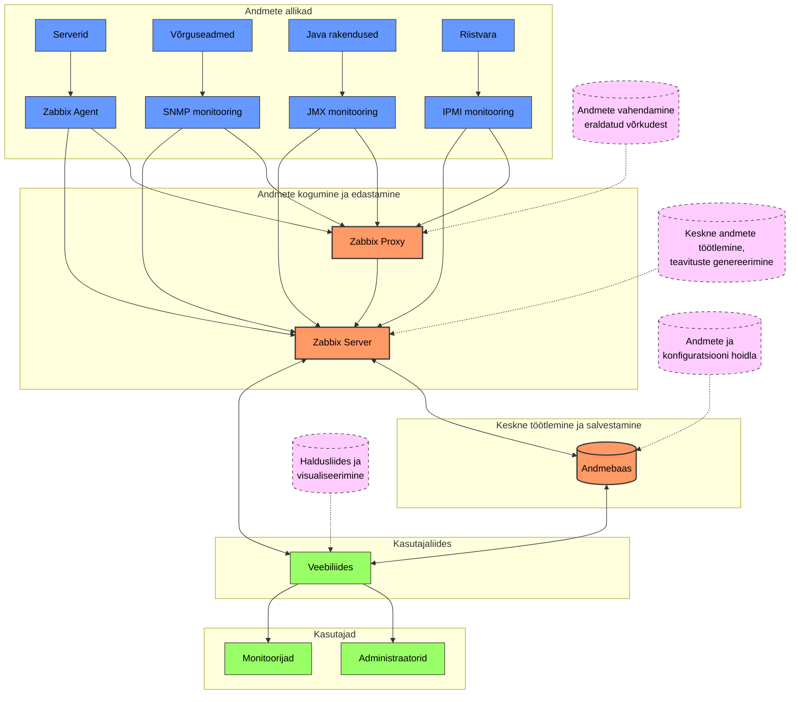
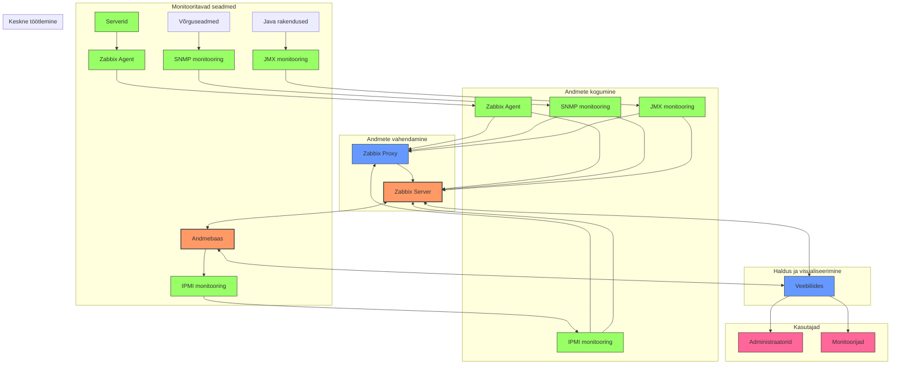
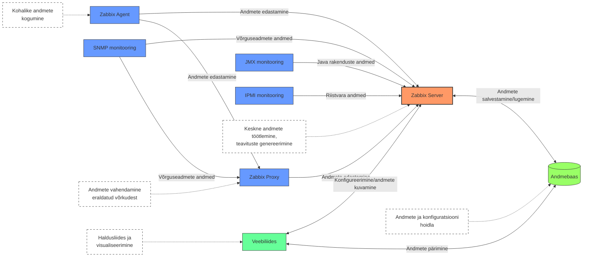

# Zabbix


## Mis on Zabbix?

Zabbix on avatud lähtekoodiga jälgimistarkvara, mille eesmärk on aidata IT-spetsialiste ja meeskondi jälgida oma arvutisüsteemide, võrkude ja rakenduste toimimist. Selle lõi Alexei Vladishev 1998. aastal ning 2001. aastal avaldati see avatud lähtekoodiga projektina, mis tähendab, et seda saab kasutada ilma litsentsitasudeta. Tänapäeval on Zabbix kujunenud üheks populaarseimaks jälgimistarkvaraks, mida kasutavad nii suured ettevõtted kui ka väiksemad organisatsioonid üle kogu maailma.

Kujutage ette olukorda, kus teil on suur hoone täis erinevaid seadmeid, aga teil puudub võimalus teada saada, kui mõni neist seadmetest lakkab töötamast või hakkab ebanormaalselt käituma. Zabbix on justkui valvur, kes pidevalt jälgib kõiki teie süsteeme ja annab kohe teada, kui midagi olulist juhtub. Selle asemel, et käia ja kontrollida iga seadet käsitsi, automatiseerib Zabbix kogu protsessi ja teavitab teid ainult siis, kui on vaja teie tähelepanu.

## Miks me vajame jälgimist?

Tänapäeva digitaalses maailmas on IT-süsteemid muutunud iga organisatsiooni jaoks elutähtsaks. Kui e-posti server lakkab töötamast, võib see peatada kogu organisatsiooni suhtluse. Kui veebisait muutub aeglaseks, võivad kliendid minna konkurentide juurde. Seepärast on ülimalt oluline teada, mis toimub teie süsteemides enne, kui probleemid mõjutavad kasutajaid.


Kujutage ette, et juhite autot pimedas ilma armatuurlaual olevate näidikuteta. Te ei teaks, kui kiiresti sõidate, kui palju kütust on alles või kas mootor kuumeneb üle. IT-süsteemid ilma jälgimistarkvarata on sarnases olukorras - te ei tea, kui hästi need toimivad, kuni midagi katki läheb.

Zabbix täidab seda lünka, pakkudes reaalajas ülevaadet kõikidest teie süsteemidest ja võimaldades teil tuvastada probleeme juba enne, kui need muutuvad kriitiliseks. See on nagu ööpäevaringne valvur, kes jälgib teie IT-keskkonda ja teavitab teid koheselt, kui midagi vajab tähelepanu.

## Zabbix'i põhikontseptsioonid

Zabbix'i mõistmiseks on oluline tunda mõningaid põhimõisteid:

**Server**: Zabbix'i süda on Zabbix server, mis kogub kõik andmed, töötleb neid ja salvestab andmebaasi. See on keskne komponent, mis haldab kõiki monitooringu ülesandeid.

**Agendid**: Agendid on väikesed programmid, mis paigaldatakse jälgitavatele serveritele ja seadmetele. Need koguvad kohalikke andmeid, nagu protsessori kasutus, mälu olek ja kettaruum, ning saadavad need Zabbix serverile.

**Andmebaas**: Kõik kogutud andmed salvestatakse andmebaasi, mis võimaldab ajalooliste andmete analüüsi ja trendide jälgimist.

**Veebiliides**: Zabbix'i kasutajasõbralik veebiliides võimaldab administraatoritel seadistada monitooringut, vaadata andmeid ja hallata teavitusi läbi tavalise veebibrauseri.

**Itemid**: Itemid määravad, milliseid andmeid kogutakse. Näiteks võib üks item jälgida protsessori koormust, teine kettaruumi kasutust ja kolmas võrguliiklust.

**Triggerid**: Triggerid määravad tingimused, millal peaks süsteem saatma hoiatuse. Näiteks võib trigger käivituda, kui protsessori koormus on üle 90% rohkem kui 5 minuti jooksul.

**Teavitused**: Kui trigger käivitub, saadab Zabbix teavituse määratud kanalite kaudu, näiteks e-posti, SMS-i või muude kommunikatsioonivahendite kaudu.

## Zabbix'i tööpõhimõte

Zabbix'i jälgimisprotsess on üsna lihtne. Kõigepealt paigaldatakse jälgitavatele serveritele Zabbix'i agendid. Need agendid koguvad erinevat tüüpi andmeid vastavalt seadistustele ja saadavad need Zabbix serverile. Server töötleb need andmed ja salvestab andmebaasi.


Veebiliides võimaldab neid andmeid visualiseerida graafikutena, mis teeb andmete mõistmise lihtsamaks. Kui mõni jälgitav väärtus ületab määratud piiri, käivitub vastav trigger ja saadetakse teavitus.

Näiteks, kui soovite jälgida veebiserverit, võib Zabbix koguda andmeid selle kohta, kui kiiresti veebisait vastab, kui palju külastajaid sellel on, ja kas kõik olulised teenused töötavad. Kui veebisait muutub liiga aeglaseks või mõni teenus lakkab töötamast, saate koheselt teavituse.

## Jälgimise tüübid Zabbix'is

Zabbix pakub erinevaid jälgimismeetodeid, et katta kõik teie IT-infrastruktuuri vajadused:

**Passiivne jälgimine**: Zabbix server küsib agendilt andmeid teatud ajavahemike järel. See on lihtsaim ja levinuim jälgimisviis.

**Aktiivne jälgimine**: Agent võtab ise serveriga ühendust ja edastab andmeid. See on kasulik, kui jälgitavad seadmed asuvad tulemüüri taga või pole otse ligipääsetavad.

**Agendita jälgimine**: Zabbix saab jälgida seadmeid ka ilma agente paigaldamata, kasutades standardprotokolle nagu SNMP, ICMP (ping) või HTTP.

**Rakenduste jälgimine**: Lisaks riistvarale võib Zabbix jälgida ka rakenduste tervist ja jõudlust, näiteks andmebaase, veebiservereid või e-posti servereid.

## Zabbix'i kasutamise eelised

Zabbix'i kasutamisega kaasneb mitmeid eeliseid, mis teevad selle populaarseks valikuks paljudes organisatsioonides:

**Avatud lähtekood**: Zabbix on täiesti tasuta ja avatud lähtekoodiga, mis tähendab, et pole litsentsitasusid ega piiranguid.

**Skaleeritavus**: Zabbix suudab jälgida tuhandeid seadmeid ühe serveriga ja veelgi rohkem kasutades hajutatud jälgimist.

**Paindlikkus**: Zabbix pakub laia valikut jälgimismeetodeid ja võimalust luua kohandatud lahendusi spetsiifiliste vajaduste jaoks.

**Tugev kogukond**: Suure kasutajaskonna tõttu on saadaval palju ressursse, juhendeid ja toetust.

**Kohandatavad teavitused**: Saate seadistada täpselt, millal ja kuidas soovite teavitusi saada, vältides liigset infot ja keskendudes ainult olulisele.

## Praktiline näide: Serveri jälgimine

Kujutage ette, et soovite jälgida oma veebiserveri tervist. Zabbix'iga võite seadistada järgmised jälgimisaspektid:

Esmalt jälgite põhilisi süsteemiressursse: protsessori kasutust, mälukasutust ja kettaruumi. Nii saate teada, kui server hakkab ressursse ammendama.

Teiseks jälgite võrguühendust ja veebiteenuse kättesaadavust. Kui veebileht muutub aeglaseks või pole kättesaadav, saate sellest kohe teada.

Kolmandaks jälgite rakenduse logisid, et tuvastada võimalikke vigu või probleeme tarkvara tasandil.

Neljandaks seadistate teavitused, et saada e-kiri või SMS, kui mõni nendest näitajatest ületab kriitilise läve.

Sellise lihtsaga jälgimisega saate vältida olukordi, kus kasutajad märkavad probleeme enne teid. Selle asemel saate proaktiivselt tegeleda probleemidega juba enne, kui need mõjutavad lõppkasutajaid.

# Zabbix'i implementeerimine

Zabbix on võimas monitooringulahendus, mis pakub paindlikkust erinevateks juurutusviisideks. Enne kui asute süsteemi üles seadma, on oluline läbi mõelda mitmed strateegilised valikud, mis määravad teie monitooringuinfrastruktuuri edukuse.

Zabbix'i juurutamine ei ole vaid tehniline protsess - see on strateegiline tegevus, mis peaks toetama teie IT-infrastruktuuri pikaajalisi eesmärke. Hästi planeeritud monitooringsüsteem aitab vähendada intsidentide arvu ja kestust, võimaldab ennetavat probleemide lahendamist ning pakub väärtuslikku informatsiooni infrastruktuuri optimeerimiseks.

## Peamised valikud implementeerimisel

Alljärgnevas tabelis on toodud olulisemad valikud, mida Zabbix'i juurutamisel kaaluda:

| Valikukategooria | Võimalused | Eelised/puudused |
|------------------|------------|------------------|
| **Paigaldustüüp** | **All-in-One** | + Lihtne paigaldada ja hallata<br>+ Madal alustamiskulu<br>- Piiratud skaleeritavus<br>- Üksikpunkti tõrke risk |
|  | **Hajutatud** | + Parem jõudlus ja skaleeritavus<br>+ Komponentide eraldamine<br>- Keerukam seadistamine<br>- Vajab rohkem ressursse |
|  | **High-Availability** | + Kõrge käideldavus<br>+ Tõrketaluvus<br>- Keerukas seadistamine<br>- Kõrgem investeering |
|  | **Konteineriseeritud** | + Lihtne juurutada ja uuendada<br>+ Keskkonna portaablus<br>- Võib esineda jõudlusprobleeme<br>- Vajab konteinerorkestreerimist |
| **Andmebaas** | **MySQL/MariaDB** | + Hästi dokumenteeritud ja testitud<br>+ Lihtne seadistada<br>- Võib vajada täiendavat optimeerimist suurtel mahtudel |
|  | **PostgreSQL** | + Parem jõudlus suurte andmemahtude korral<br>+ Täiustatud indekseerimise võimalused<br>- Vajab rohkem teadmisi optimeerimiseks |
|  | **TimescaleDB** | + Optimeeritud aegridade andmete jaoks<br>+ Parem päringute jõudlus<br>- Uuem tehnoloogia, vähem levinud |
|  | **Oracle** | + Ettevõtte tasemel tugi<br>+ Integreerub olemasolevate Oracle süsteemidega<br>- Kõrge litsentsikulu<br>- Vajab spetsialiseeritud DBA oskusi |
| **Võrgu arhitektuur** | **Tsentraliseeritud** | + Lihtsam seadistada ja hallata<br>+ Selge liiklusvoog<br>- Ei skaleeru hästi suurtes keskondades<br>- Suurem koormus kesksel serveril |
|  | **Hierarhiline** | + Parem skaleeritavus<br>+ Võimaldab jälgimist eraldatud võrkudes<br>- Keerukam seadistada<br>- Vajab rohkem ressursse |
|  | **Piirangutega** | + Töötab läbi tulemüüride<br>+ Sobib rangete turvanõuetega keskkondadesse<br>- Piiratud funktsioonid<br>- Viivitus andmete kogumisel |
|  | **Hübriid** | + Paindlik erinevatele vajadustele<br>+ Optimaalne suurte ja hajutatud keskkondade jaoks<br>- Keerukas seadistada ja hallata<br>- Nõuab põhjalikku planeerimist |

## Praktiline lähenemine juurutamisele

Zabbix'i juurutamine on mõistlik teostada etappidena. See võimaldab süsteemi järk-järgult arendada ja tagab, et iga etappi on võimalik põhjalikult testida enne järgmise juurde liikumist.

### 1. Pilootfaas

Alustage väikesemahulise pilootprojektiga, mis hõlmab piiratud arvu süsteeme. See võimaldab teil:

- Katsetada erinevaid konfiguratsioone piiratud keskkonnas
- Tutvuda Zabbix'i võimaluste ja piirangutega
- Töötada välja jälgimisstrateegiad erinevate komponentide jaoks
- Koguda kogemusi ja teadmisi enne täiemahulist juurutamist

Pilootfaasis tasub keskenduda põhilistele infrastruktuurikomponentidele nagu serverid ja võrguseadmed. Kasutage standardseid šabloone (templates) ja keskenduge kõige olulisemate näitajate jälgimisele.

### 2. Laiendamine ja kohandamine

Pärast edukat pilootfaasi saate süsteemi laiendada, hõlmates järk-järgult rohkem komponente:

```
Serverid -> Võrguseadmed -> Rakendused -> Äriprotsessid
```

Kohandage Zabbix'i vastavalt oma organisatsiooni vajadustele:

- Looge kohandatud šabloonid erinevate süsteemide jaoks
- Seadistage teavitussüsteemid vastavalt meeskonna struktuurile
- Arendage kohandatud graafikud ja dashboardid erinevate rollide jaoks
- Integreerige Zabbix olemasolevate süsteemidega (ITSM, tikettide haldus jne)

### 3. Automatiseerimine ja optimeerimine

Kui põhiline monitooringsüsteem on toimiv, keskenduge selle haldamise automatiseerimisele ja optimeerimisele:

- Automatiseerige agentide paigaldamine ja konfigureerimine
- Seadistage automaatne reageerimine teatud tüüpi probleemidele
- Optimeerige andmebaasi jõudlust vastavalt kasvavale andmemahule
- Looge automaatsed raportid ja analüüside süsteem

## Eduka juurutuse võtmetegurid

Zabbix'i edukas juurutamine sõltub mitmest olulisest tegurist:

1. **Põhjalik planeerimine** - pühendage aega arhitektuuri ja strateegiate väljatöötamisele
2. **Iteratiivne lähenemine** - liikuge edasi sammhaaval, kontrollides iga etapi tulemusi
3. **Piisav ressursside eraldamine** - veenduge, et serveritel ja andmebaasidel on piisavalt ressursse
4. **Personali väljaõpe** - investeerige meeskonna teadmistesse ja oskustesse
5. **Dokumenteerimine** - looge põhjalik dokumentatsioon konfiguratsiooni, protseduuride ja muudatuste kohta

## Zabbix'i struktuur

Zabbix monitooringu ökosüsteem koosneb mitmest komponendist, mis töötavad koos, et tagada terviklik ja skaleeritav jälgimislahendus. Iga komponent täidab spetsiifilist rolli andmete kogumisel, töötlemisel ja visualiseerimisel.

### Arhitektuuri komponendid

Zabbix'i arhitektuur on paindlik ja võimaldab juurutada nii lihtsat ühes serveris lahendust kui ka keerukat hajutatud süsteemi, mis suudab monitoorida tuhandeid seadmeid. Arhitektuuri peamised komponendid on järgmised:

**Zabbix Server** on keskne komponent, mis töötleb kogutud andmeid, haldab teavitusi ja teostab kõik põhifunktsioonid.

**Andmebaas (Database)** salvestab kõik konfiguratsiooni andmed ja kogutud meetrikad.

**Veebiserver (Web Server)** majutab Zabbix'i veebiliidest, mis võimaldab administraatoritel ja kasutajatel süsteemi seadistada ning andmeid visualiseerida.

**Zabbix Proxy** on vahekomponent, mis kogub andmeid eraldatud võrgusegmentidest või kaugasukohtadest, eeltöötleb neid ja edastab serverile.

**Zabbix Agent** on kerge tarkvara, mis paigaldatakse jälgitavatele seadmetele.

**Agentless monitooring** võimaldab jälgida seadmeid ilma spetsiaalse tarkvara paigaldamiseta.



### Andmevoogude hierarhia

Zabbix töötab järgmiste struktuurielementide hierarhiana, mis võimaldab jõudsalt hallata isegi väga suuri monitooringu keskkondi:

1. **Hostid (Hosts)** - füüsilised või virtuaalsed seadmed, mida jälgitakse
   - *Näide*: webserver01.example.com, db.example.com, router1

2. **Hostide grupid (Host Groups)** - hostide loogilised grupeeringud 
   - *Näide*: Veebiserverid, Andmebaasid, Võrguseadmed

3. **Mallid (Templates)** - eelseadistatud jälgimisparameetrite kogumid
   - *Näide*: Template OS Linux, Template DB MySQL, Template App Nginx

4. **Elemendid (Items)** - konkreetsed andmetüübid, mida kogutakse
   - *Näide*: cpu.load, memory.available, http.response.time

5. **Päästikud (Triggers)** - tingimused, mis põhinevad kogutud andmetel
   - *Näide*: {host:cpu.load.avg(5m)}>90, {host:memory.available.last()}<100M

6. **Sündmused (Events)** - päästikute oleku muutused või muud tuvastatud sündmused
   - *Näide*: Päästik "Kõrge CPU kasutus" muutus olekust "OK" olekusse "PROBLEEM"

7. **Tegevused (Actions)** - reaktsioonid sündmustele
   - *Näide*: Saada e-kiri administraatorile, käivita taaskäivitusskript

8. **Meedia (Media)** - teavituskanalid
   - *Näide*: E-post, SMS, Slack, Telegram

9. **Graafikud ja näidikupaneelid (Graphs and Dashboards)** - andmete visualiseerimine
   - *Näide*: CPU kasutuse graafik, süsteemiressursside näidikupaneel



### Zabbix'i komponentide rollid ja vastastikused seosed



| Komponent | Peamine roll | Suhtleb komponendiga | Andmete liikumine |
|-----------|--------------|----------------------|-------------------|
| **Zabbix Server** | Keskne andmete töötlemine, teavituste genereerimine | Agendid, Proksid, Andmebaas, Veebiliides | Võtab vastu andmeid agentidelt/proksidelt, salvestab andmebaasi |
| **Zabbix Agent** | Kohalike andmete kogumine | Server või Proxy | Kogub andmeid ja saadab serverile/proksile |
| **Zabbix Proxy** | Andmete vahendamine eraldatud võrkudest | Server, Agendid, SNMP seadmed | Kogub andmeid agentidelt ja edastab serverile |
| **Andmebaas** | Andmete ja konfiguratsiooni hoidla | Server, Veebiliides | Salvestab kõik andmed ja konfiguratsiooni |
| **Veebiliides** | Haldusliides ja visualiseerimine | Server, Andmebaas | Kuvab andmeid, võimaldab seadistamist |
| **SNMP monitooring** | Võrguseadmete jälgimine | Server või Proxy | Küsib andmeid SNMP protokolli kaudu |
| **JMX monitooring** | Java rakenduste jälgimine | Server | Küsib andmeid Java rakenduselt JMX kaudu |
| **IPMI monitooring** | Riistvara jälgimine | Server | Küsib andmeid füüsiliselt serverilt IPMI kaudu |

### Andmete liikumine süsteemis

1. **Andmete kogumine**:
   - Agendid koguvad andmeid jälgitavatest süsteemidest
   - SNMP, JMX, IPMI ja muud monitooringu viisid koguvad andmeid ilma agentideta
   - Andmeid võib koguda aktiivselt (server küsib) või passiivselt (agent saadab)

2. **Andmete edastamine**:
   - Andmed liiguvad otse serverisse või läbi prokside
   - Proksid puhverdavad andmeid võrguühenduse katkestuste ajal

3. **Andmete töötlemine**:
   - Server töötleb saabuvad andmed
   - Andmed salvestatakse andmebaasi
   - Kontrollitakse päästikute tingimusi

4. **Reaktsioonide genereerimine**:
   - Kui päästik käivitub, luuakse sündmus
   - Sündmused käivitavad tegevusi (teavitused, skriptid)

5. **Andmete visualiseerimine**:
   - Veebiliides kuvab andmeid graafikutel ja näidikupaneelidel
   - Andmeid saab eksportida raportitena

Zabbix'i struktuur võimaldab süsteemi skaleerida vastavalt vajadusele, alustades lihtsast ühe serveriga seadistusest ja laiendades seda globaalse monitooringu võrgustikuni, mis suudab jälgida sadu tuhandeid seadmeid.



### Zabbix 7.0.2 versioon

Zabbix 7.0.2 on uusim versioon (märts 2025 seisuga), mis sisaldab mitmeid olulisi uuendusi ja täiendusi:

* **Täiustatud kasutajaliides**: Kaasaegsem ja intuitiivsem kasutajaliides, mis lihtsustab igapäevast tööd.
* **Parem jõudlus**: Optimeeritud andmebaasitöötlus ja väiksem ressursikasutus.
* **Laiendatud API**: Täiendatud API funktsioonid automatiseerimiseks ja integreerimiseks.
* **Uued jälgimisfunktsioonid**: Täiendatud võimalused rakenduste ja konteinerite jälgimiseks.
* **Täiustatud teavitused**: Paindlikumad ja kohandatavad teavitused, sealhulgas parem integratsioon väliste süsteemidega.
* **Turvalisuse täiendused**: Täiustatud autentimine ja parema turvaomadused.


Lisainformatsiooni uuenduste ja tulevaste versioonide kohta leiate [Zabbix'i ametlikult blogilt](https://blog.zabbix.com/see-whats-possible-in-zabbix-7-2/29373/).

# Building a Monitoring Dashboard: Which Metrics to Track?

## Olulised jälgimismeetrikad

| Kategooria | Meetrika | Kirjeldus | Miks on oluline |
|------------|----------|-----------|-----------------|
| **Globaalsed meetrikad** | Süsteemi tööaeg ja kättesaadavus | Mõõdab, kui kaua süsteem on töötanud ilma katkestusteta | Võimaldab jälgida teenuste järjepidevat kättesaadavust, mida saavad kõik koheselt näha |
| | Üldine ressursside kasutus | CPU, mälu, kettaruumi ja võrgu kasutuse jälgimine | Aitab tuvastada probleeme enne, kui need muutuvad kriitiliseks |
| | Peamised kriitilised probleemid | Kohesed teavitused süsteemi oluliste probleemide kohta | Võimaldab kiiresti reageerida hädaolukordadele |
| | SLA vastavuse staatus | Teenustaseme lepingute täitmise jälgimine | Tagab klientide rahulolu ja probleemide ennetava lahendamise |
| **Infrastruktuuri meetrikad** | Serveri jõudlus | CPU, RAM, ketta I/O ja muude serveri ressursside jälgimine | Tagab funktsionaalse kasutajakogemuse ja aitab optimeerida ressursikasutust |
| | Rakenduste tervis | Rakenduste jõudluse, kättesaadavuse ja käitumise jälgimine | Võimaldab tuvastada ja lahendada probleeme ning optimeerida ressursikasutust |
| | Salvestusruumi kasutus | Reaalajas ülevaade ja ennustavad analüütikad | Aitab planeerida ressursse ja ennetada salvestusruumiga seotud probleeme |
| | Andmebaasi jõudlusnäitajad | Andmebaasi reaktsiooniaeg ja võimekus | Kindlustab, et andmebaas toetab rakendusi ja vastab päringutele kiiresti |
| **Võrgu meetrikad** | Ribalaiuse kasutus | Võrgu andmeedastuse mahu jälgimine | Annab teada, kui võrk on lähenemas läbilaskevõime piiridele |
| | Latentsus ja pakettide kadu | Andmete ülekandmise kiiruse ja kadude jälgimine | Tuvastab võrguprobleemid ja andmete kadumise |
| | Liideste staatus | Kõigi võrguseadmete ja nende jõudluse jälgimine | Aitab tuvastada võrgu kitsaskohti ja jõudlusprobleeme |
| | Tulemüüri ja VPN-tunneli staatus | Turvaseadmete ja -ühenduste seisukorra jälgimine | Tagab, et turvameetmed töötavad korrektselt |
| **Turvalisuse meetrikad** | Volitamata juurdepääsukatsed | Jälgib katseid pääseda ligi süsteemidele | Kaitseb tundlikke andmeid ja hoiab ära operatsioonide katkestusi |
| | Lõpp-punktide turvastaatus | Seadmete viirusetõrje ja tarkvara uuenduste staatus | Aitab tuvastada ja ennetada turvaohte enne nende realiseerumist |
| | Vastavus ja auditlogid | Regulatsioonidele ja nõuetele vastavuse jälgimine | Tagab nõuetele vastavuse ja aitab tuvastada pettusi |
| | Aktiivsed turvahoiatused | Pidev süsteemide ja võrgu jälgimine ohtude tuvastamiseks | Võimaldab avastada ohte enne kahju tekkimist |

## Tõhusa jälgimislaua loomise põhimõtted

Zabbix'i jälgimislaud on võimas tööriist, mis võimaldab jälgida kõiki ülaltoodud meetrikaid. Tõhusa jälgimislaua loomisel tasub arvestada järgmiste põhimõtetega:

1. **Väldi informatsiooni üleküllust** - liiga palju graafikuid, värve ja vidinaid muudavad jälgimislaua raskesti loetavaks. Keskendu olulisimale.

2. **Struktureeri vastavalt kasutajate vajadustele** - erinevad meeskonnad (IT, juhtkond, turvatiim) vajavad erinevaid meetrikaid.

3. **Kasuta sobivaid visualiseerimisformaate** - Zabbix pakub mitmeid võimalusi (joongraafikud, tulpdiagrammid, sektordiagrammid, mõõdikud), vali andmetele sobiv.

4. **Loo hierarhia** - kõige kriitilisemad näitajad peaksid olema kohe nähtavad, detailsema info jaoks saab kasutada alamvaateid.

5. **Jälgi trende ja mustreid** - ajaloolised andmed aitavad ennustada tulevasi probleeme ja planeerida ressursse.

6. **Kasuta dünaamilist uuendamist** - Zabbix'i vidinad saavad omavahel suhelda ja andmeid värskendada vastavalt olukorrale.

7. **Optimeeri andmete säilitamine** - ajalugu 7-30 päeva, trendid 365 päeva, regulaarne andmete puhastamine.

Hästi läbimõeldud jälgimislaud võimaldab kiiresti tuvastada probleeme, optimeerida ressursikasutust ning tagada süsteemide sujuv toimimine.

# Zabbix'i olulised asjad

## Andmete kogumise meetodid

### Agendiga jälgimine
- **Aktiivne vs passiivne kontroll**: 
  - *Passiivne*: Server küsib agendilt andmeid
  - *Aktiivne*: Agent saadab ise andmeid serverisse perioodi järgi
- **UserParameters**: Kohandatud kontrollide loomine agendis
  ```
  UserParameter=mysql.status[*],/usr/local/bin/check_mysql.sh $1
  ```
- **Item'id**: Kuidas seadistada erinevaid andmekogumise elemente

### Agendita jälgimine
- **SNMP** (Simple Network Management Protocol):
  - Võrguseadmete jälgimiseks (ruuterid, switchid)
  - MIB failide kasutamine ja mõistmine
- **IPMI** (Intelligent Platform Management Interface):
  - Serverriistvara jälgimiseks (temperatuur, ventilaatorid)
- **HTTP/HTTPS kontrollid**:
  - Veebiteenuste kättesaadavuse ja jõudluse jälgimine
- **JMX** (Java Management Extensions):
  - Java rakenduste jälgimine
- **SSH/Telnet kontrollid**: 
  - Kaugseadmete käsurea kaudu jälgimine

### API ja välised skriptid
- **External scripts**: Kohandatud skriptide kasutamine serveris
- **HTTP Agent**: Veebiteenuste REST API-de kontrollimiseks
- **Zabbix Sender**: Kuidas saata kohandatud meetrikaid Zabbix'i

## Templates ja mallide kasutamine

### Mallide struktuur
- **Items**: Andmete kogumise definitsioonid
- **Triggers**: Probleemide tuvastamise tingimused
- **Graphs**: Andmete visualiseerimine
- **Applications**: Items'ide loogiline grupeerimine
- **Discovery rules**: Automaatne ressursside avastamine
- **Web scenarios**: Veebiteenuste jälgimine

### Mallide haldamine
- **Mallide importimine/eksportimine**: Mallide jagamine ja varundamine
- **Pärimine (inheritance)**: Kuidas luua mallide hierarhiaid
- **Macros**: Kohandatavate muutujate kasutamine mallides
- **Mallide linkimine**: Kuidas siduda malle hostidega

### Levinud mallid
- **Operatsioonisüsteemi mallid**: Linux, Windows, macOS
- **Andmebaasi mallid**: MySQL, PostgreSQL, MongoDB
- **Võrguteenuste mallid**: HTTP, DNS, SMTP, FTP
- **Virtualiseerimisplatvormide mallid**: VMware, Docker, Kubernetes

## Häiremine ja teavitused

### Triggerite loomine
- **Tingimuste süntaks**: Kuidas kirjutada funktsionaalseid triggereid
```
{host:system.cpu.load[percpu,avg1].avg(5m)}>4
```
- **Raskusastmed (severity levels)**: Erineva tõsidusega probleemide määramine
- **Trigger dependencies**: Vältimaks üleliigseid teavitusi

### Teavituste seadistamine
- **Meedia tüübid**: Email, SMS, messengers, webhooks
- **Kasutajagrupid ja teavitusaegade määramine**
- **Teavituste sisu kohandamine**: Kuidas muuta teavituste sisu ja formaati
- **Eskalatsioonid**: Probleemide eskaleerimise seadistamine

### Tegevuste seadistamine (Actions)
- **Tingimused**: Millal tuleb tegevus käivitada
- **Toimingud**: Mida teha, kui tingimused on täidetud
- **Taastumistoimingud (recovery operations)**: Mida teha, kui probleem laheneb
- **Automatiseeritud skriptid**: Probleemide automaatne lahendamine

## Automaatne avastamine ja registreerimine

### Network Discovery
- **IP vahemike kontroll**: Võrguseadmete automaatne avastamine
- **Seadmete tüüpide tuvastamine**: Kuidas määrata seadme tüüp
- **Automaatsed tegevused**: Mida teha, kui uus seade avastatakse

### Auto-registration
- **Agentide automaatne registreerimine**: Kuidas lasta agentidel end ise registreerida
- **Hostigruppide ja mallide määramine**: Automaatne seadistuste lisamine
- **Turvalisuse tagamine**: Autoriseeritud registreerimise tagamine

### Low-Level Discovery (LLD)
- **Liideste avastamine**: Võrguliideste, kettaseadmete, protsesside jms avastamine
- **Andmebaasi tabelite ja indeksite avastamine**
- **Kohandatud avastamisreeglid**: JSON, XML, või muu struktureeritud andmeformaadi põhjal

## Andmete salvestamine ja haldamine

### Andmete elutsükkel
- **History vs Trends**: Erinevad andmete salvestamise viisid
- **Säilitamispoliitikad**: Kui kaua andmeid säilitada
- **Housekeeper**: Vananenud andmete automaatne kustutamine

### Andmebaasi hooldus
- **Partitsioneerimine**: Suurte tabelite jagamine (eriti history tabelid)
- **Indekseerimine**: Õigete indeksite kasutamine jõudluse tagamiseks
- **Regulaarne hooldus**: ANALYZE, VACUUM jms andmebaasi hoolduse tegevused

### Varundamine
- **Andmebaasi varundamine**: Meetodid Zabbix'i andmebaasi varundamiseks
- **Konfiguratsiooni eksportimine**: Seadistuste varundamine XML formaadis
- **Taastamismenetlused**: Kuidas taastada Zabbix süsteemi probleemide korral

## Optimeerimise vajaduse märgid

| Probleem | Tunnused | Lihtne lahendus |
|----------|----------|-----------------|
| **Aeglane veebiliides** | Graafikud laadivad kaua, menüüd avanevad aeglaselt | Suurenda ValueCacheSize seadistust, optimeeri dashboarde |
| **Andmed hilinenevad** | Viimane andmepunkt on vanem kui kontrolliintervall | Suurenda pollerite arvu või lisa proxy |
| **Teavitused hilinenevad** | Probleemidest ei teatata õigeaegselt | Kontrolli serveri koormust, lisa ressursse |
| **Kõrge serveri koormus** | CPU kasutus on pidevalt üle 70% | Lisa rohkem CPU ressursse või jaga koormust proksidega |
| **Andmebaasi aeglus** | Päringud võtavad kaua aega | Optimeeri andmebaasi seadistusi, lisa mälu |

## Optimeerimise samm-sammult

| Samm | Tegevus | Kasu |
|------|---------|------|
| **1. Vaata üle meetrikad** | Eemalda ebavajalikud kontrollid, pikenda intervalle | Vähendab üldist koormust |
| **2. Paranda serveri jõudlust** | Suurenda pollerite arvu ja mälu puhvreid | Kiirem andmete kogumine ja töötlemine |
| **3. Kaalutle proxy lisamist** | Lisa proxy suurematesse võrgupiirkondadesse | Koormuse hajutamine ja võrguliikluse vähendamine |
| **4. Optimeeri andmebaasi** | Anna rohkem mälu, seadista kirjutusparameetrid | Kiiremad päringud ja andmete salvestamine |
| **5. Korrigeeri andmete säilitamist** | Seadista sobivad säilitamisperioodid | Hoiab andmebaasi mahu kontrolli all |

Ma teen sulle ümber API kasutamise sektsiooni:

## API kasutamine

Zabbix API võimaldab programmilist juurdepääsu Zabbix funktsionaalsusele, mis on kriitilise tähtsusega järgmistel põhjustel:

1. **Automaatne haldus** - Võimaldab programmilist ligipääsu Zabbix'i funktsionaalsusele ja automaatset seadistamist.

2. **Rutiinülesannete automatiseerimine** - Korduvate ülesannete automatiseerimine vähendab vigade tekkimise võimalust ja säästab aega.

3. **Süsteemide integreerimine** - Võimaldab Zabbix'i integreerimist olemasolevate IT-haldussüsteemidega, luues ühtse töökeskkonna.

4. **Skaleeritavus** - Suurtes keskkondades muudab programmiline ligipääs haldamise lihtsamaks ja efektiivsemaks.

5. **Kasutuspaindlikkus** - API laiendab Zabbix'i kasutusvõimalusi, võimaldades luua kohandatud lahendusi ja aruandeid.

### API põhitoimingud

### Automatiseerimine

- **Skriptide kirjutamine**: Python, Bash või PowerShell abil Zabbix'i haldamine
- **Regulaarsed tegevused**: Seadistuste massuuendamine ajakava alusel
- **CI/CD integratsioon**: Monitooringu automaatne kohandamine rakenduste versioonide muutumisel


### Levinud API kasustusjuhud

- **Hostide masstoiming**: Uute seadmete lisamine või olemasolevate värskendamine
- **Kohandatud aruandlus**: Spetsiifiliste aruannete genereerimine ja saatmine
- **Konfiguratsioonihaldus**: Zabbix'i seadistuste sidumine konfiguratsioonihaldussüsteemidega (Ansible, Puppet jne)
- **Häiretega toimetamine**: Automaatsed reageerimistoimingud häirete korral

## Tõrkeotsing ja logide analüüs

### Logifailid
- **Serveri logid**: `/var/log/zabbix/zabbix_server.log`
- **Agendi logid**: `/var/log/zabbix/zabbix_agentd.log`
- **Proxy logid**: `/var/log/zabbix/zabbix_proxy.log`
- **Veebiserveri logid**: Apache/Nginx logid

### Levinud probleemid
- **Agent ei ühendu**: Firewall probleemid, vale hostname seadistus
- **Andmeid ei koguta**: Item'i seadistusprobleemid, agendi piirangud
- **Andmebaasi probleemid**: Aeglased päringud, kettaruumi täitumine
- **Jõudlusprobleemid**: Serveri ülekoormus, ressursipiirangud

### Diagnostika tööriistad
- **zabbix_get**: Andmete manuaalne pärimine agendilt
- **zabbix_sender**: Andmete manuaalne saatmine serverisse
- **Runtime Commands**: Serveri käsud konfiguratsioonide 
- **Jõudlusanalüüs**: Zabbix'i sisseehitatud statistika

## Zabbix'i integreerimine teiste süsteemidega

### Teavitussüsteemid
- **Slack, Microsoft Teams, Telegram**: Teavituste saatmine meeskonnakanalitesse
- **PagerDuty, OpsGenie**: Valvesüsteemide integratsioonid
- **ServiceNow, JIRA**: Piletisüsteemide integratsioonid

### Monitooringusüsteemid
- **Grafana**: Andmete visualiseerimine Grafana's
- **InfluxDB/Prometheus**: Andmete eksportimine aegridade andmebaasidesse
- **ELK Stack**: Logide ja meetrikate koondamine

### IT-haldussüsteemid
- **CMDB integratsioonid**: Konfiguratsioonihalduse integratsioonid
- **Ansible, Puppet, Chef**: Konfiguratsioonihalduse automatiseerimine
- **CI/CD Pipeline integratsioonid**: DevOps tsükli osana

## Kasulikud lingid

- [Zabbix'i ametlik veebileht](https://www.zabbix.com/)
- [Zabbix'i dokumentatsioon](https://www.zabbix.com/documentation/)
- [Zabbix'i allalaadimised](https://www.zabbix.com/download)
- [Zabbix'i foorum](https://www.zabbix.com/forum/)
- [Zabbix'i koolitus ja sertifikaadid](https://www.zabbix.com/training)
